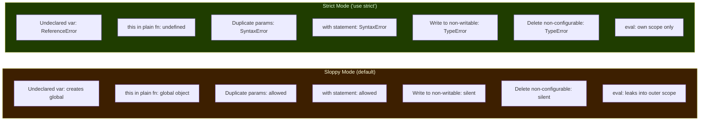
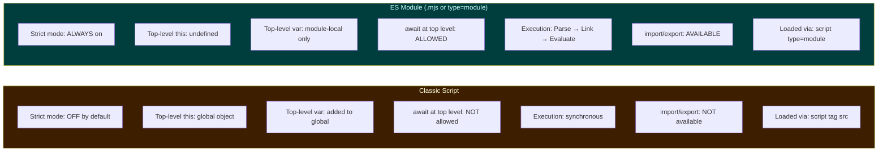

# 00 — JS Execution & Engine Internals
### 25 Questions | Advanced

The internals most candidates pretend to know but actually do not. This section covers what happens between writing code and the CPU executing it.

---

**Q1. Walk me through exactly what happens when a V8 engine executes a JavaScript file, from raw bytes to running code.** — Hard

**Answer:**
The pipeline has several distinct stages.

1. Source Text to Tokenization (Lexer/Scanner): The raw UTF-16 source is broken into tokens — identifiers, keywords, punctuation, literals. V8's scanner does this lazily, meaning it does not fully parse inner functions until they are called.

2. Tokens to AST (Parser): V8's parser builds an Abstract Syntax Tree. For inner functions, V8 uses a pre-parser first that skips the body but records variable declarations — avoiding fully parsing code that may never run.

3. AST to Bytecode (Ignition): V8's Ignition interpreter walks the AST and generates bytecode — a compact, platform-independent instruction set. This happens fast so execution can start quickly. Ignition also collects type feedback as it runs.

4. Hot Code to Machine Code (Turbofan/Maglev): V8's profiler monitors execution. When a function becomes hot (called frequently), Turbofan JIT compiles it to optimized native machine code using the type feedback Ignition collected. V8 now has an intermediate tier called Maglev between Ignition and Turbofan for medium-hot code.

5. Deoptimization: If Turbofan's assumptions turn out wrong (a function that always received integers suddenly receives a string), V8 deoptimizes — it bails out back to Ignition bytecode and starts re-collecting feedback before potentially re-optimizing.

**Spec Reference:** Not in the ECMAScript spec — this is V8 implementation detail. The spec only defines abstract execution semantics.

```
Source Code (UTF-16)
       | Scanner (Tokenizer)
     Tokens
       | Parser
      AST
       | Ignition (interpreter + type feedback)
    Bytecode + type feedback
       | Maglev (mid-tier JIT, warm code)
  Mid-optimized machine code
       | Turbofan (full JIT, hot code)
 Highly optimized machine code
       | (if assumptions fail)
   Deoptimize -> back to Ignition
```

**Follow-up:** What type feedback does Ignition collect, and how does Turbofan use it?

Ignition tracks what types appear at each operation site (for example, "this addition always gets two small integers") and stores them in feedback vectors. Turbofan reads these and speculates — it generates code assuming those types continue, adding a guard check at the start.

**GOTCHA:** Most people say "V8 compiles JS." That is technically wrong — Ignition interprets bytecode first. The JIT compilation only happens for hot paths. Saying "V8 uses JIT from the start" is also wrong.

---

**Q2. What are hidden classes in V8, and why do they matter for performance?** — Hard

**Answer:**
V8 does not use JavaScript's dynamic property lookup model directly for optimized code. Instead, it internally assigns each object a hidden class (also called a shape or map) — a C++-like struct description of that object's property layout at a given point in time.

When you access `obj.x`, instead of doing a slow hash-map lookup, V8 consults the hidden class to find the exact memory offset of `x`. This is as fast as accessing a field in a C struct.

How transitions work: Every time you add a property to an object, V8 creates a new hidden class (a transition) and links the old one to it.

```js
const a = {};           // Hidden class C0: {}
a.x = 1;               // Transition to C1: { x at offset 0 }
a.y = 2;               // Transition to C2: { x at offset 0, y at offset 8 }

const b = {};           // C0 again
b.x = 10;              // Reuses C1 — same shape
b.y = 20;              // Reuses C2 — same shape
// a and b now share hidden classes; V8 can optimize both identically
```

What breaks it:
```js
const c = {};
c.y = 1;  // C1': { y at offset 0 } — different order
c.x = 2;  // C2': { y at offset 0, x at offset 8 }
// c has DIFFERENT hidden classes from a and b
```

This is why you should always add properties in the same order and initialize all properties in the constructor.

**Follow-up:** What is a monomorphic vs polymorphic vs megamorphic call site?

- Monomorphic (1 shape): V8 generates perfectly optimized code.
- Polymorphic (2-4 shapes): V8 generates a small inline cache with branches.
- Megamorphic (5+ shapes): V8 gives up and falls back to a generic slow lookup.

**GOTCHA:** Deleting properties with `delete obj.prop` degrades an object to a dictionary object and destroys its hidden class. Set the property to `null` or `undefined` instead if you want to clear a value without hurting performance.

---

**Q3. What is an Inline Cache (IC) and how does it work?** — Hard

**Answer:**
An Inline Cache is an optimization where V8 remembers, at a specific call site in the bytecode, what type of object it saw last time and caches the lookup result — so the next call with the same type can skip the lookup entirely.

How it works: When Ignition first executes `obj.x`, it does a full lookup, finds the property, then patches that call site to remember: for objects with hidden class C1, x is at offset 0. Next time, it checks the hidden class first — if it matches, it directly reads offset 0. No lookup needed.

IC states:
```
Uninitialized  ->  first execution, no data yet
Monomorphic    ->  one hidden class seen, one fast path
Polymorphic    ->  2-4 shapes, a small if-chain
Megamorphic    ->  5+ shapes, IC disabled, generic lookup
```

```js
function getX(obj) { return obj.x; }

getX({ x: 1 });         // IC: Uninitialized -> Monomorphic
getX({ x: 2 });         // IC: still Monomorphic — same shape
getX({ x: 3, y: 4 });   // Different shape! IC: Mono -> Polymorphic
```

**Follow-up:** Can a megamorphic site ever go back to monomorphic?

No — once megamorphic, that site stays megamorphic for the lifetime of the compiled code. A deoptimization + reoptimization cycle could reset it, but that is expensive. Hot utility functions that receive objects of many shapes are a common performance pitfall for this reason.

**GOTCHA:** People assume Map and plain objects are equivalent in V8 — they are not. Map uses a hash table internally. Plain objects with stable property shapes can be much faster for property access due to ICs and hidden classes.

---

**Q4. What is deoptimization, what triggers it, and what is it bailing out to?** — Hard

**Answer:**
Deoptimization is V8's way of abandoning an optimized machine code version of a function and falling back to interpreted Ignition bytecode, because a speculation made during optimization turned out to be wrong.

Turbofan speculates based on type feedback: "this function has always received integers, so I will optimize for integers only." If that assumption is violated at runtime, the machine code cannot safely continue.

Common triggers:
```js
function add(a, b) { return a + b; }

add(1, 2);   // Fast — Turbofan sees only integers, compiles Smi fast path
add(3, 4);   // Fast

add("hello", "world");  // STRING — deoptimization triggered
// V8 falls back to Ignition, re-collects feedback, may re-optimize later
```

Other triggers:
- Changing the type of a variable after first use
- Using the arguments object in unusual ways
- try/catch blocks (historically; V8 has improved this)
- `eval()` inside a function (prevents most optimizations entirely)

Bailing out means: V8 reconstructs the JavaScript stack frame from the optimized machine code frame using stored metadata, restores the interpreter state, and continues in Ignition from where the deoptimization happened.

**Follow-up:** How can you detect deoptimizations in production?

Run Node.js with `--trace-deopt`, or use `--prof` and process with `node --prof-process`. You will see messages like `[deoptimize reason: not a Smi]`.

**GOTCHA:** Not all deoptimizations are catastrophic. Lazy deopt happens at safe points and is fairly cheap. The real cost is when a function deoptimizes and re-optimizes repeatedly — called optimization/deoptimization thrashing.

---

**Q5. What is the difference between the Execution Context creation phase and the execution phase?** — Medium

**Answer:**
Every time a function is called or a script starts, JS creates an Execution Context. This happens in two phases.

Creation Phase (before any code runs):
1. Variable Environment is created — all `var` declarations are found and set to `undefined`. Function declarations are stored with their full function bodies.
2. Lexical Environment is created — `let`/`const` bindings are registered in the Temporal Dead Zone but not initialized.
3. `this` binding is determined — depends on how the function is called.
4. Outer environment reference is set — the lexical scope chain is established based on where the function was defined.

Execution Phase: Code runs line by line. `var` assignments happen, `let`/`const` bindings are initialized when their declaration line is reached, function bodies execute.

```js
function example() {
  // CREATION PHASE:
  // var x -> undefined, function inner -> full function body stored
  // let y -> TDZ (cannot access yet)

  console.log(x);     // undefined (var hoisted)
  // console.log(y);  // ReferenceError (TDZ)

  var x = 10;         // EXECUTION PHASE: x assigned 10
  let y = 20;         // y exits TDZ, initialized to 20

  function inner() {}
}
```

**Spec Reference:** ECMAScript section 10.2 — Execution Contexts; section 10.2.1 — Identifier Resolution

**Follow-up:** What is the difference between VariableEnvironment and LexicalEnvironment in the spec?

In the spec, every execution context has both. VariableEnvironment holds `var` bindings and function declarations — set once during creation and never changed. LexicalEnvironment is for `let`/`const`/`class` and can be updated when entering a new block scope.

**GOTCHA:** People say "hoisting moves code to the top of the file." That is a mental model shortcut, not what actually happens. The code does not move — the creation phase runs first and allocates all identifiers before the execution phase begins.

---

**Q6. What is the Temporal Dead Zone (TDZ) and how is it implemented internally?** — Medium

**Answer:**
The Temporal Dead Zone is the period between entering a scope and the actual line where a `let` or `const` variable is declared. During this period, the binding exists in the environment but accessing it throws a `ReferenceError`.

Why it exists: The TDZ was a deliberate design choice to prevent the class of bugs where accessing a variable before assignment silently gives `undefined` (the `var` behavior). `let`/`const` throw loudly instead.

How it is implemented in V8: The binding is created in the Lexical Environment with a special sentinel value called "the hole" — the same marker used for array holes. The engine inserts a TDZ check before every access to a `let`/`const` binding. If the value is still the hole, it throws `ReferenceError`.

```js
{
  // TDZ for x starts here — x's binding exists but holds "the hole"
  console.log(typeof x); // ReferenceError — typeof does NOT skip TDZ
  let x = 5;             // x exits TDZ, initialized to 5
}
```

Tricky case with default parameters:
```js
function test(y = x, x = 1) {}
test(); // ReferenceError — default param y=x accesses x before x is initialized
```

**Spec Reference:** ECMAScript section 14.3.1 — Let and Const Declarations

**Follow-up:** Does `typeof` protect against TDZ like it protects against undeclared variables?

No, and this is a common misconception. `typeof undeclaredVar` safely returns `"undefined"`. But `typeof tdzVar` where the variable is declared with `let`/`const` but not yet initialized throws `ReferenceError`. The TDZ overrides the usual `typeof` safety net.

**GOTCHA:** `let` in a `for` loop creates a new binding per iteration. Each iteration's binding has its own TDZ-to-initialized lifecycle, separate from the others. This is why closures inside `for (let ...)` loops capture distinct values.

---

**Q7. What exactly is the scope chain and how is it built?** — Medium

**Answer:**
The scope chain is a linked list of Lexical Environments that represents all variable scopes accessible from a given point in code. Each environment has a reference to its outer environment, forming the chain.

How it is built: When a function is defined, V8 captures a reference to the current Lexical Environment and stores it on the function object as its `[[Environment]]` internal slot. When that function is called, V8 creates a new Lexical Environment for it and sets its outer reference to that captured `[[Environment]]`. This is what makes lexical scoping work — the chain is set at definition time, not call time.

```js
const global_x = 1;

function outer() {
  const outer_x = 2;

  function inner() {
    const inner_x = 3;
    console.log(inner_x);  // 3  — own environment
    console.log(outer_x);  // 2  — outer's environment (scope chain)
    console.log(global_x); // 1  — global environment (scope chain)
  }

  inner();
}

// inner's scope chain:
// [inner's env] -> [outer's env] -> [global env] -> null
```

**Spec Reference:** ECMAScript section 8.1 — Lexical Environments; section 8.1.2.4 — NewFunctionEnvironment

**Follow-up:** Why can dynamic scoping not solve closures the same way?

With dynamic scoping, the scope chain would be built from the call stack, not the definition location. A function called from a completely different context would see the caller's variables instead of the defining scope's variables. JS deliberately uses lexical scoping for predictability — you can understand a function's variable access purely by reading its definition, without knowing where it gets called.

**GOTCHA:** Scope chain lookup is O(depth) — every step up the chain is a lookup. Very deep scope chains (functions nested many levels) have a performance cost. V8 can often optimize this away, but it is worth being aware of.

---

**Q8. How does JavaScript's garbage collector work — specifically the generational GC in V8?** — Hard

**Answer:**
V8 uses a generational garbage collector based on the empirical observation that most objects die young. The heap is split into two main regions.

New Space (Young Generation, approximately 1-8 MB):
- New objects are allocated here using a bump pointer allocator — very fast, just increment a pointer.
- Collected by Scavenge (Minor GC) — a fast copying collector. It uses two semi-spaces. Live objects are copied from the from-space to the to-space; everything left behind is garbage. After collection, the spaces flip.
- Objects that survive two scavenges are promoted to old space.

Old Space (Old Generation, hundreds of MB):
- Collected by Mark-Sweep-Compact (Major GC):
  - Mark: Starting from roots (globals, stack variables), traverse all reachable objects and mark them.
  - Sweep: Free all unmarked objects.
  - Compact (optional): Defragment by moving live objects together for better allocation locality.

Incremental and Concurrent GC: Major GC is expensive — it can pause JS execution for hundreds of milliseconds. V8 reduces pauses with:
- Incremental marking: Mark in small steps interleaved with JS execution.
- Concurrent marking: Mark on background threads while JS runs.
- Lazy sweeping: Sweep pages on-demand rather than all at once.

```
V8 Heap Layout:

  New Space (Young Gen)              Old Space (Old Gen)
  +-----------------+----------+     +------------------+
  |  from-space     | to-space |  -> | Promoted objects |
  | (allocate here) | (GC dest)|     | Long-lived data  |
  +-----------------+----------+     +------------------+
  Scavenge (Minor GC) — fast         Mark-Sweep (Major GC)
```

**Follow-up:** What is a write barrier in the context of GC?

When you write a reference from an old-space object to a new-space object, the GC needs to know about it — otherwise the new-space object might be incorrectly collected during a minor GC, which does not scan old space. V8 inserts a write barrier — a small piece of code executed on every property assignment — that records cross-generational references in a remembered set.

**GOTCHA:** The GC does not immediately free memory when an object becomes unreachable. It only frees it when the GC next runs. This is why heap snapshots taken immediately after dereferencing a large object still show it in memory.

---

**Q9. What is strict mode and what does it change at the spec level?** — Medium

**Answer:**
Strict mode (`'use strict'`) is an opt-in to a stricter variant of JavaScript defined in ES5. ES6 modules and class bodies are always in strict mode automatically.

What it specifically changes:



```js
'use strict';

x = 5;               // ReferenceError (undeclared)
delete Object.prototype; // TypeError (non-configurable)

function f(a, a) {}  // SyntaxError (duplicate params)

function g() {
  console.log(this); // undefined (plain call, not global)
}
g();

with ({}) {}         // SyntaxError
```

**Spec Reference:** ECMAScript section 10.2.1 — Strict Mode Code

**Follow-up:** If a sloppy mode function calls a strict mode function, what is `this` in the strict function?

The strict function's `this` is determined by how it is called, not by the caller's mode. If called as a plain function call `fn()`, `this` is `undefined` inside the strict function regardless of the caller's mode.

**GOTCHA:** Strict mode is file-scoped or function-scoped, not block-scoped. Putting `'use strict'` inside an `if` block does nothing if it is not at the top of the function or file.

---

**Q10. What is the difference between a Script and a Module execution context in JS?** — Medium

**Answer:**
Scripts and modules differ in several important ways at the runtime level.



```js
// In a Script:
var x = 1;
console.log(window.x); // 1 — added to global object

// In a Module:
var x = 1;
console.log(window.x); // undefined — x is module-local only
console.log(this);      // undefined — not global
```

Module execution happens in 3 phases:
1. Parse: Load and parse the module, find import declarations.
2. Link: Establish live bindings between modules before any code runs.
3. Evaluate: Execute the module body.

**Spec Reference:** ECMAScript section 15.2 — Modules; section 15.2.1 — Module Records

**Follow-up:** Can a module import from a script?

No. Scripts and modules have fundamentally different linking mechanisms. A module can import from another module. A script can dynamically `import()` a module (dynamic import is always available). But a module cannot use `require()` in Node without the `.cjs`/`.mjs` extension configuration.

**GOTCHA:** `<script type="module">` automatically defers HTML parsing — you do not need to add the `defer` attribute. Also, module scripts are only fetched once regardless of how many script tags reference them, because the module registry caches them by URL.

---

**Q11. What are V8 shapes and how do `Object.create(null)` objects differ from regular objects?** — Hard

**Answer:**
V8's hidden classes track the shape of an object — which properties it has, in what order, and their attributes (writable, enumerable, configurable). This allows V8 to compile property accesses as fixed memory offsets rather than hash lookups.

`Object.create(null)` creates an object with `null` as its prototype — it has no `__proto__`, no `toString`, no `hasOwnProperty`. This is useful for pure dictionary objects with no prototype chain pollution.

```js
const dict = Object.create(null);
dict.toString = "my value"; // No conflict with Object.prototype.toString
dict.hasOwnProperty;        // undefined — no inherited methods

// Safely use as a dictionary — no prototype chain to traverse
for (const key in dict) {
  // Only own properties, nothing inherited
  console.log(key, dict[key]);
}
```

V8 perspective: These objects still get hidden classes, but they start from a different root hidden class (since they have no prototype). They do not share the hidden class tree with regular objects.

**Follow-up:** Why is `Object.create(null)` preferred over `{}` for dictionaries?

With `{}`, keys like `"toString"`, `"constructor"`, `"hasOwnProperty"` shadow prototype methods and can cause subtle bugs. `Object.create(null)` has no such risk. `for...in` on `{}` also iterates prototype properties unless guarded with `hasOwnProperty`.

**GOTCHA:** `Object.create(null)` objects fail `instanceof Object` — the check returns `false`, which can surprise code that assumes all objects are instances of `Object`. Also, they cannot be used directly with `JSON.stringify` options that rely on prototype methods — though basic serialization works fine.

---

**Q12. What is the difference between `[[Prototype]]`, `__proto__`, `prototype`, and `Object.getPrototypeOf()`?** — Medium

**Answer:**
These four concepts are related but distinct.

- `[[Prototype]]` — The internal slot on every object pointing to its prototype. This is a spec-level concept — you cannot access it directly in code. It is what gets walked during property lookup.

- `__proto__` — A deprecated accessor property defined on `Object.prototype` that gets and sets `[[Prototype]]`. It was non-standard for years but standardized in ES6 Annex B for web compatibility. Do not use in new code.

- `Object.getPrototypeOf(obj)` — The correct, spec-standard way to read `[[Prototype]]`. Use this.

- `prototype` — A property on constructor functions and classes. When you use `new F()`, the new object's `[[Prototype]]` is set to `F.prototype`. This is how inheritance chains are built. Arrow functions do not have a `prototype` property.

```js
function Dog(name) { this.name = name; }
Dog.prototype.bark = function() { return "Woof!"; };

const rex = new Dog("Rex");

// All three of these point to the same object:
Object.getPrototypeOf(rex) === Dog.prototype; // true
rex.__proto__ === Dog.prototype;               // true (deprecated)

// Dog.prototype has its own [[Prototype]]:
Object.getPrototypeOf(Dog.prototype) === Object.prototype; // true
```

**Spec Reference:** ECMAScript section 9.1 — Ordinary Object Internal Methods: [[GetPrototypeOf]]

**Follow-up:** What does `Object.create(proto)` do that `new` does not?

`Object.create(proto)` creates an object with exactly `proto` as its `[[Prototype]]` without calling any constructor function. `new F()` both sets the prototype AND calls `F` as a constructor. `Object.create` is pure prototypal inheritance with no constructor side effects.

**GOTCHA:** `Function.prototype` is a special function — it is both a function AND an object, and it is the prototype of all functions. So `Object.getPrototypeOf(Dog) === Function.prototype` is true. `Function.prototype`'s own `[[Prototype]]` is `Object.prototype`, completing the chain to `null`.

---

**Q13. What happens internally when you call `new F()`?** — Medium

**Answer:**
The `new` operator performs exactly these steps per the ECMAScript spec:

1. Create a new ordinary object — `Object.create(F.prototype)` — so the new object's `[[Prototype]]` is set to `F.prototype`.
2. Call `F` with `this` bound to the new object.
3. If `F` returns an object, use that as the result. Otherwise, use the new object from step 1.
4. Return the result.

```js
// Manual implementation of new:
function myNew(Constructor, ...args) {
  const obj = Object.create(Constructor.prototype); // Step 1
  const result = Constructor.apply(obj, args);       // Step 2
  return (result !== null && typeof result === 'object') ? result : obj; // Step 3
}

function Point(x, y) { this.x = x; this.y = y; }
const p = myNew(Point, 3, 4);
console.log(p.x, p.y);           // 3 4
console.log(p instanceof Point); // true
```

The tricky return case:
```js
function Weird() {
  this.x = 1;
  return { x: 99 }; // returning a plain object
}
const w = new Weird();
console.log(w.x); // 99 — the returned object wins over 'this'

function Weird2() {
  this.x = 1;
  return 42; // returning a primitive
}
const w2 = new Weird2();
console.log(w2.x); // 1 — primitive return is ignored, 'this' is returned
```

**Spec Reference:** ECMAScript section 13.3.5.1 — Runtime Semantics: EvaluateNew

**Follow-up:** What if you call `new` on an arrow function?

TypeError: ArrowFunction is not a constructor. Arrow functions have no `[[Construct]]` internal method and no `prototype` property. This is by design — since arrow functions have no own `this`, they cannot be constructors.

**GOTCHA:** Classes require `new`. Calling a class without `new` throws `TypeError: Class constructor X cannot be invoked without 'new'`. This differs from ES5 constructor functions, which you could accidentally call without `new` and silently pollute the global object.

---

**Q14. What is the full prototype chain lookup algorithm?** — Medium

**Answer:**
When you access `obj.prop`, JavaScript follows this exact algorithm (the `[[Get]]` internal method):

1. Check if `obj` has an own property named `prop` using `[[GetOwnProperty]]`.
2. If found — return its value (or invoke getter if it is an accessor property).
3. If not found — get `obj.[[Prototype]]`.
4. If `[[Prototype]]` is `null` — return `undefined`.
5. Recursively apply `[[Get]]` on the prototype with the same key.

```js
const grandparent = { a: 1 };
const parent = Object.create(grandparent);
parent.b = 2;
const child = Object.create(parent);
child.c = 3;

child.c; // own property — 3
child.b; // not own -> check parent -> found -> 2
child.a; // not own -> check parent -> not own -> check grandparent -> found -> 1
child.z; // not own -> ... -> Object.prototype -> not own -> null -> undefined
```

**Follow-up:** What is the performance implication of deep prototype chains?

Every property miss at each level costs one additional lookup. A chain of depth N means up to N lookups per property access. V8's inline caches mitigate this by caching the full chain result for a given property name and hidden class combination — so subsequent accesses are fast. But heavily varied property access patterns defeat the cache.

**GOTCHA:** Property assignment does not walk the prototype chain the same way. `obj.prop = value` checks if there is a setter or non-writable property descriptor on the prototype before writing, but it writes to `obj` itself — it does not modify the prototype. The exception is if there is a setter defined on the prototype — then the setter is invoked.

---

**Q15. What is the Temporal Dead Zone for class declarations?** — Medium

**Answer:**
Like `let` and `const`, class declarations are not hoisted with a value. They are in the Temporal Dead Zone from the start of their scope until the class declaration is evaluated.

```js
// This works — function declaration is fully hoisted:
const p = new Point(1, 2);
function Point(x, y) { this.x = x; this.y = y; }

// This fails — class declaration is in TDZ:
const p = new Circle(5); // ReferenceError: Cannot access 'Circle' before initialization
class Circle {
  constructor(r) { this.r = r; }
}
```

Why the spec made this choice: Class bodies execute code — class fields, static blocks, decorators. The spec needed consistent semantics, and treating classes like `let`/`const` was the cleanest solution.

**Spec Reference:** ECMAScript section 15.7.2 — Runtime Semantics: ClassDeclarationEvaluation

**GOTCHA:** Class expressions work differently — they evaluate when that line is reached. `const C = class { ... }` — you can use `C` after this line. But you still cannot reference `C` before this assignment line.

---

**Q16. How does `eval()` affect optimization?** — Hard

**Answer:**
`eval()` is V8's optimizer's biggest obstacle. Here is exactly why.

Problem 1 — Can't determine scope statically:
V8 resolves variable names at parse/compile time via scope analysis. `eval` can introduce new bindings or modify existing ones at runtime, making static analysis impossible.

```js
function problem() {
  let x = 1;
  eval("var x = 99; var newVar = 42"); // What variables exist now?
  console.log(x);      // 99
  console.log(newVar); // 42 — appeared from nowhere
}
```

Because of this, V8 must conservatively deoptimize any function that calls `eval()` — it cannot use fast variable lookup or make any assumptions about local scope.

Problem 2 — Global eval vs direct eval:
```js
const geval = eval;
geval("var x = 1"); // indirect eval — always runs in global scope
eval("var y = 2");  // direct eval — runs in current scope
```

Only direct eval (writing `eval(...)` literally) can access or modify the local scope. Indirect eval always acts in global scope. Using indirect eval limits scope damage if you must use eval.

Safe alternatives:
- JSON parsers for data
- `Function("return " + expr)()` for math expression evaluation (still unsafe with untrusted input)
- Template engines for templating
- WebAssembly for sandboxed computation

**GOTCHA:** The `with` statement has the same optimizer-breaking effect as `eval` — V8 cannot statically determine which object a property lookup resolves to. This is one of the main reasons `with` is forbidden in strict mode.

---

**Q17. What is a function's `[[Environment]]` internal slot?** — Hard

**Answer:**
Every function object in JavaScript has an internal slot called `[[Environment]]` that stores a reference to the Lexical Environment that was active when the function was created. This is the key mechanism behind closures.

When a function is called, a new execution context is created. The new Lexical Environment's outer reference is set to the function's `[[Environment]]`. This wires up the scope chain to the function's definition location, not its call location — that is lexical scoping.

```js
function makeAdder(x) {
  // makeAdder is called; a new env is created: { x: 5 }
  // The inner function is created here; its [[Environment]] = { x: 5 }
  return function(y) {
    return x + y; // x found via [[Environment]] -> outer env
  };
}

const add5 = makeAdder(5); // add5.[[Environment]] = { x: 5 }
add5(3);
// new env: { y: 3 }, outer -> { x: 5 } -> 5 + 3 = 8
```

**Spec Reference:** ECMAScript section 10.2.3 — FunctionCreate, where [[Environment]] is set

**Follow-up:** Why does this create a memory concern with closures?

The function holds a reference to the entire outer Lexical Environment object. If that environment contains many variables, all of them stay alive as long as the closure exists — even if only one variable is actually used by the closure. V8 can sometimes optimize this by capturing only the used variables, but it is not guaranteed.

**GOTCHA:** Arrow functions also capture `[[Environment]]` for variable lookup and for `this` binding. They do not create their own `this` binding — they use the `this` value from `[[Environment]]`. This is the precise reason arrow functions lexically inherit `this`.

---

**Q18. What is lazy parsing in V8 and how does it affect startup performance?** — Hard

**Answer:**
V8 does not fully parse all code upfront. For inner functions, V8 uses a pre-parser that scans the function body to find its end, identifies variable declarations, but does not build a full AST. The full parse only happens when the function is actually called for the first time.

Why this helps: On a typical webpage, a significant portion of JavaScript is never executed during page load — unused features, edge case handlers, conditionally loaded paths. Lazy parsing avoids wasting time on code that never runs.

The cost: If a function IS called immediately (like IIFEs or module-level code), lazy parsing wastes time — it pre-parses, then must fully parse again. V8 has heuristics to detect certain patterns (like `(function(){...})()`) and skip straight to full parsing.

```js
// V8 lazy-parses this — not needed immediately:
function outer() {
  function inner() { /* complex body */ } // pre-parsed only
  // inner is only fully parsed when outer() is called
}

// V8 eager-parses this — IIFE pattern detected:
(function() { /* ... */ })(); // immediately invoked
```

**Follow-up:** What is the parsing budget problem in large apps?

Large JS bundles have kilobytes of code requiring parsing. Even lazy parsing has overhead. The solution is code splitting — loading only the JS needed for the current page. Parsing time is often underestimated compared to network download time in performance analysis.

**GOTCHA:** V8's Script Streaming allows parsing to begin before the script finishes downloading — the parser works on already-downloaded bytes in parallel with the network. This is another reason `async`/`defer` matter for performance — they allow streaming whereas render-blocking scripts cannot be streamed effectively.

---

**Q19. What are element kinds in V8 and how do arrays get stored differently based on content?** — Hard

**Answer:**
V8 stores array elements differently based on what types of values are in the array, in a system called element kinds. These are distinct from property storage.

Element kinds from most to least optimized:

| Kind | Description | Example |
|---|---|---|
| PACKED_SMI_ELEMENTS | All integers, no holes | `[1, 2, 3]` |
| PACKED_DOUBLE_ELEMENTS | All doubles, no holes | `[1.1, 2.2]` |
| PACKED_ELEMENTS | Mixed types, no holes | `[1, "a", {}]` |
| HOLEY_SMI_ELEMENTS | All integers, has holes | `[1, , 3]` |
| HOLEY_DOUBLE_ELEMENTS | All doubles, has holes | `[1.1, , 3.3]` |
| HOLEY_ELEMENTS | Mixed, has holes | `[1, , "a"]` |

Transitions are one-way — once an array degrades, it cannot go back:
```js
let arr = [1, 2, 3];     // PACKED_SMI_ELEMENTS — fastest
arr.push(1.5);           // -> PACKED_DOUBLE_ELEMENTS — cannot go back to Smi
arr.push("hello");       // -> PACKED_ELEMENTS — cannot go back
arr[10] = 5;             // Creates hole -> HOLEY_ELEMENTS — cannot go back
```

Once an array becomes HOLEY_ELEMENTS, V8 must check for holes on every iteration — significant overhead.

**Follow-up:** What is the performance impact of pre-allocating arrays with `new Array(100)`?

`new Array(100)` creates a holey array with 100 slots — it immediately becomes HOLEY_SMI_ELEMENTS or worse. Pushing values one by one starts with PACKED_SMI_ELEMENTS and stays packed. Building via `push` is therefore better for element access performance.

**GOTCHA:** `delete arr[2]` creates a hole — it does not shift elements. The array becomes holey, downgrading its element kind permanently. Setting to `undefined` (`arr[2] = undefined`) does not create a hole — it sets a real `undefined` value and keeps the array packed.

---

**Q20. What is the difference between Smi and HeapNumber in V8?** — Hard

**Answer:**
V8 represents numbers in two different ways internally, with meaningful performance implications.

Smi (Small Integer): V8 represents small integers (typically the range of -2^31 to 2^31 - 1) as tagged pointers — they are encoded directly in the pointer value itself, without any heap memory allocation. The lowest bit of the pointer is set to 1 to indicate it is a Smi, not a pointer.

HeapNumber: Any number that does not fit in a Smi range — floats like `1.5`, large integers like `2**32`, or `NaN` — are allocated as HeapNumber objects on the heap. Each HeapNumber is a real heap allocation with an 8-byte double-precision float.

```js
// Fast — Smi arithmetic, no heap allocation:
let x = 5;
let y = x + 3; // Both Smis -> result is Smi -> no heap alloc

// Slower — HeapNumber, heap allocation required:
let a = 1.5;
let b = a + 2.5; // Float -> result is HeapNumber -> heap alloc
```

**Follow-up:** Why do TypedArrays avoid this overhead?

TypedArray (such as Int32Array, Float64Array) stores raw binary data with no tagging — they are essentially C arrays. Operations on typed arrays never need Smis or HeapNumbers for intermediate values — they work directly on binary data. This is why TypedArray operations can be significantly faster than regular array arithmetic for numeric computation.

**GOTCHA:** Bitwise operators like `~x` or `x | 0` coerce operands to 32-bit integers. V8 can optimize bitwise operations on Smis well. But `x | 0` as a truncation trick can actually hurt performance if V8 cannot prove the result fits in a Smi.

---

**Q21. What is the fast properties vs slow properties distinction in V8?** — Hard

**Answer:**
V8 stores object properties in two modes.

Fast properties (linear storage): Properties are stored in a descriptor array with fixed offsets based on the hidden class. Access is O(1) by offset — as fast as a C struct field. Most objects start in this mode.

Slow properties (dictionary mode): Properties are stored in a hash table. Access is still approximately O(1) but with more overhead than linear storage. V8 falls into this mode when:
- Properties are added dynamically in unpredictable ways
- Properties are deleted (using heuristics)
- The number of properties exceeds a threshold (roughly 1024)
- `Object.defineProperty` is called in ways that make properties non-default

```js
// Fast properties — always created the same way:
function Point(x, y) { this.x = x; this.y = y; }
const p = new Point(1, 2);

// Can degrade to dictionary mode with too many dynamic additions:
const obj = {};
for (let i = 0; i < 2000; i++) {
  obj[`prop${i}`] = i;
}
```

**Follow-up:** How can you verify if an object is in fast or slow properties mode?

In Node.js with `--allow-natives-syntax`, you can call `%HasFastProperties(obj)` which is a V8-internal function. In practice, you infer it from benchmarks or the DevTools Memory profiler.

**GOTCHA:** Objects with integer-indexed properties (like `obj[0]`, `obj[1]`) use a different storage system from named properties — they use the elements store. An object can be in fast-named-properties mode AND have holey elements at the same time. These two storage systems are orthogonal.

---

**Q22. What is Turbofan's escape analysis and how can it eliminate allocations?** — Hard

**Answer:**
Escape analysis is an optimization where Turbofan determines whether an allocated object escapes the function it was created in — whether it can be accessed outside that function via references, return values, or closures.

If an object does not escape, Turbofan can eliminate the heap allocation entirely and represent the object's fields as local variables (stack or registers).

```js
function process(x, y) {
  const point = { x, y }; // This object might be eliminated entirely
  return point.x + point.y;
  // If point never escapes, Turbofan may optimize this to: return x + y;
}
```

When does an object escape?
- Returned from the function
- Passed to an external function
- Stored in a closure, global, or property of another object
- Passed to `eval` or `arguments`

Real-world significance: Short-lived objects created inside hot loops — like temporary coordinate or range objects — are prime targets. If they do not escape, V8 eliminates thousands of allocations per second, dramatically reducing GC pressure.

**GOTCHA:** Any call to an external or unknown function forces conservatism — V8 assumes the object might escape. This is why small, self-contained hot functions optimize better than ones that call many helpers.

---

**Q23. What are feedback vectors and how do they power V8's adaptive optimization?** — Hard

**Answer:**
A feedback vector is a data structure attached to each function, containing slots that record runtime observations about that function's behavior. Ignition populates these slots as it runs, and Turbofan reads them to make optimization decisions.

Types of feedback slots:

| Slot Type | What It Records |
|---|---|
| Call IC | Type of this, callee function identity |
| Load IC | Hidden class of object being read from |
| Store IC | Hidden class of object being written to |
| Binary op IC | Types of operands (Smi+Smi? Smi+double?) |
| Comparison IC | Types being compared |

```js
function add(x, y) { return x + y; }

// After many calls with integers:
// Binary op IC slot: BOTH_SMI -> Turbofan generates Smi fast path

add(1, 2);   // Populates: both Smi
add(3, 4);   // Confirms: both Smi
// Turbofan compiles: integer addition, no float path

add(1.5, 2); // DEOPT — feedback said Smi, got float
// Ignition updates slot: SMI_OR_NUMBER
// Turbofan recompiles with float path included
```

**Follow-up:** Why does warming up a function matter in benchmarks?

JIT benchmarks must call the function many times before measuring so Ignition can collect enough feedback for Turbofan to compile it. Measuring the first few calls includes interpreter overhead and misses the JIT-compiled performance. This is why benchmark tools like benchmark.js have explicit warm-up phases.

**GOTCHA:** If you call a function with `null` once, the IC slot may pollute — even if 99% of calls use valid objects. A single call with an unusual type can cause a polymorphic or megamorphic IC, degrading all subsequent calls. This is why type-stable functions perform significantly better.

---

**Q24. How does V8 handle the `arguments` object and why is it a performance concern?** — Hard

**Answer:**
The `arguments` object is an array-like object available inside non-arrow functions that holds all passed arguments. In sloppy mode, it has a special behavior that makes optimization very difficult.

In sloppy mode — aliasing: `arguments[0]` and the first named parameter are aliased — changing one changes the other.
```js
function sloppy(a, b) {
  arguments[0] = 99;
  console.log(a); // 99 — aliased
}
sloppy(1, 2);
```

This aliasing makes it impossible for V8 to keep `a` and `b` as simple stack variables — they must be tied to the `arguments` heap allocation.

In strict mode: No aliasing. `arguments` is a simple snapshot of values at call time. Much easier to optimize.

The core optimization problem: If a function accesses `arguments` at all (even just `arguments.length`), V8's optimizer must be very conservative. It cannot freely move or eliminate arguments-related operations.

```js
// Avoid — arguments in a hot function:
function sum() {
  let total = 0;
  for (let i = 0; i < arguments.length; i++) total += arguments[i];
  return total;
}

// Prefer — rest parameters:
function sum(...nums) {
  return nums.reduce((a, b) => a + b, 0);
}
// Rest params create a real Array, no aliasing, much easier to optimize
```

**GOTCHA:** `Array.from(arguments)` or `[...arguments]` creates a copy — fine to do, but the initial `arguments` object already triggered the allocation concern. For truly hot functions, use rest parameters from the start.

---

**Q25. What is on-stack replacement (OSR) in V8?** — Hard

**Answer:**
On-Stack Replacement (OSR) is V8's technique for switching from interpreted code to optimized machine code while a function is still running — specifically, mid-loop execution.

The problem OSR solves: Normally, V8 only switches to optimized code between function calls. But what if a function has a single enormous loop running for millions of iterations? Without OSR, the entire loop would run in the slow interpreter.

How OSR works: V8 inserts OSR entry points at loop back-edges. Ignition tracks a loop invocation counter. When a loop becomes hot enough:
1. Turbofan compiles an optimized version of the function.
2. At the next loop back-edge, V8 replaces the current stack frame with the optimized version — right in the middle of execution.
3. Execution continues in optimized machine code from that loop iteration forward.

```js
function hot() {
  let sum = 0;
  for (let i = 0; i < 10_000_000; i++) {
    sum += i; // V8 performs OSR here mid-loop once this becomes hot
  }
  return sum;
}
hot(); // OSR kicks in during execution, not on the next call
```

**Follow-up:** What is an OSR entry in `--trace-opt` output?

When you run Node with `--trace-opt`, you will see lines like `[optimizing with OSR entry]` for functions with hot loops. This confirms OSR was triggered during execution rather than on a subsequent call.

**GOTCHA:** OSR-compiled code is sometimes less optimized than normally-compiled code because Turbofan must generate code that can enter the loop at any iteration, not just from the start. OSR'd functions may be re-compiled without OSR on subsequent calls for better optimization quality.

---

*Next: [01-Core-Fundamentals.md](./01-Core-Fundamentals.md)*
