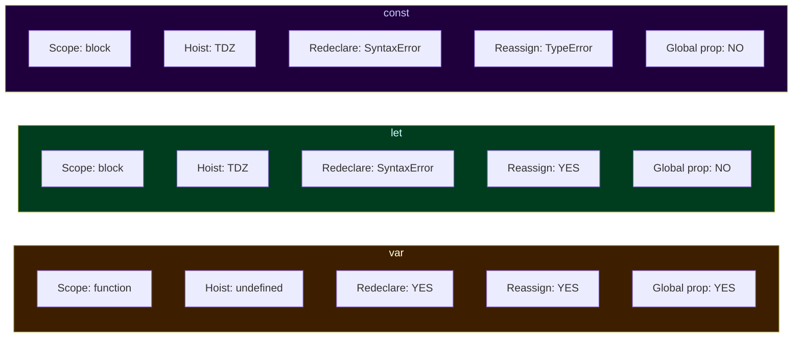

# 01 — Core JS Fundamentals
### 25 Questions | All Levels

---

**Q1. What is a closure? Give a real-world use case.** — Easy

**Answer:**
A closure is a function that retains access to the variables from its outer (enclosing) scope even after that outer function has finished executing. When a function is created, it captures a reference to its surrounding Lexical Environment — not a snapshot of values, but a live reference. That environment persists in memory as long as any closure references it.

Real-world use cases:
- Data privacy / encapsulation (module pattern)
- Partial application and currying
- Memoization
- Event handlers retaining state
- React hooks (useState uses closures to remember state between renders)

```js
function createCounter(start = 0) {
  let count = start; // This variable lives in the closure

  return {
    increment: () => ++count,
    decrement: () => --count,
    reset: () => { count = start; },
    value: () => count
  };
}

const counter = createCounter(10);
counter.increment(); // 11
counter.increment(); // 12
counter.decrement(); // 11
counter.value();     // 11

// count is fully private — no way to access it directly from outside
```

**Spec Reference:** ECMAScript section 8.1 — Lexical Environments; section 14.1.20 — FunctionDeclarationInstantiation

**Follow-up:** What is the difference between a closure and a regular function?

Every function is technically a closure — all functions capture their `[[Environment]]`. The distinction people usually mean is a function that survives beyond its outer function's execution and continues accessing that outer scope. What makes closures interesting is that the outer scope's variables stay alive in memory even after the outer function returned.

**GOTCHA:** Closures hold references, not copies. If you close over a variable and that variable changes later, the closure sees the new value — not the value at creation time. This is the source of the classic loop-with-var bug where all callbacks see the final value of `i`.

---

**Q2. Explain hoisting in full detail — `var`, `let`, `const`, and function declarations.** — Easy

**Answer:**
Hoisting is not about code moving anywhere. During the creation phase of every execution context, the JS engine scans for declarations and sets up bindings in the environment before any code runs. The behavior differs significantly by declaration type.

`var` declarations:
- Binding is created and initialized to `undefined` during the creation phase.
- Assignment happens at the line where you write it.
```js
console.log(x); // undefined — not an error
var x = 5;
console.log(x); // 5
```

`let` and `const` declarations:
- Binding is created during the creation phase but NOT initialized — it enters the Temporal Dead Zone.
- Accessing the binding before the declaration line throws `ReferenceError`.
- `const` additionally requires an initializer at the declaration line.
```js
console.log(y); // ReferenceError: Cannot access 'y' before initialization
let y = 5;
```

Function declarations:
- The entire function (name + body) is hoisted and fully initialized during the creation phase.
- This is why you can call a function declaration before its textual position in the file.
```js
greet(); // "Hello" — works fine

function greet() {
  console.log("Hello");
}
```

Function expressions (including arrow functions) assigned to `var`:
- Only the `var` binding is hoisted (to `undefined`). The function itself is NOT hoisted.
```js
greet(); // TypeError: greet is not a function (it is undefined at this point)

var greet = function() { console.log("Hello"); };
```

**Spec Reference:** ECMAScript section 14.1.20 — FunctionDeclarationInstantiation; section 8.1.1.1 — Declarative Environment Records

**Follow-up:** Are class declarations hoisted?

Yes, but they are in the TDZ — same as `let`. The binding exists from the top of the scope but you cannot access it before the class declaration line.

**GOTCHA:** In sloppy mode, function declarations inside blocks (like `if` blocks) have inconsistent and surprising hoisting behavior that differs between environments. In strict mode (and all ES6 modules), block-scoped function declarations are properly block-scoped. Avoid function declarations inside blocks.

---

**Q3. Explain `var` vs `let` vs `const` completely — scope, hoisting, redeclaration, reassignment.** — Easy

**Answer:**



```js
// var — function scoped, leaks out of blocks:
function example() {
  if (true) {
    var x = 1; // 'x' is scoped to 'example', not the if-block
  }
  console.log(x); // 1 — accessible here
}

// let — block scoped:
function example2() {
  if (true) {
    let y = 2; // scoped to the if-block only
  }
  console.log(y); // ReferenceError
}

// const — block scoped, no reassignment:
const obj = { a: 1 };
obj.a = 2;    // ALLOWED — mutating the object, not reassigning the binding
obj = {};     // TypeError — reassigning the binding is not allowed
```

My practical rule: Default to `const`. Use `let` when reassignment is needed. Never use `var` in modern code.

**Follow-up:** If `const` prevents reassignment, why can you mutate `const` objects?

`const` makes the binding constant — the variable always points to the same object in memory. It says nothing about whether that object's contents can change. To prevent mutation, use `Object.freeze()`.

**GOTCHA:** `var` in a `for` loop creates ONE binding shared across all iterations. `let` creates a NEW binding per iteration. This distinction is crucial for closures inside loops.

---

**Q4. How is `this` determined? Cover all six cases.** — Medium

**Answer:**
`this` is determined at the point of function invocation, not where the function is defined (except for arrow functions which capture `this` lexically). There are six distinct rules.

1. Default binding (plain function call):
```js
function f() { console.log(this); }
f(); // undefined in strict mode, global object in sloppy mode
```

2. Implicit binding (method call):
```js
const obj = { name: "A", greet() { console.log(this.name); } };
obj.greet(); // "A" — this is obj (the object before the dot)
```

3. Explicit binding (`call`, `apply`, `bind`):
```js
function greet() { console.log(this.name); }
greet.call({ name: "B" }); // "B" — explicitly set
```

4. `new` binding (constructor call):
```js
function Person(name) { this.name = name; }
const p = new Person("C");
p.name; // "C" — this is the new object
```

5. Arrow function (lexical `this`):
```js
const obj = {
  value: 42,
  getValue: function() {
    const inner = () => this.value; // 'this' captured from getValue's execution context
    return inner();
  }
};
obj.getValue(); // 42
```

6. Event handler / implicit global context:
```js
button.addEventListener("click", function() {
  console.log(this); // the button element — this is set by the event system
});
```

Priority order (highest to lowest): `new` > explicit (`call`/`apply`/`bind`) > implicit (method) > default

**Spec Reference:** ECMAScript section 9.4.1 — Bound Function Exotic Objects; section 13.2.5 — Arrow Function Definitions

**Follow-up:** What happens to `this` when you extract a method from an object?

```js
const obj = { name: "A", greet() { console.log(this.name); } };
const fn = obj.greet;
fn(); // undefined — the implicit binding is lost when method is extracted
```
The function loses its connection to `obj`. This is one of the most common `this` bugs in JS. The fix is `fn.bind(obj)` or always using arrow functions for methods that will be passed as callbacks.

**GOTCHA:** `this` inside a `setTimeout` callback with a regular function is the global object (or `undefined` in strict mode) — not the object the surrounding method belongs to. This surprises many developers. Arrow functions or `.bind(this)` solve it.

---

**Q5. What is the prototype chain and how does inheritance work through it?** — Medium

**Answer:**
Every object in JavaScript has an internal link (its `[[Prototype]]`) pointing to another object, or `null`. When you access a property on an object, the engine first checks the object's own properties. If not found, it follows the `[[Prototype]]` link to the next object and checks there. This chain continues until the property is found or the chain ends at `null`.

This prototype-based delegation is how inheritance works in JavaScript. ES6 classes are syntactic sugar — they still use the prototype chain underneath.

```js
// Prototypal inheritance — manual:
const animal = {
  breathe() { return "breathing"; }
};

const dog = Object.create(animal); // dog.[[Prototype]] === animal
dog.bark = function() { return "woof"; };

const rex = Object.create(dog); // rex.[[Prototype]] === dog
rex.name = "Rex";

rex.name;    // own property — "Rex"
rex.bark();  // found on dog via [[Prototype]] chain
rex.breathe(); // found on animal via [[Prototype]] chain

// The chain: rex -> dog -> animal -> Object.prototype -> null
```

ES6 class syntax under the hood:
```js
class Animal {
  constructor(name) { this.name = name; }
  breathe() { return "breathing"; }
}

class Dog extends Animal {
  bark() { return "woof"; }
}

const rex = new Dog("Rex");

// Under the hood:
// Dog.prototype.[[Prototype]] === Animal.prototype
// rex.[[Prototype]] === Dog.prototype
```

**Follow-up:** What is the difference between classical inheritance and prototypal inheritance?

Classical inheritance (Java, C++) copies behavior — when a class is instantiated, a new object gets its own copy of all methods. Prototypal inheritance delegates — the child object does not get copies; it holds a reference to the parent via `[[Prototype]]` and lookups go there at runtime. Prototypal inheritance is more memory-efficient (methods are shared) and more flexible (you can modify the prototype at runtime and all existing objects see the change).

**GOTCHA:** `instanceof` checks if `Constructor.prototype` is anywhere in the `[[Prototype]]` chain of the object — it does NOT check the constructor function itself. This means `instanceof` can give misleading results if prototypes are manually reassigned or if objects cross realms (iframe boundaries).

---

**Q6. Explain the event loop in full — call stack, queues, and microtasks.** — Hard

**Answer:**
The event loop is the mechanism that allows JavaScript — which is single-threaded — to handle asynchronous operations without blocking.

Components:
- Call stack: LIFO structure. Synchronous code runs here, one frame at a time.
- Web APIs / libuv: The browser or Node.js provides these to handle things like timers, network, and file I/O outside the JS thread.
- Microtask queue: Holds Promise callbacks, `queueMicrotask`, and MutationObserver callbacks.
- Macrotask queue (task queue): Holds `setTimeout`, `setInterval`, and I/O callbacks.

The loop algorithm:
1. Run all synchronous code on the call stack until empty.
2. Drain the entire microtask queue (run all pending microtasks, including any new ones added during this step).
3. Render (if applicable, in browser).
4. Pull one macrotask from the macrotask queue and execute it.
5. After that one macrotask, drain the microtask queue again completely.
6. Repeat from step 3.

```js
console.log("1 - sync");

setTimeout(() => console.log("2 - macrotask"), 0);

Promise.resolve()
  .then(() => console.log("3 - microtask 1"))
  .then(() => console.log("4 - microtask 2"));

queueMicrotask(() => console.log("5 - microtask 3"));

console.log("6 - sync");

// Output order:
// 1 - sync
// 6 - sync
// 3 - microtask 1
// 5 - microtask 3
// 4 - microtask 2
// 2 - macrotask
```

Note: Microtasks 3 and 4 — "5 - microtask 3" runs before "4 - microtask 2" because microtasks 1 and 3 were both queued before the microtask queue started draining, while microtask 2 is queued by microtask 1 and thus runs after 3.

**Spec Reference:** HTML Living Standard — Event Loops section (HTML spec, not ECMAScript spec)

**Follow-up:** What happens if a microtask schedules another microtask indefinitely?

The page (or Node process) hangs — the event loop is stuck in the microtask draining step and never processes macrotasks or renders. This is equivalent to an infinite loop but harder to detect because the call stack appears empty.

**GOTCHA:** `setTimeout(fn, 0)` does NOT run immediately. It puts `fn` in the macrotask queue with at minimum a ~1ms delay (browsers enforce a minimum of 1ms; Node uses ~1ms). ALL pending microtasks run before this callback, no matter how many there are.

---

**Q7. What is the difference between microtasks and macrotasks? Name all the ones you know.** — Hard

**Answer:**
The distinction determines execution order relative to the event loop cycle.

Microtasks run immediately after the current synchronous task completes and before any macrotask is processed. The entire microtask queue is drained before moving on.

Macrotasks are processed one at a time per event loop iteration. After each macrotask, the microtask queue is drained completely before the next macrotask runs.

Microtask sources:
- `Promise.then()`, `Promise.catch()`, `Promise.finally()`
- `queueMicrotask(fn)`
- `MutationObserver` callbacks
- `async`/`await` continuations (each `await` resumes as a microtask)
- `Promise.resolve().then(...)` (even without awaiting)

Macrotask sources:
- `setTimeout(fn, delay)`
- `setInterval(fn, delay)`
- `setImmediate(fn)` (Node.js only)
- I/O callbacks
- UI rendering events (click, keydown, etc.)
- `MessageChannel` port messages
- `requestAnimationFrame` (browser — technically separate from standard macrotask queue)

```js
setTimeout(() => console.log("macrotask"), 0);
Promise.resolve().then(() => console.log("microtask"));
// Output: "microtask" then "macrotask"
// — microtasks always win, regardless of registration order
```

**Follow-up:** Is `requestAnimationFrame` a microtask or macrotask?

Neither exactly. `requestAnimationFrame` callbacks run before the next browser repaint, which is after microtasks are drained but in a specific rendering step of the event loop — between macrotasks, alongside style calculations and layout. It is best thought of as its own category.

**GOTCHA:** `Promise` constructor executor runs synchronously — the callback passed to `new Promise((resolve, reject) => { ... })` runs immediately, not as a microtask. Only `.then()`/`.catch()`/`.finally()` callbacks and `await` continuations are microtasks.

---

**Q8. What is a Promise internally? How do states and transitions work?** — Medium

**Answer:**
A Promise is an object representing the eventual completion or failure of an asynchronous operation. Internally, it has three states and can only move forward — never backward.

States:
- Pending: Initial state. The operation is not yet complete.
- Fulfilled: The operation completed successfully. The promise has a result value.
- Rejected: The operation failed. The promise has a rejection reason.

A promise is "settled" once it is either fulfilled or rejected. It cannot change state again.

Internal slots (per the spec):
- `[[PromiseState]]`: "pending", "fulfilled", or "rejected"
- `[[PromiseResult]]`: The fulfillment value or rejection reason
- `[[PromiseFulfillReactions]]`: Callbacks to call on fulfillment
- `[[PromiseRejections]]`: Callbacks to call on rejection

```js
const p = new Promise((resolve, reject) => {
  // resolve() transitions [[PromiseState]] from "pending" to "fulfilled"
  // reject() transitions [[PromiseState]] from "pending" to "rejected"
  // Calling both or calling the same one twice has no effect after first call
  
  setTimeout(() => resolve("done"), 1000);
});

p.then(val => console.log(val));   // "done" after 1 second
p.then(val => console.log(val));   // Also "done" — .then() can be called multiple times
```

Chaining: `.then()` always returns a new promise. If the callback returns a value, the new promise fulfills with that value. If the callback returns a promise, the new promise "follows" that promise. If the callback throws, the new promise rejects.

```js
Promise.resolve(1)
  .then(v => v + 1)           // fulfills with 2
  .then(v => { throw new Error("oops"); }) // rejects
  .catch(err => err.message)  // catches: "oops", fulfills with "oops"
  .then(v => console.log(v)); // "oops"
```

**Spec Reference:** ECMAScript section 27.2 — Promise Objects

**Follow-up:** What is the difference between `Promise.resolve(value)` and `new Promise(resolve => resolve(value))`?

Functionally equivalent in most cases. `Promise.resolve(value)` is a static shortcut. One difference: if `value` is already a promise, `Promise.resolve(value)` returns it directly (same object). `new Promise(resolve => resolve(value))` creates a new promise that follows `value`.

**GOTCHA:** An unhandled promise rejection (a rejected promise with no `.catch()`) fires a global `unhandledrejection` event in the browser or crashes the process in Node.js. This is a common production bug — always attach `.catch()` or wrap in `try/catch` when using `async/await`.

---

**Q9. How does `async`/`await` work under the hood?** — Medium

**Answer:**
`async`/`await` is syntactic sugar over promises and generators. An `async` function always returns a promise. `await` pauses the async function's execution until the awaited promise settles — but it does NOT block the event loop. The suspension is cooperative — control returns to the caller.

How `await` works mechanically:
1. The expression after `await` is passed to `Promise.resolve()` — so you can await any value, not just promises.
2. The async function's execution is suspended at that point.
3. A microtask is scheduled to resume the function once the promise resolves.
4. Control returns to the caller of the async function.
5. After the current synchronous code and any prior microtasks complete, the async function resumes.

```js
async function fetchUser(id) {
  console.log("1 - before await");
  const user = await getUser(id); // suspends here, returns to caller
  console.log("3 - after await"); // resumes as microtask
  return user;
}

console.log("0 - before call");
fetchUser(1);              // returns a promise immediately
console.log("2 - after call");

// Output:
// 0 - before call
// 1 - before await
// 2 - after call
// 3 - after await
```

Generator-based mental model: The compiler desugars an async function into a state machine similar to a generator. Each `await` is a `yield` point. A hidden runner drives the generator, calling `.next()` each time the awaited promise resolves.

**Follow-up:** How many microtask ticks does it take for code after `await` to run?

At least one tick per `await`, because the continuation is scheduled as a microtask. `await Promise.resolve(1)` takes one tick. `await aPromiseThatResolvesToAPromise` might take two ticks due to "following" another promise.

**GOTCHA:** `async` functions are NOT synchronous until the first `await`. The code before the first `await` runs synchronously in the same turn. This surprises developers who assume the entire async function is deferred.

---

**Q10. What is the difference between `Promise.all`, `allSettled`, `race`, and `any`?** — Medium

**Answer:**

`Promise.all(iterable)`:
- Waits for ALL promises to fulfill.
- Short-circuits immediately on the FIRST rejection — the overall promise rejects with that reason.
- Result is an array of fulfillment values in the same order as the input, regardless of completion order.
- Use when you need all results and any failure is fatal.

`Promise.allSettled(iterable)`:
- Waits for ALL promises to settle (either fulfill or reject).
- Never short-circuits — always waits for all.
- Result is an array of outcome objects: `{ status: "fulfilled", value }` or `{ status: "rejected", reason }`.
- Use when you need to know the outcome of every promise, even if some fail.

`Promise.race(iterable)`:
- Resolves or rejects as soon as the FIRST promise settles, with its value or reason.
- Does not cancel other promises — they still run.
- Use for timeouts (race a real request against a `setTimeout` rejection).

`Promise.any(iterable)`:
- Resolves as soon as the FIRST promise fulfills.
- Only rejects if ALL promises reject — with an `AggregateError` containing all reasons.
- Introduced in ES2021.
- Use when any successful result is acceptable.

```js
// Race: implement a timeout
const withTimeout = (promise, ms) =>
  Promise.race([
    promise,
    new Promise((_, reject) =>
      setTimeout(() => reject(new Error("Timeout")), ms)
    )
  ]);

// Any: first successful CDN
const asset = await Promise.any([
  fetch("https://cdn1.example.com/asset.js"),
  fetch("https://cdn2.example.com/asset.js"),
  fetch("https://cdn3.example.com/asset.js"),
]);
```

**GOTCHA:** With `Promise.all`, even if one promise fails and the overall result rejects, the other promises do NOT stop executing. There is no built-in cancellation. To cancel, use `AbortController` to cancel fetch requests, or implement your own cancellation logic.

---

**Q11. What is the scope chain and what is the difference between scope chain and prototype chain?** — Medium

**Answer:**
These are two separate lookup chains that serve completely different purposes.

Scope chain (variable lookup):
- Used when the engine resolves a variable name (identifier).
- Chain of Lexical Environments, built at the point a function is DEFINED (lexical scoping).
- Traversed when accessing any variable — local first, then outer scopes, then global.
- Only traversed during variable identifier resolution.

Prototype chain (property lookup):
- Used when accessing a property on an object using dot or bracket notation.
- Chain of objects linked via `[[Prototype]]`.
- Traversed when accessing `obj.prop` — own properties first, then prototype, then prototype's prototype.
- Only traversed when reading/writing object properties.

```js
const outerVar = "I am in scope chain";

function outer() {
  const obj = { x: 1 };
  // Object.prototype.toString accessed via prototype chain on obj
  // outerVar accessed via scope chain from inner
  
  function inner() {
    console.log(outerVar); // scope chain lookup — goes up lexical scopes
    console.log(obj.x);    // prototype chain lookup on obj — finds own property
    console.log(obj.toString()); // prototype chain — not own prop, found on Object.prototype
  }
  inner();
}
```

**Follow-up:** Can these two chains interact?

Yes. When a function is created inside a method on an object, the scope chain can reference the object's properties via `this`. But the two chains are separate mechanisms — modifying one does not affect the other.

**GOTCHA:** Variables and properties are different things. `x` (bare identifier) is resolved via scope chain. `this.x` or `obj.x` (property access) is resolved via prototype chain on the object. Confusing these leads to bugs like trying to access a local variable as `this.localVar` when they are not the same thing.

---

**Q12. Explain `call`, `apply`, and `bind` with their use cases.** — Medium

**Answer:**
All three let you explicitly control what `this` refers to inside a function. The key difference is when and how the function is invoked.

`call(thisArg, arg1, arg2, ...)`:
- Invokes the function immediately.
- Arguments are passed individually (comma-separated).
- Use when you know all arguments at call time.

`apply(thisArg, [arg1, arg2, ...])`:
- Invokes the function immediately.
- Arguments are passed as an array (or array-like object).
- Use when arguments are already in an array form.

`bind(thisArg, arg1, arg2, ...)`:
- Does NOT invoke the function.
- Returns a new function with `this` permanently bound and optionally with some arguments pre-filled (partial application).
- Use when you need to pass a function as a callback and want to preserve context.

```js
function introduce(greeting, punctuation) {
  console.log(`${greeting}, I am ${this.name}${punctuation}`);
}

const person = { name: "Alice" };

introduce.call(person, "Hello", "!");    // "Hello, I am Alice!"
introduce.apply(person, ["Hi", "."]);   // "Hi, I am Alice."

const boundIntroduce = introduce.bind(person, "Hey");
boundIntroduce("?");                     // "Hey, I am Alice?" — can pass remaining args later

// Practical bind use case:
class Button {
  constructor(label) { this.label = label; }
  handleClick() { console.log("Clicked:", this.label); }
  attachListener(element) {
    element.addEventListener("click", this.handleClick.bind(this));
    // Without bind, 'this' inside handleClick would be the DOM element
  }
}
```

**Follow-up:** What is the difference between `bind` and an arrow function for preserving `this`?

Both work for preserving `this`, but differently. `bind` creates a wrapper function that sets `this` at call time using `apply`. An arrow function captures `this` lexically at the time of its creation — `this` cannot be overridden even with `call`/`apply`/`bind`. Attempting to call `arrowFn.call({ x: 1 })` on an arrow function does not change its `this`.

**GOTCHA:** `bind` creates a new function every time it is called. If you do `element.addEventListener("click", this.fn.bind(this))` without storing the bound reference, you cannot later call `removeEventListener` with the same reference — because each `.bind()` call creates a different function object.

---

**Q13. What is currying and partial application? What is the difference between them?** — Medium

**Answer:**
Both involve transforming functions to pre-fill arguments, but they work differently.

Currying transforms a function that takes N arguments into N chained functions that each take one argument:
```js
// Normal function:
const add = (a, b, c) => a + b + c;

// Curried form:
const curriedAdd = a => b => c => a + b + c;

curriedAdd(1)(2)(3); // 6
const addOne = curriedAdd(1);       // a function that takes b
const addOneAndTwo = addOne(2);     // a function that takes c
addOneAndTwo(3);                    // 6
```

Partial application pre-fills some arguments of a function and returns a new function expecting the rest — but does not enforce one-at-a-time:
```js
function partial(fn, ...presetArgs) {
  return function(...laterArgs) {
    return fn(...presetArgs, ...laterArgs);
  };
}

const multiply = (a, b, c) => a * b * c;
const double = partial(multiply, 2); // pre-fills a=2
double(3, 4); // 24 — passes b=3, c=4 all at once
```

General curry implementation:
```js
function curry(fn) {
  return function curried(...args) {
    if (args.length >= fn.length) {
      return fn.apply(this, args);
    }
    return function(...more) {
      return curried.apply(this, [...args, ...more]);
    };
  };
}
```

**Follow-up:** When would you use currying in practice?

Currying is useful for creating specialized functions from general ones — like a logger that has the log level pre-filled (`logError = log("error")`), or functional composition pipelines. Libraries like Ramda and lodash/fp are fully curried.

**GOTCHA:** Currying relies on `fn.length` (the function's formal parameter count). Rest parameters (`...args`) have `length` of 0, which breaks naive curry implementations. Functions with default parameters also behave unexpectedly with length.

---

**Q14. What are higher-order functions? Name the most important built-in ones.** — Easy

**Answer:**
A higher-order function is a function that either takes one or more functions as arguments, returns a function, or both. Functions in JavaScript are first-class citizens — they can be passed around, stored in variables, and returned just like any other value.

Key built-in higher-order functions:

`Array.prototype.map(fn)`: Transforms each element, returns a new array of the same length.
```js
[1, 2, 3].map(x => x * 2); // [2, 4, 6]
```

`Array.prototype.filter(fn)`: Returns a new array with elements for which `fn` returns truthy.
```js
[1, 2, 3, 4].filter(x => x % 2 === 0); // [2, 4]
```

`Array.prototype.reduce(fn, initialValue)`: Accumulates a single result by iterating through the array.
```js
[1, 2, 3, 4].reduce((sum, x) => sum + x, 0); // 10
```

`Array.prototype.forEach(fn)`: Calls `fn` for each element; returns `undefined` — for side effects only.

`Array.prototype.find(fn)` / `findIndex(fn)`: Returns the first matching element or its index.

`Array.prototype.some(fn)` / `every(fn)`: Short-circuit checks.

`Array.prototype.sort(fn)`: Sorts in place using a comparator.

`Function.prototype.bind(context)`: Returns a new function with `this` bound — itself a higher-order function.

**Follow-up:** Implement `map` using `reduce`.
```js
const myMap = (arr, fn) => arr.reduce((acc, val, i) => [...acc, fn(val, i, arr)], []);
```

**GOTCHA:** `forEach` does not return anything and cannot be chained. It cannot be short-circuited — you cannot `break` out of it. If you need early exit, use a `for...of` loop or `some()`/`find()`.

---

**Q15. What are generators? How do they work and what are they used for?** — Hard

**Answer:**
A generator function (declared with `function*`) returns an iterator object when called. The function body does not run immediately — it runs lazily, one `yield` at a time. Each call to `.next()` on the iterator runs the body until the next `yield`, which pauses execution and returns `{ value, done }`.

Key properties:
- Execution is suspended at each `yield`.
- `.next(value)` can pass a value BACK into the generator — the `yield` expression evaluates to that value.
- `return` inside a generator sets `done: true`.
- Generators implement the iterator protocol naturally.

```js
function* counter(start = 0) {
  let count = start;
  while (true) {
    const reset = yield count; // yield returns count, receives reset
    if (reset) {
      count = start;
    } else {
      count++;
    }
  }
}

const gen = counter(10);
gen.next();       // { value: 10, done: false }
gen.next();       // { value: 11, done: false }
gen.next(true);   // { value: 10, done: false } — reset passed in, count restarted
```

Use cases:
- Lazy/infinite sequences (generate values on demand without building an array)
- Custom iterables (implement `Symbol.iterator` via a generator)
- State machines
- The internal implementation of `async`/`await` (generators + promises)
- Data pipelines with `yield*` delegation

```js
// Infinite Fibonacci — lazy, no array needed:
function* fibonacci() {
  let [a, b] = [0, 1];
  while (true) {
    yield a;
    [a, b] = [b, a + b];
  }
}

const fib = fibonacci();
fib.next().value; // 0
fib.next().value; // 1
fib.next().value; // 1
fib.next().value; // 2
```

**Spec Reference:** ECMAScript section 27.5 — Generator Objects

**Follow-up:** What is `yield*` and how does it work?

`yield*` delegates to another iterable (including another generator). It iterates through the delegated iterable, forwarding each value from it to the outer generator's consumer, and when it finishes, the `yield*` expression evaluates to the delegated generator's return value.

**GOTCHA:** Calling a generator function does NOT execute any of its body. It returns the generator object, and the body only begins executing on the first `.next()` call. This surprises developers who expect the code before the first `yield` to run immediately.

---

**Q16. What are Symbols? Name all the well-known Symbols.** — Medium

**Answer:**
A Symbol is a primitive data type that creates a guaranteed unique value. Every call to `Symbol()` creates a value that is not equal to any other value, ever. Symbols are often used as unique property keys to avoid name collisions.

```js
const id = Symbol("id"); // "id" is just a description, not the value
const id2 = Symbol("id");
id === id2; // false — always unique

// As object keys:
const KEY = Symbol("key");
const obj = { [KEY]: "secret" };
obj[KEY]; // "secret"

// Symbol keys are NOT visible to:
Object.keys(obj);            // []
Object.values(obj);          // []
JSON.stringify(obj);         // "{}" — symbols are omitted
for (const k in obj) {}      // nothing — symbols are not enumerable this way

// But visible to:
Object.getOwnPropertySymbols(obj); // [Symbol(key)]
Reflect.ownKeys(obj);              // [Symbol(key)]
```

Global Symbol registry:
```js
const s1 = Symbol.for("shared"); // registered globally
const s2 = Symbol.for("shared"); // returns the same one
s1 === s2; // true

Symbol.keyFor(s1); // "shared"
```

Well-known Symbols (built into the language — used to customize built-in behavior):

```mermaid
flowchart TD
    root["Well-Known Symbols"]
    root --> Iteration["Iteration"]
    Iteration --> S1["Symbol.iterator<br/>for...of / spread / destructuring"]
    Iteration --> S2["Symbol.asyncIterator<br/>for await...of"]

    root --> Coercion["Coercion"]
    Coercion --> S3["Symbol.toPrimitive<br/>Number() / String() / + operator"]
    Coercion --> S4["Symbol.toStringTag<br/>Object.prototype.toString"]

    root --> OOP["OOP"]
    OOP --> S5["Symbol.hasInstance<br/>instanceof operator"]
    OOP --> S6["Symbol.species<br/>Constructor for derived objects"]

    root --> ArrayOps["Array Ops"]
    ArrayOps --> S7["Symbol.isConcatSpreadable<br/>Array.prototype.concat"]

    root --> StringMethods["String Methods"]
    StringMethods --> S8["Symbol.match — str.match()"]
    StringMethods --> S9["Symbol.replace — str.replace()"]
    StringMethods --> S10["Symbol.search — str.search()"]
    StringMethods --> S11["Symbol.split — str.split()"]

    root --> Scoping["Scoping"]
    Scoping --> S12["Symbol.unscopables<br/>with statement exclusion"]
```



**GOTCHA:** Symbols are NOT coerced to strings automatically. `"" + Symbol("x")` throws `TypeError`. You must explicitly call `.toString()` or `.description`.

---

**Q17. What is the difference between `null` and `undefined`? When does each appear?** — Easy

**Answer:**
Both represent the absence of a meaningful value, but they come from different sources and carry different semantic intent.

`undefined`:
- The language's default "no value" — automatically assigned by the engine.
- Cases where `undefined` appears: uninitialized `var` declarations, missing function arguments, accessing a non-existent property, a function with no explicit `return`, `void 0`.
- Signals: "this value was not provided or initialized."

`null`:
- An intentional absence value — always set deliberately by a developer.
- Signals: "this value exists, and I am explicitly saying it has no value right now."
- Used for things like resetting a reference, clearing a DOM node pointer, or indicating an intentional empty state.

```js
let x;          // undefined — engine initialized it
x = null;       // null — you are explicitly saying "no value"

function f(a) {
  console.log(a); // undefined if called as f() without argument
}

const obj = {};
obj.prop;       // undefined — property does not exist

typeof null;      // "object" — historical bug in JS, never fixed for compatibility
typeof undefined; // "undefined"

null == undefined;  // true  — abstract equality treats them as equal
null === undefined; // false — strict equality, different types
```

Checking for both at once:
```js
if (value == null) { /* catches both null and undefined */ }
if (value === null || value === undefined) { /* same, explicit */ }
value ?? "default"; // nullish coalescing — triggers on both null and undefined only
```

**GOTCHA:** `typeof null === "object"` is a decades-old bug. The original type tag bits for `null` happened to be `000`, which was the tag for objects. It was never fixed because changing it would break web compatibility.

---

**Q18. What is the difference between `==` and `===`?** — Easy

**Answer:**
`===` (strict equality) compares both value AND type. No type coercion occurs. It uses the SameValueZero algorithm for most cases (with the exception that `NaN !== NaN`).

`==` (abstract equality) coerces operands to the same type before comparing, following a specific algorithm in the spec. This produces surprising results.

The full abstract equality coercion rules (ECMAScript spec):
1. Same type: use `===`.
2. `null == undefined` → true. (`null == anything_else` → false).
3. Number vs String: convert string to number, then compare.
4. Boolean vs anything: convert boolean to number first (true→1, false→0), then re-apply.
5. Object vs primitive: call ToPrimitive on the object, then re-apply.

```js
// Surprising results from ==:
console.log(0 == "0");      // true — "0" converted to number 0
console.log(0 == false);    // true — false converted to 0
console.log("" == false);   // true — both become 0
console.log(null == 0);     // false — null only equals undefined
console.log(null == false); // false — same reason
console.log([] == false);   // true — [].valueOf() -> [] -> [].toString() -> "" -> 0
console.log([] == ![]);     // true — one of the most famous JS quirks
```

Always use `===` in production code. The only legitimate use case for `==` is `value == null` to catch both `null` and `undefined` in one check.

**Spec Reference:** ECMAScript section 7.2.14 — Abstract Equality Comparison

**GOTCHA:** `NaN` is the only value not equal to itself under both `==` and `===`. Use `Number.isNaN(x)` (not `isNaN(x)` — the global one coerces its argument first) or `Object.is(x, NaN)` to check for NaN.

---

**Q19. What is `typeof`, and what are all its possible return values?** — Easy

**Answer:**
`typeof` is a unary operator that returns a string describing the type of its operand. There are exactly 8 possible return values:

| Expression | Result |
|---|---|
| `typeof undefined` | `"undefined"` |
| `typeof null` | `"object"` (bug!) |
| `typeof true` | `"boolean"` |
| `typeof 42` | `"number"` |
| `typeof "hello"` | `"string"` |
| `typeof 42n` | `"bigint"` |
| `typeof Symbol()` | `"symbol"` |
| `typeof function(){}` | `"function"` |
| `typeof {}` | `"object"` |
| `typeof []` | `"object"` |
| `typeof new Date()` | `"object"` |

Note that arrays, plain objects, dates, regex, and null all return `"object"`. To distinguish them:
- Use `Array.isArray(x)` for arrays.
- Use `x instanceof Date` for dates.
- Use `Object.prototype.toString.call(x)` for a precise type string: `"[object Array]"`, `"[object Date]"`, `"[object Null]"`, `"[object RegExp]"`, etc.

`typeof` is safe to use on undeclared variables — it returns `"undefined"` instead of throwing a ReferenceError. This is useful for feature detection:
```js
if (typeof globalThis !== "undefined") { /* ... */ }
```

But it is NOT safe to use on variables in the TDZ:
```js
typeof letVar; // ReferenceError if letVar is declared let/const but not yet initialized
```

**GOTCHA:** `typeof function(){}` returns `"function"` — but functions ARE objects in JavaScript. They are callable objects with a `[[Call]]` internal method. `typeof` makes a special exception for callables.

---

**Q20. What is event delegation and when should you use it?** — Medium

**Answer:**
Event delegation is the pattern of attaching a single event listener to a parent element instead of individual listeners on each child, then using `event.target` inside the handler to determine which child was actually clicked.

It works because of event bubbling — events fired on a child element bubble up through all its ancestors. By the time the event reaches the parent, `event.target` still points to the original element that triggered it.

```js
// Without delegation — bad for large lists or dynamic content:
document.querySelectorAll("li").forEach(li => {
  li.addEventListener("click", handleClick);
});

// With delegation — one listener handles all current AND future items:
document.getElementById("list").addEventListener("click", function(event) {
  const li = event.target.closest("li");
  if (li && this.contains(li)) {
    handleClick(li);
  }
});
```

When to use it:
- Lists or grids with many items (avoids N listeners)
- Dynamically added elements (a delegated listener automatically handles new children)
- Performance-critical UIs where many elements need the same interaction

When NOT to use it:
- Events that do not bubble (focus, blur, scroll — use `focusin`/`focusout` instead for delegation)
- When you need fine-grained control over individual element behavior that differs per element

**Follow-up:** What is `event.target` vs `event.currentTarget`?

`event.target` is the element that originally triggered the event. `event.currentTarget` is the element the listener is attached to. In delegation, `currentTarget` is the parent container, `target` is the actual clicked child.

**GOTCHA:** Using `event.target.tagName === "LI"` in a delegation handler is fragile — if the user clicks on a child element inside the `<li>` (like a `<span>`), `target` will be the `<span>`, not the `<li>`. Use `event.target.closest("li")` to walk up to the nearest matching ancestor.

---

**Q21. What is the difference between shallow copy and deep copy?** — Medium

**Answer:**
A shallow copy creates a new top-level object but does not copy nested objects — it copies only their references. Changes to nested objects in the copy affect the original.

A deep copy creates a fully independent copy at every level of nesting. No references are shared.

```js
const original = {
  name: "Alice",
  address: { city: "London" }
};

// Shallow copy:
const shallow = { ...original };
shallow.name = "Bob";           // Safe — primitive, does not affect original
shallow.address.city = "Paris"; // DANGEROUS — original.address.city is now "Paris" too

// Deep copy:
const deep = structuredClone(original);
deep.address.city = "Tokyo";    // Safe — original.address.city is still "Paris"
```

Methods and their depth:
- `{ ...obj }` / `Object.assign({}, obj)`: Shallow — copies only top-level.
- `JSON.parse(JSON.stringify(obj))`: Deep — but loses functions, `undefined`, `Date` objects (converted to strings), `RegExp`, `Map`, `Set`, circular references throw.
- `structuredClone(obj)`: Deep — handles `Date`, `Map`, `Set`, `RegExp`, `ArrayBuffer`, circular references. Cannot clone functions or DOM nodes.
- Manual recursive clone: Full control but must handle all edge cases.

**Follow-up:** When would you use `JSON.parse(JSON.stringify())` over `structuredClone`?

Only in environments that lack `structuredClone` (old browsers before 2022). `structuredClone` is strictly better for deep cloning — it handles more types and circular references. The JSON method is still commonly seen in older codebases.

**GOTCHA:** `Object.freeze` makes an object's properties non-writable, but it is shallow — nested objects are NOT frozen. A shallow copy of a frozen object is no longer frozen. You need a deep freeze implementation if you want full immutability.

---

**Q22. What is `Object.defineProperty` and when do you need it?** — Medium

**Answer:**
`Object.defineProperty(obj, prop, descriptor)` defines a property on an object with full control over its attributes. A property descriptor has two forms:

Data descriptor:
- `value`: The property's value
- `writable`: Whether the value can be changed with `=`
- `enumerable`: Whether it shows up in `for...in`, `Object.keys()`, etc.
- `configurable`: Whether the property can be redefined or deleted

Accessor descriptor:
- `get`: A getter function
- `set`: A setter function
- `enumerable` and `configurable` apply here too

```js
const obj = {};

// Non-writable, non-enumerable constant:
Object.defineProperty(obj, "PI", {
  value: 3.14159,
  writable: false,
  enumerable: false,
  configurable: false
});

obj.PI;           // 3.14159
obj.PI = 999;     // Fails silently in sloppy mode, TypeError in strict mode
Object.keys(obj); // [] — PI is non-enumerable

// Computed getter with lazy caching:
let cached;
Object.defineProperty(obj, "computed", {
  get() {
    if (cached === undefined) cached = expensiveComputation();
    return cached;
  },
  enumerable: true,
  configurable: true
});
```

Use cases:
- Defining truly private constants
- Implementing getter/setter pairs for reactive data (how Vue 2 worked)
- Creating non-enumerable utility properties
- Defining properties that should not appear in JSON serialization

**Spec Reference:** ECMAScript section 10.1.6 — [[DefineOwnProperty]]

**GOTCHA:** Default descriptor values differ depending on how you set them. If you add a property normally (`obj.x = 1`), all attributes default to `true`. If you use `Object.defineProperty` and omit an attribute, it defaults to `false` or `undefined`. This asymmetry is a source of bugs.

---

**Q23. What is the difference between `for...in` and `for...of`?** — Easy

**Answer:**
`for...in` iterates over the enumerable property KEYS (names) of an object, including inherited ones from the prototype chain.

`for...of` iterates over the VALUES of any iterable object — arrays, strings, Maps, Sets, generators, anything implementing `Symbol.iterator`. It does NOT work on plain objects by default (they are not iterable).

```js
const obj = { a: 1, b: 2 };
for (const key in obj) {
  console.log(key); // "a", "b" — property names
}

const arr = [10, 20, 30];
for (const val of arr) {
  console.log(val); // 10, 20, 30 — values
}

// for...in on arrays — fragile:
for (const i in arr) {
  console.log(i); // "0", "1", "2" — string indices, not values
  // Also iterates any enumerable properties added to Array.prototype — dangerous
}

// for...in includes inherited enumerable properties:
function Parent() {}
Parent.prototype.inherited = "yes";
const child = new Parent();
child.own = "own";
for (const k in child) {
  console.log(k); // "own", "inherited"
}
// Guard with:
for (const k in child) {
  if (Object.hasOwn(child, k)) console.log(k); // "own" only
}
```

**GOTCHA:** Never use `for...in` to iterate arrays. Use `for...of`, `forEach`, or a classic `for` loop. The reason: `for...in` iterates string keys, not numeric values. If any code adds enumerable properties to `Array.prototype`, they will appear in your loop.

---

**Q24. What is memoization and when should you use it?** — Medium

**Answer:**
Memoization is an optimization technique where you cache the result of an expensive function call using its input as the cache key. On subsequent calls with the same input, the cached result is returned immediately without re-executing the function body.

Prerequisites for memoization to be correct:
- The function must be pure — same inputs always produce the same output, no side effects.
- The cost of the function body must be significantly greater than the cache overhead.

```js
function memoize(fn) {
  const cache = new Map();
  return function(...args) {
    const key = JSON.stringify(args);
    if (cache.has(key)) {
      return cache.get(key);
    }
    const result = fn.apply(this, args);
    cache.set(key, result);
    return result;
  };
}

const expensiveCalc = memoize(function fibonacci(n) {
  if (n <= 1) return n;
  return fibonacci(n - 1) + fibonacci(n - 2); // This would be VERY slow without memoization
});

expensiveCalc(40); // Computed once
expensiveCalc(40); // Returned from cache instantly
```

`JSON.stringify` as a cache key has limitations: it does not handle functions, circular references, `undefined`, `Symbol`, or `Map`/`Set` values as keys. For more complex scenarios, use a `WeakMap` or a custom serializer.

**Follow-up:** What is the difference between memoization and caching?

Memoization is a specific form of caching: it is function-level, automatic, and tied to the function's return value for given inputs. General caching is a broader concept — caching HTTP responses, database query results, rendered HTML — which can involve TTL, invalidation strategies, and distributed storage.

**GOTCHA:** Memoizing a function that takes object arguments by reference (not value) — `JSON.stringify` will correctly serialize them, but two different object references with the same content will hit the cache. If the function modifies the object, this can lead to subtle bugs with stale cached results.

---

**Q25. What is the difference between imperative and declarative programming, and how does JS support both?** — Medium

**Answer:**
Imperative programming describes HOW to achieve a result — step-by-step instructions, explicit control flow, mutation.

Declarative programming describes WHAT result you want — you specify the goal and the implementation handles the mechanics.

```js
const numbers = [1, 2, 3, 4, 5];

// Imperative:
const evens = [];
for (let i = 0; i < numbers.length; i++) {
  if (numbers[i] % 2 === 0) {
    evens.push(numbers[i]);
  }
}

// Declarative:
const evens = numbers.filter(n => n % 2 === 0);
// You say WHAT you want (filtered even numbers), not HOW to iterate
```

JavaScript supports both because:
- It has first-class functions (enabling declarative patterns like map/filter/reduce)
- It allows mutable state and loops (imperative)
- It has prototype-based and class-based OOP (imperative inheritance)
- It supports functional patterns like closures, currying, composition (declarative)

The trend in modern JS is toward declarative style: React's JSX describes what the UI should look like rather than imperatively manipulating the DOM; async/await describes what should happen in sequence rather than managing callback chains.

**Follow-up:** What is functional programming and how is it related to declarative style?

Functional programming is a declarative paradigm that emphasizes: pure functions (no side effects), immutability (no state mutation), and composing small functions to build complex behavior. JS supports it with first-class and higher-order functions, but unlike Haskell or Elm, JS does not enforce immutability — you must discipline yourself.

**GOTCHA:** Purely declarative code can sometimes be harder to debug than imperative code because the control flow is abstracted away. A long chain of `.filter().map().reduce()` is clean but harder to step through than a for loop when something goes wrong. Know when to use each style.

---

*Next: [02-Type-System.md](./02-Type-System.md)*
