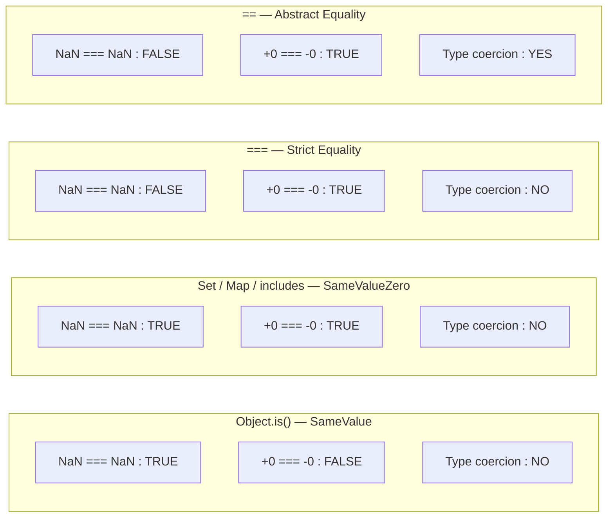

# 02 — Type System Deep Dive
### 20 Questions | Intermediate to Advanced

---

**Q1. What are all the primitive types in JavaScript? How is `typeof` not the complete picture?** — Medium

**Answer:**
JavaScript has 8 primitive types (as of ES2020):

1. `undefined`
2. `null`
3. `boolean` — `true`, `false`
4. `number` — double-precision 64-bit float (IEEE 754)
5. `string`
6. `symbol` (ES2015)
7. `bigint` (ES2020)
8. `object` — NOT a primitive, but the 8th type in the spec's type system

Everything else is an object — arrays, functions, dates, regex, maps, etc.

`typeof` is not the complete picture because:
- `typeof null` returns `"object"` (historical bug)
- `typeof function(){}` returns `"function"` — but functions ARE objects
- `typeof []` returns `"object"` — arrays are objects
- `typeof NaN` returns `"number"` — NaN is technically a number type

Better type checking:
```js
// For exact runtime type:
Object.prototype.toString.call(value);
// Returns: "[object Null]", "[object Array]", "[object Date]", "[object RegExp]", etc.

// Specific checks:
Array.isArray(value);
value instanceof Date;
typeof value === "bigint";
typeof value === "symbol";
Number.isNaN(value);      // true only for actual NaN, not coerced
Number.isFinite(value);   // true only for finite numbers
```

**Spec Reference:** ECMAScript section 6 — ECMAScript Data Types and Values

**Follow-up:** What is the difference between a primitive value and a primitive wrapper object?

When you access a property on a primitive (like `"hello".length`), JS temporarily wraps the primitive in its wrapper object (`String`, `Number`, `Boolean`, `BigInt`, `Symbol`) to perform the property lookup, then discards the wrapper. You can create these wrappers explicitly with `new String("hello")`, but that is bad practice — the result is an object, not a primitive, so `typeof new String("hello")` is `"object"` and `new String("hello") === new String("hello")` is `false`.

**GOTCHA:** `Object(value)` wraps a primitive in its wrapper object. `Object.is(NaN, NaN)` returns `true` unlike `===`. `Object.is(+0, -0)` returns `false` unlike `===`. These are the two cases where `Object.is` (SameValue algorithm) differs from strict equality.

---

**Q2. What is the ToPrimitive abstract operation and how does type coercion actually work?** — Hard

**Answer:**
ToPrimitive is a spec-level algorithm that converts an object to a primitive value. It is invoked automatically whenever an object is used in a context expecting a primitive (addition, comparison, string concatenation, etc.).

ToPrimitive(input, preferredType):
- If `input` is already a primitive, return it unchanged.
- Otherwise, call the `@@toPrimitive` method if it exists (`[Symbol.toPrimitive]`).
- Otherwise, based on `preferredType` ("default", "number", "string"):
  - For "number" hint: try `valueOf()` first, then `toString()`
  - For "string" hint: try `toString()` first, then `valueOf()`
  - "default" behaves like "number" for most built-in objects

```js
const obj = {
  valueOf()  { return 42; },
  toString() { return "forty-two"; }
};

+obj;           // 42 — "number" hint, valueOf() called first
`${obj}`;       // "forty-two" — "string" hint, toString() called first
obj + "";       // "42" — "default" hint, valueOf() called first, then stringified
```

Customizing with `Symbol.toPrimitive`:
```js
const temp = {
  celsius: 100,
  [Symbol.toPrimitive](hint) {
    if (hint === "number") return this.celsius;
    if (hint === "string") return `${this.celsius}°C`;
    return this.celsius; // default
  }
};

+temp;       // 100
`${temp}`;   // "100°C"
temp + "";   // "100"
```

**Spec Reference:** ECMAScript section 7.1.1 — ToPrimitive

**GOTCHA:** Arrays have a `toString()` that joins elements with commas: `[1,2,3].toString()` is `"1,2,3"`. Their `valueOf()` returns the array itself (an object), so ToPrimitive falls back to `toString()`. This is why `[] + []` is `""` and `[] + {}` is `"[object Object]"`.

---

**Q3. What is the ToNumber abstract operation? Show the full conversion table.** — Hard

**Answer:**
ToNumber converts any value to a number. It is called by arithmetic operators, unary `+`, `Number()`, etc.

| Input | Result |
|---|---|
| `undefined` | `NaN` |
| `null` | `0` |
| `true` | `1` |
| `false` | `0` |
| `""` | `0` |
| `" "` (whitespace) | `0` |
| `"42"` | `42` |
| `"42abc"` | `NaN` |
| `"0x1F"` | `31` (hex parsed) |
| `"Infinity"` | `Infinity` |
| `[]` | `0` (via `ToPrimitive` -> `""` -> `0`) |
| `["3"]` | `3` (via `ToPrimitive` -> `"3"` -> `3`) |
| `["3","4"]` | `NaN` (via `ToPrimitive` -> `"3,4"` -> NaN) |
| `{}` | `NaN` (via `ToPrimitive` -> `"[object Object]"` -> NaN) |
| `null` | `0` |

```js
Number(undefined); // NaN
Number(null);      // 0
Number(true);      // 1
Number(false);     // 0
Number("");        // 0
Number("  ");      // 0 — whitespace-only string becomes 0
Number("42abc");   // NaN
Number([]);        // 0
Number([3]);       // 3
Number([3,4]);     // NaN
```

**Spec Reference:** ECMAScript section 7.1.4 — ToNumber

**Follow-up:** Why does `Number(null)` return `0` but `Number(undefined)` return `NaN`?

The spec defines it this way by design. `null` was meant to represent an intentional "empty value" that should convert to 0 (analogous to false in many contexts). `undefined` represents "not initialized" — converting it to a number has no meaningful value, so `NaN` (Not a Number) is appropriate.

**GOTCHA:** `parseInt("42abc")` returns `42` — it stops at the first non-numeric character. `Number("42abc")` returns `NaN` — it requires the entire string to be numeric. These behave very differently and are often confused.

---

**Q4. What is the ToString abstract operation for each type?** — Medium

**Answer:**
ToString converts any value to a string. Called by string concatenation, template literals, `String()`, `.toString()`, etc.

| Input | Result |
|---|---|
| `undefined` | `"undefined"` |
| `null` | `"null"` |
| `true` | `"true"` |
| `false` | `"false"` |
| `0` | `"0"` |
| `-0` | `"0"` (note: `-0` loses its sign!) |
| `NaN` | `"NaN"` |
| `Infinity` | `"Infinity"` |
| `42` | `"42"` |
| objects | calls ToPrimitive with "string" hint |

```js
String(-0);        // "0" — -0 loses sign when stringified
String(undefined); // "undefined"
String(null);      // "null"

// Objects:
String([1,2,3]);   // "1,2,3" — Array.toString() joins with comma
String({});        // "[object Object]"
String(new Date()); // Human-readable date string — Date overrides toString
```

Template literals: `${expr}` calls `ToString(ToPrimitive(expr))`.

**Spec Reference:** ECMAScript section 7.1.17 — ToString

**GOTCHA:** `-0` and `0` are stringified identically: `String(-0) === "0"`. But `JSON.stringify(-0)` returns `"0"` as well. And `Object.is(-0, 0)` is `false`. To detect `-0`, use `Object.is(x, -0)` or `1/x === -Infinity`.

---

**Q5. What is the ToBoolean abstract operation? What are all the falsy values?** — Easy

**Answer:**
ToBoolean converts a value to a boolean. Called by `if` conditions, logical operators, `Boolean()`, `!!`.

There are exactly 8 falsy values in JavaScript — everything else is truthy:

| Falsy Value | Notes |
|---|---|
| `false` | The boolean false |
| `0` | Numeric zero |
| `-0` | Negative zero |
| `0n` | BigInt zero |
| `""` | Empty string (length 0) |
| `null` | The null value |
| `undefined` | The undefined value |
| `NaN` | Not a Number |

Everything else is truthy, including:
- `"0"` (non-empty string — truthy!)
- `"false"` (non-empty string — truthy!)
- `[]` (empty array — truthy!)
- `{}` (empty object — truthy!)
- `function(){}` (function — truthy!)
- `-1` (negative number other than -0 — truthy!)

```js
Boolean(0);         // false
Boolean("0");       // true — "0" is not an empty string
Boolean([]);        // true — arrays are always truthy
Boolean("");        // false
Boolean(null);      // false
Boolean(undefined); // false
Boolean(NaN);       // false

// Common mistake:
if ([]) { console.log("truthy!"); } // logs "truthy!" — empty array is truthy
if ("false") { console.log("truthy!"); } // logs "truthy!" — non-empty string
```

**Spec Reference:** ECMAScript section 7.1.2 — ToBoolean

**GOTCHA:** `[]` and `{}` are both truthy, even when empty. This surprises almost everyone. The only way to get a falsy from an empty array via loose comparison is `[] == false` (which is true due to coercion through ToPrimitive and ToNumber), but `if ([])` is always truthy.

---

**Q6. What is SameValue, SameValueZero, and Abstract Equality? When is each used?** — Hard

**Answer:**
These are three different equality algorithms defined in the ECMAScript spec, used in different contexts.

SameValue (used by `Object.is()`):
- Treats `+0` and `-0` as different
- Treats `NaN` as equal to `NaN`
- Otherwise identical to `===`
```js
Object.is(NaN, NaN);  // true
Object.is(+0, -0);    // false
Object.is(1, 1);      // true
```

SameValueZero (used by `Map`, `Set`, `Array.prototype.includes`, `Array.prototype.indexOf`-like in Set):
- `+0` and `-0` are treated as EQUAL (unlike SameValue)
- `NaN` is equal to `NaN` (unlike `===`)
```js
const s = new Set([NaN, +0]);
s.has(NaN);  // true — SameValueZero
s.has(-0);   // true — +0 and -0 are same in SameValueZero

[NaN].includes(NaN); // true — uses SameValueZero
[NaN].indexOf(NaN);  // -1 — indexOf uses strict equality (===)
```

Abstract Equality (used by `==`):
- Performs type coercion per the complex coercion algorithm
- `null == undefined` is true
- `NaN == NaN` is false (even after coercion)

Strict Equality (used by `===`):
- No coercion
- `NaN !== NaN`
- `+0 === -0`



**Spec Reference:** ECMAScript section 7.2.10 — SameValue; 7.2.11 — SameValueZero; 7.2.14 — Abstract Equality

**GOTCHA:** `Array.prototype.indexOf` uses strict equality, so `[NaN].indexOf(NaN)` returns `-1`. But `[NaN].includes(NaN)` uses SameValueZero, returning `true`. This inconsistency in the standard library is a common interview question.

---

**Q7. How does JavaScript's number type work? What are its limitations?** — Medium

**Answer:**
JavaScript uses IEEE 754 double-precision floating-point (64-bit) for all numbers. This format has:
- 1 sign bit
- 11 exponent bits
- 52 mantissa (fraction) bits

Safe integer range:
```js
Number.MAX_SAFE_INTEGER; // 9007199254740991 (2^53 - 1)
Number.MIN_SAFE_INTEGER; // -9007199254740991
```

"Safe" means integers that can be represented exactly AND for which arithmetic produces correct results. Beyond this range, precision is lost:
```js
9007199254740992 === 9007199254740993; // true — they round to the same float!
```

Floating-point imprecision:
```js
0.1 + 0.2;     // 0.30000000000000004 — NOT 0.3
0.1 + 0.2 === 0.3; // false
```
This is not a JS bug — it is fundamental to IEEE 754 binary floating-point. Most numbers cannot be represented exactly in binary. The fix:
```js
Math.abs(0.1 + 0.2 - 0.3) < Number.EPSILON; // true — compare within tolerance
```

Special values:
- `Infinity`, `-Infinity`: Produced by division by zero, overflow
- `NaN`: Not a Number — produced by `0/0`, `Math.sqrt(-1)`, invalid string conversion
- `-0`: Negative zero — preserves sign of very small negative numbers. Equals `0` with `===`.

**Follow-up:** When do you need BigInt?

When working with integers beyond `Number.MAX_SAFE_INTEGER` — such as cryptography, finance, or working with 64-bit IDs from systems like Twitter snowflake IDs. BigInt cannot be mixed with regular numbers in arithmetic without explicit conversion.

**GOTCHA:** `Number.isInteger(1.0)` returns `true` — `1.0` and `1` are the same floating-point value in JS. `Number.isInteger(1.0000000000000001)` also returns `true` because that value rounds to `1` in IEEE 754.

---

**Q8. What is NaN and how should you check for it?** — Easy

**Answer:**
NaN stands for "Not a Number" and is a special numeric value in IEEE 754 that represents an undefined or unrepresentable numeric result. Despite its name, `typeof NaN === "number"` — it is part of the number type.

NaN is produced by:
- Invalid arithmetic: `0 / 0`, `Math.sqrt(-1)`, `Infinity - Infinity`
- Parsing failures: `Number("abc")`, `parseInt("xyz")`
- Operations involving NaN: `NaN + 1` is NaN, `NaN * 0` is NaN

NaN's defining property: `NaN !== NaN` — it is the only value in JavaScript not equal to itself.

How to check for NaN correctly:

```js
const x = NaN;

// Wrong:
x === NaN;          // false — NaN is never equal to NaN
x == NaN;           // false — same reason

// Risky — do not use the global isNaN():
isNaN("hello");     // true — isNaN coerces its argument to number first!
isNaN(undefined);   // true — undefined becomes NaN, so isNaN returns true

// Correct — use Number.isNaN():
Number.isNaN(NaN);       // true — no coercion, strict check
Number.isNaN("hello");   // false — "hello" is not NaN, it is a string
Number.isNaN(undefined); // false — undefined is not NaN

// Also correct:
Object.is(x, NaN);  // true — SameValue algorithm
x !== x;            // true — the NaN self-inequality trick
```

**Spec Reference:** ECMAScript section 6.1.6 — The Number Type (IEEE 754 NaN)

**GOTCHA:** The global `isNaN()` function coerces its argument to a number before checking. `isNaN("hello")` is `true` because `Number("hello")` is `NaN`. This is a frequent source of bugs. Always use `Number.isNaN()` in modern code.

---

**Q9. What is BigInt and how does it interact with regular numbers?** — Medium

**Answer:**
BigInt is a primitive type introduced in ES2020 for representing integers of arbitrary precision. It is denoted with an `n` suffix or created with `BigInt()`.

```js
const big = 9007199254740993n; // One more than MAX_SAFE_INTEGER
const fromNum = BigInt(42);    // 42n

typeof 42n; // "bigint"
```

Key rules for BigInt:
- Cannot be mixed with regular numbers in arithmetic — must explicitly convert:
```js
42n + 1;            // TypeError: Cannot mix BigInt and other types
42n + BigInt(1);    // 43n — OK
Number(42n) + 1;    // 43 — convert BigInt to Number (may lose precision)
```
- No fractional BigInt values: `5n / 2n` is `2n` (truncated, not `2.5n`)
- No `Math` methods work with BigInt: `Math.sqrt(9n)` throws TypeError
- JSON does not support BigInt: `JSON.stringify(42n)` throws TypeError
- Comparisons with regular numbers use abstract equality coercion:
```js
42n == 42;  // true — abstract equality coerces
42n === 42; // false — different types, strict equality
42n > 41;   // true — relational comparisons work
```

Use cases:
- Cryptography (large prime numbers)
- Financial calculations requiring exact integer precision
- Working with 64-bit IDs from APIs
- High-precision timestamp arithmetic

**GOTCHA:** `BigInt` values cannot be used with `JSON.stringify` directly. You must convert them: `JSON.stringify({ id: user.id.toString() })`. This is a common issue when working with database IDs that arrive as BigInt.

---

**Q10. What is type coercion in the `+` operator and why is it asymmetric?** — Hard

**Answer:**
The `+` operator is asymmetric — it serves as both numeric addition and string concatenation. The algorithm checks whether either operand, after ToPrimitive conversion, is a string. If yes, both are converted to strings and concatenated. Otherwise, both are converted to numbers and added.

This is called the "addition algorithm" in the spec and differs from all other arithmetic operators which always use ToNumber.

```js
// String concatenation wins when either side is a string after coercion:
1 + "2";       // "12" — number coerced to string
"3" + 4;       // "34"
[] + [];       // "" — both ToPrimitive to "", then concat
[] + {};       // "[object Object]" — [] -> "", {} -> "[object Object]", concat
{} + [];       // 0 — DIFFERENT! {} is parsed as empty block, then +[] = +([] = 0)
true + true;   // 2 — both ToNumber: 1+1
true + "1";    // "true1" — true ToNumber is skipped because other side is string hint

// Other arithmetic operators ALWAYS use ToNumber:
"5" - 2;       // 3 — string coerced to number
"5" * "3";     // 15 — both strings coerced to numbers
"5" ** 2;      // 25
true * false;  // 0
```

**Spec Reference:** ECMAScript section 13.15.3 — ApplyStringOrNumericBinaryOperator

**Follow-up:** Why does `{} + []` return `0` in some contexts but `"[object Object]"` in others?

When `{} + []` appears as a statement (not inside an expression context), the `{}` is parsed as an empty block statement, not an object literal. The statement becomes: (empty block) followed by (`+[]`). The unary `+` on `[]` calls `ToNumber([])`, which calls `ToPrimitive([])`, which gives `""`, and `Number("") === 0`. In expression context (`x = {} + []`), `{}` is parsed as an object literal, so it becomes `ToPrimitive({}) + ToPrimitive([])` = `"[object Object]" + ""` = `"[object Object]"`.

**GOTCHA:** All arithmetic operators except `+` are purely numeric. `"10" - 5` = `5` because `-` has no string mode. This is why `someVar - 0` is a common (but ugly) pattern for coercing to number — it avoids the ambiguity of `+`.

---

**Q11. What does `Object.prototype.toString.call(value)` return for each type?** — Medium

**Answer:**
`Object.prototype.toString` uses the `[Symbol.toStringTag]` internal slot (or hardcoded type tags) to produce a precise type string. It is the most reliable way to get the exact type of any value.

```js
Object.prototype.toString.call(undefined);     // "[object Undefined]"
Object.prototype.toString.call(null);          // "[object Null]"
Object.prototype.toString.call(true);          // "[object Boolean]"
Object.prototype.toString.call(42);            // "[object Number]"
Object.prototype.toString.call("hello");       // "[object String]"
Object.prototype.toString.call(Symbol());      // "[object Symbol]"
Object.prototype.toString.call(42n);           // "[object BigInt]"
Object.prototype.toString.call({});            // "[object Object]"
Object.prototype.toString.call([]);            // "[object Array]"
Object.prototype.toString.call(function(){});  // "[object Function]"
Object.prototype.toString.call(new Date());    // "[object Date]"
Object.prototype.toString.call(/regex/);       // "[object RegExp]"
Object.prototype.toString.call(new Map());     // "[object Map]"
Object.prototype.toString.call(new Set());     // "[object Set]"
Object.prototype.toString.call(new WeakMap()); // "[object WeakMap]"
Object.prototype.toString.call(new Promise(()=>{})); // "[object Promise]"
Object.prototype.toString.call(new Int32Array()); // "[object Int32Array]"
```

Custom `toStringTag`:
```js
class MyCollection {
  get [Symbol.toStringTag]() { return "MyCollection"; }
}
Object.prototype.toString.call(new MyCollection()); // "[object MyCollection]"
```

**Follow-up:** Why do we use `Object.prototype.toString.call(x)` instead of just `x.toString()`?

Because `x.toString()` can be overridden by the object's prototype. `Array.prototype.toString` joins elements with commas. `Object.prototype.toString` on an array would give `[object Array]`, but `[1,2].toString()` gives `"1,2"`. By calling `Object.prototype.toString.call(x)`, we bypass the object's own `.toString()` method and use the base implementation.

**GOTCHA:** `Symbol.toStringTag` can be set on any object to customize what `Object.prototype.toString` returns. This means you cannot fully trust `[object ...]` strings for type checking unless you control the code — user code can fake any tag.

---

**Q12. What is type coercion with relational operators (`<`, `>`, `<=`, `>=`)?** — Medium

**Answer:**
Relational operators always attempt numeric comparison UNLESS both operands are strings, in which case they do lexicographic (character code) comparison.

The algorithm:
1. Call ToPrimitive on both sides with "number" hint.
2. If both results are strings: compare lexicographically using Unicode code points.
3. Otherwise: call ToNumber on both and compare numerically.

```js
// Numeric comparison:
5 > "3";         // true — "3" becomes 3, then 5 > 3
"10" > "9";      // false — both strings, "1" < "9" lexicographically
"10" > 9;        // true — one is a number, so "10" becomes 10, then 10 > 9

// The string comparison trap:
["10", "9", "100"].sort(); // ["10", "100", "9"] — lexicographic by default

// Object coercion:
[3] > [2];       // true — ToPrimitive: "3" > "2" — wait, but these become numbers?
                 // ToPrimitive([3]) -> "3", ToPrimitive([2]) -> "2"
                 // Both strings -> lexicographic: "3" > "2" -> true (but accidentally numeric here)

[10] > [9];      // true, because "10" > "9" fails lexicographically? No:
                 // "10" > "9" -> "1" vs "9" -> char code 49 < 57 -> false!
[10] > [9];      // Actually false — "10" lexicographically < "9"
```

**Spec Reference:** ECMAScript section 13.11 — Relational Operators

**GOTCHA:** `"10" < "9"` is `true` — because lexicographically, "1" (char code 49) comes before "9" (char code 57). This is why `[10, 9, 100].sort()` gives `[10, 100, 9]` — always pass a comparator to `.sort()` for numeric sorting: `.sort((a, b) => a - b)`.

---

**Q13. What is the `in` operator and how does it differ from `hasOwnProperty`?** — Easy

**Answer:**
The `in` operator checks whether a property name exists on an object OR anywhere in its prototype chain. It returns `true` for inherited properties.

`Object.hasOwn(obj, prop)` (or the older `obj.hasOwnProperty(prop)`) checks only the object's own properties — not inherited ones.

```js
const parent = { inherited: true };
const child = Object.create(parent);
child.own = true;

"own" in child;           // true — own property
"inherited" in child;     // true — inherited through prototype chain
"missing" in child;       // false

Object.hasOwn(child, "own");          // true
Object.hasOwn(child, "inherited");    // false — inherited, not own
child.hasOwnProperty("inherited");    // false — same as above (deprecated form)

// Also works for array indices:
"0" in [1, 2, 3];   // true — index 0 exists
1 in [1, 2, 3];     // true — numeric index (auto-converted to string)
```

The `in` operator also works with `for...in` semantics — it finds everything `for...in` would iterate.

**Follow-up:** Why use `Object.hasOwn()` instead of `obj.hasOwnProperty()`?

`Object.hasOwn` was introduced in ES2022 as a safer alternative. `obj.hasOwnProperty()` can fail if:
- The object was created with `Object.create(null)` (no prototype, so no `hasOwnProperty` method)
- Someone has overridden `hasOwnProperty` on the object itself

`Object.hasOwn` is always safe because it calls the spec-level check directly.

**GOTCHA:** The `in` operator works with class private fields — but with `#` syntax: `#field in obj`. This lets you safely check if a private field exists on an object without try/catch.

---

**Q14. What is the `instanceof` operator and how does it work internally?** — Medium

**Answer:**
`instanceof` checks whether a constructor's `prototype` property exists anywhere in an object's `[[Prototype]]` chain.

The algorithm:
1. Get `Constructor.prototype`.
2. Get the object's `[[Prototype]]` chain.
3. Walk the chain — if `Constructor.prototype` is found, return `true`. If chain ends at `null`, return `false`.

```js
class Animal {}
class Dog extends Animal {}

const rex = new Dog();

rex instanceof Dog;     // true — Dog.prototype is in rex's chain
rex instanceof Animal;  // true — Animal.prototype is also in the chain
rex instanceof Object;  // true — Object.prototype is at the root of every chain
```

Customizing `instanceof` with `Symbol.hasInstance`:
```js
class EvenNumbers {
  static [Symbol.hasInstance](value) {
    return Number.isInteger(value) && value % 2 === 0;
  }
}

4 instanceof EvenNumbers;  // true — custom check
3 instanceof EvenNumbers;  // false
```

**Follow-up:** When does `instanceof` give wrong results?

Two major failure cases:
1. Across iframes/realms: An array created in an iframe has `Array.prototype` from THAT iframe. `arr instanceof Array` from the parent frame returns `false`. Use `Array.isArray()` which is realm-agnostic.
2. After prototype manipulation: `Dog.prototype = {}; rex instanceof Dog` returns `false` even though `rex` was created as a `Dog`.

**GOTCHA:** `instanceof` does NOT check the constructor property on the object. It checks the prototype chain. This means renaming or replacing the constructor function's `prototype` property will break `instanceof` checks on previously created instances.

---

**Q15. What is type coercion in equality checks? Walk through `[] == ![]`.** — Hard

**Answer:**
`[] == ![]` evaluating to `true` is one of the most famous JavaScript coercion quirks. Here is the full step-by-step:

Step 1: Evaluate `![]`
- `!` applies `ToBoolean` first: `ToBoolean([])` is `true` (arrays are always truthy)
- `!true` is `false`
- Left side: `[]`, Right side: `false`

Step 2: Apply abstract equality: `[] == false`
- Right side is a boolean — spec says: convert boolean to number first
- `ToNumber(false)` is `0`
- Now: `[] == 0`

Step 3: Apply abstract equality: `[] == 0`
- Left side is an object — spec says: call `ToPrimitive([])`
- `ToPrimitive([])` tries `valueOf()`: `[].valueOf()` returns `[]` (still an object)
- Falls back to `toString()`: `[].toString()` returns `""`
- Now: `"" == 0`

Step 4: Apply abstract equality: `"" == 0`
- One is string, other is number — spec says: convert string to number
- `ToNumber("")` is `0`
- Now: `0 == 0`

Step 5: Both same type — `0 === 0` is `true`. Result: `true`.

```js
[] == ![];  // true — the full coercion chain above
```

This perfectly illustrates why `===` should be the default. Each step is individually logical by the spec rules, but the overall result is deeply counterintuitive.

**Spec Reference:** ECMAScript section 7.2.14 — Abstract Equality Comparison

**GOTCHA:** There are many such coercion surprises: `null == 0` is `false` (null only equals `undefined`), `"" == 0` is `true`, `" " == 0` is `true` (whitespace string converts to 0). The rule of thumb: never use `==` unless you specifically need `null == undefined` to be true.

---

**Q16. What is the difference between loose and strict property access — own vs enumerable vs configurable?** — Medium

**Answer:**
Every property on a JavaScript object has a property descriptor with attributes that control its behavior.

For data properties:
- `value`: The stored value
- `writable`: If `false`, assignment to this property in strict mode throws TypeError; in sloppy mode, it silently fails
- `enumerable`: If `false`, the property does not show up in `for...in`, `Object.keys()`, `JSON.stringify()`, or spread
- `configurable`: If `false`, the property descriptor itself cannot be changed, and the property cannot be deleted

For accessor properties (getter/setter):
- `get`: The getter function
- `set`: The setter function
- `enumerable` and `configurable` same as above

```js
const obj = {};

Object.defineProperty(obj, "x", {
  value: 42,
  writable: false,    // cannot reassign
  enumerable: false,  // hidden from iteration
  configurable: false // cannot redefine or delete
});

obj.x;              // 42 — readable
obj.x = 99;         // Silent fail (sloppy), TypeError (strict)
Object.keys(obj);   // [] — x is non-enumerable
delete obj.x;       // false — cannot delete non-configurable
JSON.stringify(obj); // "{}" — x not in output

// But it IS still accessible:
obj.x;                              // 42
Object.getOwnPropertyDescriptor(obj, "x"); // shows the descriptor
Object.getOwnPropertyNames(obj);    // ["x"] — includes non-enumerable own props
```

Operations and what they respect:
- `Object.keys()`: own, enumerable only
- `Object.getOwnPropertyNames()`: own, ALL (including non-enumerable)
- `for...in`: own AND inherited, enumerable only
- `Reflect.ownKeys()`: own, ALL, including Symbols

**GOTCHA:** When you spread an object (`{ ...obj }`), only own, enumerable properties are copied — non-enumerable and Symbol keys are skipped. This can cause silent data loss when spreading objects with hidden properties.

---

**Q17. What is the difference between `Object.freeze`, `Object.seal`, and `Object.preventExtensions`?** — Medium

**Answer:**
These three methods offer different levels of object immutability.

`Object.preventExtensions(obj)`:
- Prevents new properties from being added to the object.
- Existing properties can still be modified or deleted.
- `Object.isExtensible(obj)` returns `false`.

`Object.seal(obj)`:
- Calls `preventExtensions` AND marks all existing properties as `configurable: false`.
- Existing properties can still be MODIFIED (if `writable: true`), but cannot be deleted or have their descriptors changed.
- `Object.isSealed(obj)` returns `true`.

`Object.freeze(obj)`:
- Calls `seal` AND marks all existing data properties as `writable: false`.
- No additions, no deletions, no modifications.
- `Object.isFrozen(obj)` returns `true`.

```js
const obj = { x: 1, nested: { y: 2 } };

Object.freeze(obj);

obj.x = 99;          // Silent fail (sloppy), TypeError (strict)
obj.z = 3;           // Silent fail (sloppy), TypeError (strict)
delete obj.x;        // Silent fail (sloppy), TypeError (strict)
obj.x;               // Still 1

// ALL THREE ARE SHALLOW:
obj.nested.y = 999;  // WORKS — freeze is shallow
obj.nested;          // { y: 999 } — nested object was NOT frozen
```

Deep freeze:
```js
function deepFreeze(obj) {
  Object.getOwnPropertyNames(obj).forEach(name => {
    const value = obj[name];
    if (value && typeof value === "object") deepFreeze(value);
  });
  return Object.freeze(obj);
}
```

**Follow-up:** How do you make a truly immutable data structure?

Use `deepFreeze` for static config objects. For application state, prefer immutable patterns with spread operators or libraries like Immer, which use structural sharing (only changed parts are new objects, shared parts remain the same reference).

**GOTCHA:** Frozen objects can still be modified via prototype chain manipulation. If you freeze `obj` but `obj.__proto__` is not frozen, adding a property to the prototype makes it appear on `obj` via lookup. This is rarely a practical issue but is worth knowing for security-sensitive code.

---

**Q18. What is the difference between a primitive and a boxed object? Why does `.toString()` work on a string primitive?** — Medium

**Answer:**
Primitive values (`string`, `number`, `boolean`, `bigint`, `symbol`) are not objects — they have no properties or methods. Yet you can call methods on them: `"hello".toUpperCase()`. This works through a process called auto-boxing (or wrapping).

When you access a property or method on a primitive, JS:
1. Creates a temporary wrapper object (String, Number, Boolean, BigInt, Symbol)
2. Performs the property lookup on that wrapper object
3. Returns the result
4. Discards the temporary wrapper object

```js
"hello".toUpperCase();
// Internally: (new String("hello")).toUpperCase()
// The wrapper is discarded immediately after — it is never stored

// You can explicitly create wrapper objects (but do not do this):
const strObj = new String("hello");
typeof strObj;       // "object" — not "string"
strObj === "hello";  // false — different types
strObj == "hello";   // true — abstract equality coerces
```

Implications:
```js
const s = "hello";
s.custom = "value"; // No error, but this is set on the temporary wrapper, then discarded
s.custom;           // undefined — the property is gone
```

**Follow-up:** Why is `new String("hello")` bad practice?

Because it creates an object, not a primitive. Strict equality with a string literal fails. `if (new String(""))` is truthy (objects are always truthy), so even an empty wrapped string passes an `if` check. Libraries and comparison functions may behave unexpectedly.

**GOTCHA:** `Symbol("key")` and `new Symbol("key")` — wait, `new Symbol()` throws a TypeError. Symbols cannot be constructed with `new`. This is a deliberate design choice to prevent accidental creation of wrapper Symbol objects.

---

**Q19. What is `Object.is()` and when should you use it over `===`?** — Medium

**Answer:**
`Object.is(a, b)` implements the SameValue algorithm — it is like `===` but with two critical differences:

1. `Object.is(NaN, NaN)` returns `true` (unlike `===` which returns `false`)
2. `Object.is(+0, -0)` returns `false` (unlike `===` which returns `true`)

```js
// === behavior:
NaN === NaN;  // false
+0 === -0;    // true

// Object.is behavior:
Object.is(NaN, NaN);  // true
Object.is(+0, -0);    // false

// Everything else is the same as ===:
Object.is(1, 1);          // true
Object.is("a", "a");      // true
Object.is({}, {});         // false — reference equality for objects
Object.is(null, null);     // true
Object.is(undefined, undefined); // true
```

When to use `Object.is`:
- When you specifically need to distinguish `+0` from `-0` (e.g., physics simulations, signed zero semantics)
- When you need to check if a value is exactly `NaN` (instead of `Number.isNaN`)
- In polyfills or utilities implementing spec-level equality

React uses `Object.is` for its state comparison in hooks — `useState` uses it to decide whether a state update should trigger a re-render. This is why setting state to `NaN` twice does NOT trigger a re-render (NaN is considered equal to itself by `Object.is`).

**GOTCHA:** `Object.is` does not do deep equality. `Object.is({a:1}, {a:1})` is `false` — they are different object references. For deep equality, use `structuredClone` comparison or a library.

---

**Q20. How does implicit type coercion work in logical operators (`&&`, `||`, `??`)?** — Medium

**Answer:**
Logical operators in JavaScript do not simply return `true` or `false` — they return one of the actual operand values. They are "short-circuit" operators.

`||` (OR):
- Returns the first truthy value, or the last value if all are falsy.
- Short-circuits: if left side is truthy, right side is never evaluated.
```js
"hello" || "default";  // "hello" — first truthy
"" || "default";       // "default" — "" is falsy
null || 0 || "";       // "" — all falsy, returns last
false || null || "ok"; // "ok" — first truthy
```

`&&` (AND):
- Returns the first falsy value, or the last value if all are truthy.
- Short-circuits: if left side is falsy, right side is never evaluated.
```js
"hello" && "world";   // "world" — all truthy, returns last
"" && "world";        // "" — first falsy, short-circuits
1 && 2 && 3;          // 3 — all truthy, returns last
null && sideEffect(); // null — sideEffect is never called
```

`??` (Nullish Coalescing, ES2020):
- Returns the right side only if the left side is `null` or `undefined` (nullish).
- Unlike `||`, does NOT trigger on other falsy values like `0`, `""`, `false`.
```js
0 || "default";   // "default" — 0 is falsy, || triggers
0 ?? "default";   // 0 — 0 is not null/undefined, ?? does not trigger

null ?? "default";      // "default"
undefined ?? "default"; // "default"
false ?? "default";     // false — false is not nullish
"" ?? "default";        // "" — empty string is not nullish
```

```js
// Common pattern before ??: default parameter simulation (WRONG):
function greet(name) {
  name = name || "World"; // Bug: if name is "" or 0, it becomes "World"
}

// Correct with ??:
function greet(name) {
  name = name ?? "World"; // Only replaces null or undefined
}
```

**Spec Reference:** ECMAScript section 13.13 — Binary Logical Operators

**GOTCHA:** `&&` and `||` cannot be mixed with `??` without explicit parentheses — doing so is a SyntaxError to prevent ambiguous expressions: `a || b ?? c` throws SyntaxError. Write `(a || b) ?? c` or `a || (b ?? c)` explicitly.

---

*Next: [03-ES6-Plus-Features.md](./03-ES6-Plus-Features.md)*
