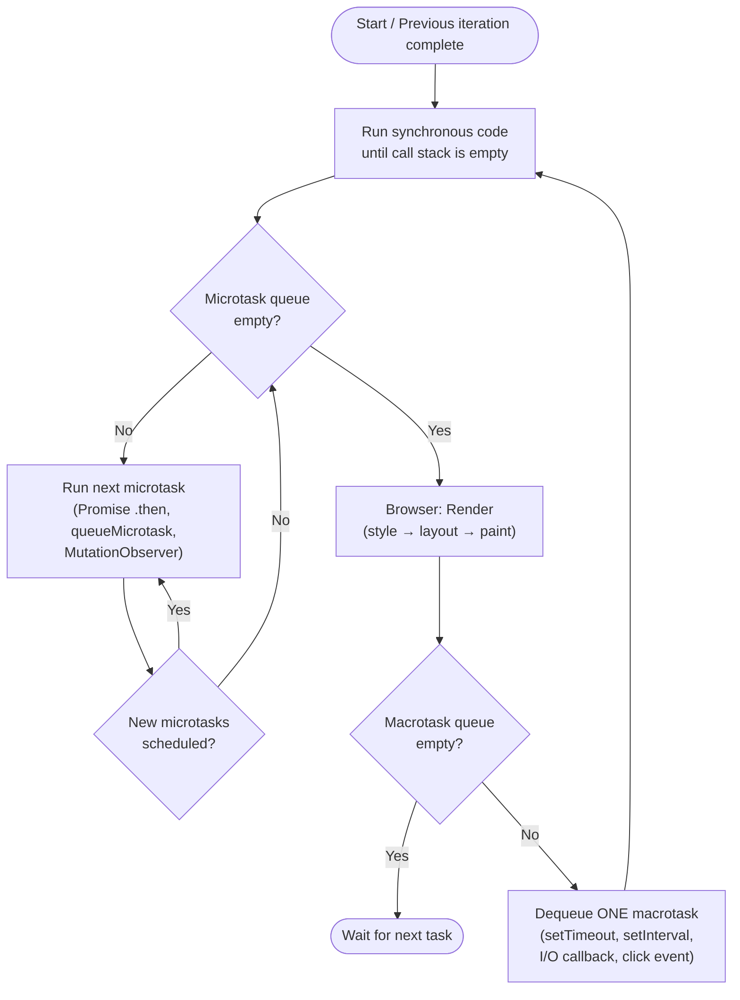
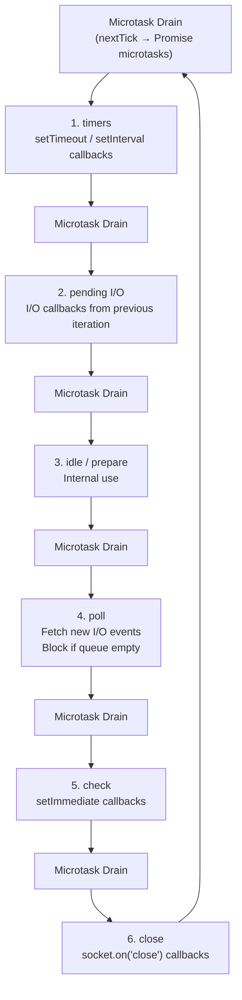
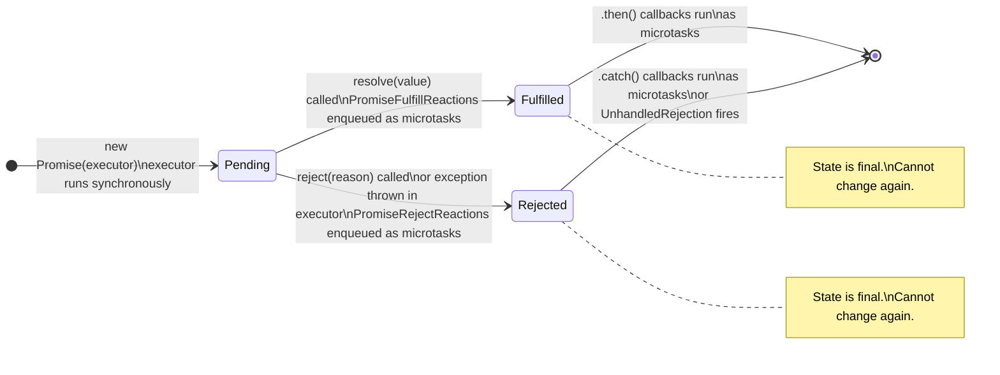

# 05 — Advanced Async & Event Loop
### 25 Questions | Advanced

---

**Q1. What is the exact order of microtask vs macrotask execution? Show a complex example.** — Hard

**Answer:**
The event loop processes tasks in this exact order per iteration:



```js
console.log("1");

setTimeout(() => console.log("2 - macrotask A"), 0);

Promise.resolve()
  .then(() => {
    console.log("3 - microtask 1");
    setTimeout(() => console.log("4 - macrotask B"), 0);
    return Promise.resolve();
  })
  .then(() => console.log("5 - microtask 2"));

queueMicrotask(() => console.log("6 - microtask 3"));

setTimeout(() => console.log("7 - macrotask C"), 0);

console.log("8");

// Output:
// 1          — sync
// 8          — sync
// 3 - microtask 1   — microtask queue drained (microtask 1 runs)
// 6 - microtask 3   — microtask queue (scheduled concurrently with microtask 1)
// 5 - microtask 2   — microtask 2 was scheduled BY microtask 1's .then return
// 2 - macrotask A   — first macrotask
// (microtask queue is empty after macrotask A)
// 7 - macrotask C   — second macrotask
// 4 - macrotask B   — macrotask B was scheduled INSIDE microtask 1, queued after A and C
```

**Spec Reference:** HTML Living Standard — Event Loop Processing Model

**Follow-up:** What if a microtask schedules another microtask infinitely?

The event loop never proceeds past step 2. No macrotasks run. No rendering happens. The tab freezes (in browsers) or the process is stuck (in Node.js). This is the async equivalent of an infinite loop.

**GOTCHA:** `setTimeout(fn, 0)` has a minimum delay of approximately 1ms in browsers (spec says at least 0ms but browsers enforce a minimum). More critically, it still must wait for all current microtasks to drain before it runs — regardless of how many microtasks there are.

---

**Q2. What is the Node.js event loop and how do its phases differ from the browser's?** — Hard

**Answer:**
Node.js uses the libuv library for its event loop, which has a more detailed, phase-based structure than the browser's model.

Node.js event loop phases (executed in order per iteration):


Between EACH of these phases (and after the poll phase), Node drains the microtask queues in this order:
1. `process.nextTick` callbacks (Node-specific — higher priority than promises)
2. Promise microtasks

```js
setImmediate(() => console.log("setImmediate"));    // check phase
setTimeout(() => console.log("setTimeout"), 0);     // timers phase
process.nextTick(() => console.log("nextTick"));     // before next phase
Promise.resolve().then(() => console.log("promise")); // microtask

// Output:
// nextTick  — process.nextTick drains before anything
// promise   — promise microtask drains
// setTimeout — timers phase (or setImmediate first — depends on when event loop starts)
// setImmediate — check phase
```

The `setTimeout(fn, 0)` vs `setImmediate` ordering is NOT guaranteed when called at the top level — it depends on whether the event loop has started or not. But inside an I/O callback, `setImmediate` ALWAYS runs before the next `setTimeout`:
```js
require("fs").readFile(__filename, () => {
  setTimeout(() => console.log("timeout"), 0);
  setImmediate(() => console.log("immediate"));
  // "immediate" always prints first here — guaranteed in I/O callback
});
```

**Follow-up:** When would you use `process.nextTick` vs `Promise.resolve().then`?

`process.nextTick` has higher priority — it runs before promise microtasks. Use it when you need something to run asynchronously but before any I/O or promise callbacks — like deferring error emission in an EventEmitter. But overuse of `nextTick` can starve I/O. Prefer `Promise.resolve().then()` for most async deferrals.

**GOTCHA:** `process.nextTick` is not part of the event loop phases — it runs between ANY phase transitions, including before the loop even starts. This makes it more powerful (and more dangerous) than `setTimeout(fn, 0)` or even `Promise` microtasks when it comes to priority.

---

**Q3. How does the Promise constructor executor run? Is it synchronous?** — Medium

**Answer:**
Yes — the executor function passed to `new Promise((resolve, reject) => { ... })` runs synchronously and immediately. Only the callbacks passed to `.then()`/`.catch()`/`.finally()` are scheduled as microtasks.

```js
console.log("before new Promise");

const p = new Promise((resolve, reject) => {
  console.log("executor runs synchronously"); // runs NOW
  resolve(42); // transitions state, schedules .then callbacks as microtasks
  console.log("after resolve — still synchronous");
});

p.then(v => console.log("then:", v)); // scheduled as microtask

console.log("after new Promise");

// Output:
// before new Promise
// executor runs synchronously
// after resolve — still synchronous
// after new Promise
// then: 42
```

This means exceptions thrown inside the executor are automatically caught and convert the promise to a rejected state:
```js
const p = new Promise((resolve, reject) => {
  throw new Error("executor error"); // caught, equivalent to reject(new Error(...))
});

p.catch(err => console.log(err.message)); // "executor error"
```

**Follow-up:** What is the difference between `Promise.resolve(value)` and wrapping in `new Promise`?

If `value` is already a promise, `Promise.resolve(value)` returns it directly (same reference). `new Promise(resolve => resolve(value))` creates a new promise that "follows" `value` — there is an extra microtask hop because of the "following" mechanism. This is why `await Promise.resolve(x)` and `await x` where `x` is a promise may differ by one microtask tick.

**GOTCHA:** Calling `resolve()` or `reject()` multiple times in the executor has no effect after the first call. The promise is settled on the first call and ignores subsequent ones. There is no error thrown — they are silently ignored. This can mask bugs where you accidentally resolve and reject in different code paths.

---

**Q4. What is `Promise.withResolvers()` and why was it added?** — Medium

**Answer:**
`Promise.withResolvers()` is a static method added in ES2024 that returns an object containing a promise along with its `resolve` and `reject` functions — avoiding the need to extract them from the executor.

```js
// Old pattern — extracting resolve/reject outside the executor:
let resolve, reject;
const promise = new Promise((res, rej) => {
  resolve = res;
  reject = rej;
});
// Now resolve and reject are usable from outside

// With Promise.withResolvers():
const { promise, resolve, reject } = Promise.withResolvers();
// Exactly the same result, cleaner syntax

// Practical use case — event-driven async:
function waitForClick(element) {
  const { promise, resolve } = Promise.withResolvers();
  element.addEventListener("click", resolve, { once: true });
  return promise;
}

// Another use case — exposing a promise to external controllers:
class AsyncOperation {
  constructor() {
    const { promise, resolve, reject } = Promise.withResolvers();
    this.result = promise;
    this._resolve = resolve;
    this._reject = reject;
  }

  complete(value) { this._resolve(value); }
  fail(reason) { this._reject(reason); }
}

const op = new AsyncOperation();
op.result.then(v => console.log("done:", v));
op.complete(42); // triggers: "done: 42"
```

**Spec Reference:** ECMAScript 2024 — Promise.withResolvers

**GOTCHA:** The old pattern of declaring `let resolve, reject` outside the `new Promise()` was sometimes called a "deferred" pattern. It was common enough that jQuery had `$.Deferred()`, and the community frequently requested this built-in. If you are in an environment without `Promise.withResolvers`, use the old extraction pattern — they are functionally identical.

---

**Q5. How does `async`/`await` desugaring work with multiple awaits?** — Hard

**Answer:**
An `async` function with multiple `await` expressions is desugared into a state machine — similar to a generator but driven by promises automatically. Each `await` is a suspension point that becomes a state in the machine.

```js
async function fetchUserAndOrders(userId) {
  const user = await fetchUser(userId);
  const orders = await fetchOrders(user.id);
  return { user, orders };
}
```

This desugars to approximately:
```js
function fetchUserAndOrders(userId) {
  // Returns a promise immediately
  return new Promise((resolve, reject) => {
    let _user;

    // State 0 — before first await:
    Promise.resolve(fetchUser(userId)).then(user => {
      _user = user;

      // State 1 — after first await, before second:
      return Promise.resolve(fetchOrders(_user.id));
    }).then(orders => {

      // State 2 — after second await:
      resolve({ user: _user, orders });
    }).catch(reject); // any unhandled rejection rejects the outer promise
  });
}
```

Each `await` adds one microtask hop — the continuation after `await` is scheduled as a `.then` callback. Multiple awaits mean multiple microtask hops even if all the promises are already resolved:

```js
async function threeHops() {
  await null; // hop 1
  await null; // hop 2
  await null; // hop 3
  console.log("3 microtask ticks later");
}
threeHops();
console.log("synchronous");
// Output: "synchronous", then "3 microtask ticks later"
```

**Follow-up:** What is the overhead of `await` in a tight loop?

Each `await` in a loop adds a microtask hop per iteration. In a loop running 10,000 iterations, that is 10,000 microtask enqueue/dequeue operations. For CPU-bound work in a tight loop, avoid `await` per iteration — batch the async work outside the loop.

**GOTCHA:** `await` on a non-promise value still introduces an async gap (at least one microtask tick). `await 42` is equivalent to `await Promise.resolve(42)`. This surprises people who think `await nonPromise` is a no-op — it is NOT synchronous.

---

**Q6. What is the difference between `return await promise` and `return promise` inside an async function?** — Hard

**Answer:**
This is a subtle but important distinction that affects error handling in `try/catch` blocks.

`return promise` (without `await`):
- The async function's promise "follows" the returned promise — it resolves/rejects when the returned promise does.
- The `try/catch` inside the async function does NOT catch rejections from the returned promise, because the function has already returned.

`return await promise` (with `await`):
- The async function suspends, waits for the promise to settle, then returns the result OR catches the rejection.
- The `try/catch` inside the async function DOES catch rejections, because the function is still "in scope" when the rejection occurs.

```js
async function withoutAwait() {
  try {
    return fetch("/bad-url"); // Returns immediately — try/catch does NOT apply to fetch rejection
  } catch (err) {
    console.log("caught:", err); // NEVER runs for fetch failure
  }
}

async function withAwait() {
  try {
    return await fetch("/bad-url"); // Suspends here — try/catch DOES apply
  } catch (err) {
    console.log("caught:", err); // Runs if fetch rejects
  }
}
```

The difference also appears in stack traces and error boundaries in frameworks.

```js
async function logAndReturn() {
  // With return await — the async function appears in the stack trace
  return await someAsyncOperation();
}

// Without await — the function already returned; it may not appear in the trace
async function logAndReturn2() {
  return someAsyncOperation();
}
```

**Follow-up:** Is `return await` always worth the extra microtask?

In `try/catch` blocks inside async functions, yes — `return await` is necessary for correct error handling. In simple pass-through functions with no error handling, `return promise` is fine and avoids one extra microtask tick.

**GOTCHA:** ESLint has a rule `no-return-await` that flags `return await` as unnecessary. This rule is often misconfigured — it is fine for simple cases but INCORRECT to disable `return await` inside `try/catch` blocks. The rule has exceptions for this exact scenario.

---

**Q7. How do you handle concurrent async operations without race conditions?** — Hard

**Answer:**
Race conditions in async code occur when multiple operations share state and the order of their completion determines correctness.

Pattern 1 — Request cancellation with AbortController:
```js
let currentController = null;

async function search(query) {
  // Cancel any in-flight search:
  currentController?.abort();
  currentController = new AbortController();

  try {
    const res = await fetch(`/search?q=${query}`, {
      signal: currentController.signal
    });
    const data = await res.json();
    renderResults(data); // Only reached if not aborted
  } catch (err) {
    if (err.name === "AbortError") return; // Expected — ignore
    throw err;
  }
}
```

Pattern 2 — Sequence tracking (for non-cancellable operations):
```js
let latestRequestId = 0;

async function fetchData(query) {
  const requestId = ++latestRequestId;
  const data = await fetch(`/api?q=${query}`).then(r => r.json());

  if (requestId !== latestRequestId) {
    return; // A newer request has been issued — discard this stale response
  }

  renderData(data);
}
```

Pattern 3 — Deduplicating concurrent identical requests:
```js
const inflight = new Map();

async function fetchOnce(url) {
  if (inflight.has(url)) return inflight.get(url);

  const promise = fetch(url).then(r => r.json()).finally(() => inflight.delete(url));
  inflight.set(url, promise);
  return promise;
}
// Multiple callers requesting the same URL get the same promise — one network request
```

Pattern 4 — Mutex for sequential access to shared state:
```js
class Mutex {
  #queue = [];
  #locked = false;

  async acquire() {
    if (!this.#locked) {
      this.#locked = true;
      return;
    }
    return new Promise(resolve => this.#queue.push(resolve));
  }

  release() {
    if (this.#queue.length > 0) {
      this.#queue.shift()();
    } else {
      this.#locked = false;
    }
  }
}

const mutex = new Mutex();
async function criticalSection() {
  await mutex.acquire();
  try {
    // Only one caller at a time can be here
    await updateSharedResource();
  } finally {
    mutex.release();
  }
}
```

**GOTCHA:** JavaScript's single-threaded nature means you DO NOT have true concurrent modification. But async code can interleave at every `await` point — treat each `await` as a point where another async operation can run. If you read state before `await` and write it after, another operation can have changed it in between.

---

**Q8. What is `AbortController` and `AbortSignal`? How do you compose multiple abort signals?** — Hard

**Answer:**
`AbortController` is a browser/Node API for cancelling asynchronous operations. It provides a controller object and a signal. The signal is passed to async operations; calling `controller.abort()` fires the `abort` event on the signal and causes fetch requests and custom code to cancel.

```js
const controller = new AbortController();
const { signal } = controller;

// Using with fetch:
fetch("/api/data", { signal })
  .then(r => r.json())
  .catch(err => {
    if (err.name === "AbortError") {
      console.log("Fetch was cancelled");
    }
  });

// Cancel after 5 seconds:
setTimeout(() => controller.abort("Timeout"), 5000);

// Check if already aborted before starting:
if (signal.aborted) {
  console.log("Already aborted:", signal.reason);
}

// Listen to abort event:
signal.addEventListener("abort", () => {
  console.log("Aborted because:", signal.reason);
});
```

`AbortSignal.timeout(ms)` — static shortcut (ES2022):
```js
const signal = AbortSignal.timeout(5000); // aborts after 5s
fetch("/api/data", { signal });
```

`AbortSignal.any([signals])` — abort when ANY signal fires (ES2024):
```js
const userCancel = new AbortController();
const timeout = AbortSignal.timeout(10000);

// Aborts if user cancels OR timeout fires:
const combinedSignal = AbortSignal.any([userCancel.signal, timeout]);

fetch("/api/data", { signal: combinedSignal });
```

Making custom async operations abortable:
```js
function delay(ms, signal) {
  return new Promise((resolve, reject) => {
    if (signal?.aborted) return reject(signal.reason);

    const timer = setTimeout(resolve, ms);

    signal?.addEventListener("abort", () => {
      clearTimeout(timer);
      reject(signal.reason);
    }, { once: true });
  });
}
```

**Spec Reference:** DOM Living Standard — AbortController interface

**GOTCHA:** `controller.abort()` does not automatically cancel in-flight XHR or fetch in environments that do not support `AbortSignal` on those APIs. In Node.js < 18, `fetch` was not built-in — use `node-fetch` with its own cancellation. Also, aborting a promise chain does NOT cancel promises that do not check the signal — you must propagate the signal to every async step.

---

**Q9. What is `queueMicrotask()` and when should you use it over `Promise.resolve().then()`?** — Medium

**Answer:**
`queueMicrotask(fn)` directly enqueues a function as a microtask. It is functionally equivalent to `Promise.resolve().then(fn)` but with less overhead — it does not create a Promise object.

```js
// These are equivalent in terms of execution order:
queueMicrotask(() => console.log("microtask 1"));
Promise.resolve().then(() => console.log("microtask 2"));

// Both run before any macrotask, after current synchronous code
```

When to prefer `queueMicrotask`:
- When you need to defer a callback to the microtask queue but have no need for the promise machinery
- Performance-critical code where promise object allocation matters
- Implementing low-level scheduling utilities

When to prefer `Promise.resolve().then()`:
- When you need the chainable promise API
- When the deferred operation might throw and you want promise-based error handling

```js
// queueMicrotask does NOT return a promise — no .then() chaining:
queueMicrotask(() => {
  // If this throws, the error goes to the global unhandledRejection / process error handlers
  // NOT to a promise chain
});

// Promise.resolve().then() catches throws as rejections:
Promise.resolve()
  .then(() => { throw new Error("oops"); })
  .catch(err => console.log("caught:", err.message));
```

**Spec Reference:** HTML Living Standard — queueMicrotask API

**GOTCHA:** Errors thrown inside a `queueMicrotask` callback are NOT caught by surrounding try/catch because the callback runs in a separate microtask. They become uncaught exceptions and fire the `unhandledrejection` event (or `uncaughtException` in Node). This differs from promise `.then` callbacks where errors become rejections.

---

**Q10. What is `requestAnimationFrame` and where does it fit in the event loop?** — Medium

**Answer:**
`requestAnimationFrame(callback)` schedules a callback to run before the browser's next paint. It is the correct API for animations because the callback fires at the display's refresh rate (typically 60fps = every ~16.67ms), synchronized with the browser's render pipeline.

Where it fits in the event loop:
```
Task (macrotask)
  -> Microtask queue drains
  -> [requestAnimationFrame callbacks run here]
  -> Style recalculation
  -> Layout
  -> Paint
  -> Composite
Task (next macrotask)
```

`rAF` callbacks run before painting, after microtasks, at the optimal time in the rendering cycle.

```js
// Correct animation:
function animate() {
  element.style.left = (parseFloat(element.style.left) + 1) + "px";
  requestAnimationFrame(animate); // schedules next frame
}
requestAnimationFrame(animate); // starts the animation loop

// Batching DOM reads and writes:
requestAnimationFrame(() => {
  // Read phase — safe to read layout here:
  const height = element.offsetHeight;

  // Write phase — all writes in same rAF callback to avoid layout thrashing:
  element.style.height = (height + 10) + "px";
  other.style.width = (height * 2) + "px";
});

// Cancel a scheduled frame:
const id = requestAnimationFrame(callback);
cancelAnimationFrame(id);
```

Difference from `setTimeout(fn, 16)`:
- `setTimeout(fn, 16)` is not synchronized with the screen refresh — it can fire mid-frame, causing visual tearing or doubled rendering
- `rAF` fires exactly once per frame, synchronized with the GPU's rendering pipeline
- `rAF` callbacks are paused when the tab is hidden (background throttling) — `setTimeout` continues

**GOTCHA:** Multiple `requestAnimationFrame` callbacks registered in the same frame ALL run in that frame before the paint — they do not queue across frames. This means you can safely call `rAF` multiple times within a single frame and all callbacks will execute together before the next paint.

---

**Q11. What is `requestIdleCallback` and when should you use it?** — Medium

**Answer:**
`requestIdleCallback(callback)` schedules work to run during browser idle periods — times when the event loop has no pending tasks, no rAF callbacks, and no user interactions. This is ideal for non-urgent background work that should not interfere with user experience.

```js
// Non-urgent analytics processing:
requestIdleCallback((deadline) => {
  // deadline.timeRemaining() — how many ms are left in this idle period
  // deadline.didTimeout — whether the optional timeout was exceeded

  while (deadline.timeRemaining() > 1 && tasks.length > 0) {
    processTask(tasks.pop()); // Do work while there is time
  }

  if (tasks.length > 0) {
    requestIdleCallback(processRemainingTasks); // Schedule more if not done
  }
}, { timeout: 2000 }); // Force execution after 2s even if not idle
```

Use cases:
- Prefetching secondary data
- Processing analytics events in batches
- Pre-warming caches
- Low-priority DOM updates
- Cleaning up stale data

Use `requestAnimationFrame` instead when work MUST happen before the next paint. Use `requestIdleCallback` for work that can wait.

**GOTCHA:** `requestIdleCallback` is NOT available in all environments — Safari added it late, and it is not in Node.js. For universal code, either polyfill with `setTimeout(callback, 1)` or check availability. The `timeout` option is important for time-sensitive work — without it, your callback could be delayed indefinitely if the browser is always busy.

---

**Q12. How does error propagation work through a promise chain?** — Medium

**Answer:**
In a promise chain, errors propagate forward, skipping `.then` handlers and landing in the nearest `.catch`. After `.catch` handles the error, the chain continues normally unless the catch handler itself throws.

```js
Promise.resolve("start")
  .then(v => { throw new Error("step 2 failed"); }) // skipped by next .then
  .then(v => console.log("step 3 — skipped"))        // never runs
  .then(v => console.log("step 4 — skipped"))        // never runs
  .catch(err => {
    console.log("caught:", err.message); // "step 2 failed"
    return "recovered";                 // return value restores normal flow
  })
  .then(v => console.log("step 6:", v))  // "step 6: recovered"
  .catch(err => console.log("step 7 catch — not needed"));  // skipped
```

Error in `.catch` propagates forward again:
```js
Promise.reject("initial error")
  .catch(err => {
    console.log("first catch:", err);
    throw new Error("error in catch"); // creates a new rejection
  })
  .catch(err => console.log("second catch:", err.message)); // "error in catch"
```

`.finally()` runs regardless:
```js
fetch("/api/data")
  .then(r => r.json())
  .catch(err => console.log("error:", err))
  .finally(() => hideLoadingSpinner()); // ALWAYS runs — like try/finally
```

**Spec Reference:** ECMAScript section 27.2.5 — Promise.prototype.then

**Follow-up:** What is "promise swallowing"?

When you have a `.catch` that handles the error but does not re-throw or return a rejected promise, the chain continues as fulfilled. This can silently eat errors:
```js
promise
  .catch(err => { console.error(err); }) // returns undefined — chain continues as fulfilled
  .then(v => processResult(v)); // v is undefined — possibly a bug
```

**GOTCHA:** A `.catch` at the end of a chain only catches errors from that chain. It does NOT catch errors thrown synchronously elsewhere. Also, if you forget to add `.catch()` to a promise chain, unhandled rejections in modern Node.js will terminate the process (since Node 15+).

---

**Q13. What are async IIFE patterns and when are they useful?** — Medium

**Answer:**
An async IIFE (Immediately Invoked Function Expression) is an async function that calls itself immediately, allowing `await` in contexts that are not themselves async — such as the top level of a CommonJS module.

```js
// Pattern 1 — Basic async IIFE:
(async () => {
  const data = await fetch("/api/data").then(r => r.json());
  console.log(data);
})(); // invoked immediately

// Pattern 2 — With error handling:
(async () => {
  try {
    const result = await riskyOperation();
    processResult(result);
  } catch (err) {
    console.error("Failed:", err);
    process.exit(1); // In Node.js scripts
  }
})();

// Pattern 3 — In event listeners (common React/DOM pattern):
button.addEventListener("click", async (event) => {
  event.target.disabled = true;
  try {
    await submitForm(formData);
    showSuccess();
  } catch (err) {
    showError(err.message);
  } finally {
    event.target.disabled = false;
  }
});
// The event listener itself is a sync function; the inner async function
// handles its own error propagation
```

When async IIFEs are needed vs top-level await:
- In ES modules (`.mjs` or `<script type="module">`), top-level `await` is available — no async IIFE needed.
- In CommonJS (`require`-based) Node.js files, top-level `await` is NOT available — use async IIFE or convert to ESM.
- In browsers with classic scripts, top-level `await` is NOT available — use async IIFE.

**GOTCHA:** An async IIFE returns a promise. If that promise rejects and there is no `.catch()` or `try/catch` inside, it becomes an unhandled rejection. Always include error handling inside async IIFEs, especially in long-running applications.

---

**Q14. What is a "thenable" and how does the promise spec handle non-Promise thenables?** — Hard

**Answer:**
A thenable is any object that has a `.then` method. The Promise specification resolves any thenable as if it were a Promise — even if it was not created by `Promise`. This is the "Promise Resolution Procedure" from the Promises/A+ spec that ES6 Promises are based on.

```js
// A thenable that is not a native Promise:
const thenable = {
  then(resolve, reject) {
    setTimeout(() => resolve(42), 100);
  }
};

// When awaited or passed to Promise.resolve, it is treated as a promise:
const result = await thenable; // waits 100ms, result = 42
Promise.resolve(thenable).then(v => console.log(v)); // 42

// Promise.resolve on a native Promise returns it directly:
const p = Promise.resolve(42);
Promise.resolve(p) === p; // true — same object

// Promise.resolve on a thenable creates a new promise that follows it:
Promise.resolve(thenable) === thenable; // false — new promise created
```

Why thenables matter:
- Libraries that predated native Promises (jQuery `$.ajax()`, older Bluebird thenables) return thenable objects. Native promises automatically work with them via the thenable protocol.
- This backward compatibility is why the Promise spec explicitly handles thenables rather than only native Promise instances.

Checking if something is thenable:
```js
function isThenable(value) {
  return value !== null &&
    (typeof value === "object" || typeof value === "function") &&
    typeof value.then === "function";
}
```

**GOTCHA:** Any object with a `.then` method is treated as a thenable, even accidentally. If you have an object with a `then` property for unrelated reasons (like `{ then: "after-action" }`), that object is NOT a thenable because `then` must be a function. But `{ then: () => {} }` IS a thenable and will behave like a never-resolving promise if its `then` method never calls its callbacks.

---

**Q15. How does `async`/`await` interact with `try/catch` vs `.catch()`?** — Medium

**Answer:**
`async`/`await` allows using synchronous `try/catch` for asynchronous errors. This is one of its most valuable features. Under the hood, both are equivalent in behavior.

```js
// Using .catch():
function fetchData() {
  return fetch("/api")
    .then(r => r.json())
    .catch(err => {
      console.error("Error:", err);
      return null; // default value
    });
}

// Using try/catch with async/await — equivalent:
async function fetchData() {
  try {
    const r = await fetch("/api");
    return await r.json();
  } catch (err) {
    console.error("Error:", err);
    return null; // default value
  }
}
```

Handling specific error types:
```js
async function processData(id) {
  try {
    const data = await fetchFromDB(id);
    const result = await processAsync(data);
    return result;
  } catch (err) {
    if (err instanceof NotFoundError) {
      return null; // expected — not an exceptional case
    }
    if (err instanceof NetworkError) {
      return processData(id); // retry
    }
    throw err; // unexpected — re-throw
  }
}
```

Granular error handling per await:
```js
async function granular() {
  // Option 1: wrap each await individually
  const user = await fetchUser(id).catch(() => null);
  const orders = await fetchOrders(user?.id).catch(() => []);

  // Option 2: helper function
  const [user, userErr] = await to(fetchUser(id)); // Go-style error handling
  if (userErr) return handleError(userErr);
}

// The "to" helper:
async function to(promise) {
  try {
    return [await promise, null];
  } catch (err) {
    return [null, err];
  }
}
```

**GOTCHA:** `try/catch` inside an `async` function does NOT catch synchronous errors that happen AFTER the function returns. If you do `return fetch(url)` (without `await`), the try/catch is no longer active when the fetch fails. Use `return await fetch(url)` inside try/catch blocks.

---

**Q16. What is the "async context" problem and how does it relate to AsyncLocalStorage in Node.js?** — Hard

**Answer:**
The async context problem: In synchronous code, you can store request-scoped data (like a user ID or request trace ID) in a simple variable. With async code, multiple concurrent requests share the same execution context — you cannot use a module-level variable without race conditions.

```js
// WRONG — shared state across concurrent requests:
let currentUser = null;

app.get("/", async (req, res) => {
  currentUser = req.user; // Race condition! Another request can overwrite this
  await someAsyncOperation();
  console.log(currentUser); // Might be the wrong user by now
});
```

`AsyncLocalStorage` (Node.js built-in) solves this by maintaining separate storage per async execution context (per request):
```js
const { AsyncLocalStorage } = require("async_hooks");
const storage = new AsyncLocalStorage();

// Middleware — sets context for the duration of the request:
app.use((req, res, next) => {
  storage.run({ userId: req.user.id, traceId: uuid() }, next);
});

// Anywhere in the async call chain — no need to pass context manually:
async function dbQuery(sql) {
  const context = storage.getStore(); // { userId, traceId } for THIS request
  console.log(`[${context.traceId}] Running: ${sql}`);
  return db.query(sql);
}

// Works correctly even with many concurrent requests
```

How it works: `AsyncLocalStorage` uses Node's `AsyncResource` and the async hooks system to propagate a "context" object through all async operations spawned within a `storage.run()` call — across `await`, `setTimeout`, `Promise.then`, etc.

**Follow-up:** Is there a browser equivalent of AsyncLocalStorage?

The `AsyncContext` TC39 proposal (Stage 2) is working on a standardized browser-compatible API. Until it lands, browser code must pass context explicitly (via function arguments, React Context, etc.).

**GOTCHA:** Each `storage.run()` call creates an isolated context. If you call a function that creates its own `run()`, it creates a nested context. The child context inherits the parent's store initially, but changes in the child do not propagate back to the parent. This is the correct isolation behavior.

---

**Q17. What is structured concurrency and how does it apply to JavaScript?** — Hard

**Answer:**
Structured concurrency is a programming model where concurrent tasks have a defined lifetime bounded by their enclosing scope — tasks are created in a "scope" and the scope does not complete until all tasks within it complete or are cancelled.

JavaScript does not have built-in structured concurrency, but the concept applies when designing async code:

```js
// Unstructured — tasks leak beyond their scope:
async function badPattern() {
  // Fire and forget — no way to know when these complete or handle errors
  fetch("/api/a"); // uncontrolled
  fetch("/api/b"); // uncontrolled
  return "done"; // function returns before requests complete
}

// Structured — scope waits for all tasks:
async function goodPattern() {
  const [a, b] = await Promise.all([
    fetch("/api/a").then(r => r.json()),
    fetch("/api/b").then(r => r.json())
  ]);
  return { a, b }; // function returns ONLY after both complete
}
```

Applying structured concurrency with AbortController for cancellation:
```js
async function scopedFetch(urls) {
  const controller = new AbortController();

  try {
    return await Promise.all(
      urls.map(url => fetch(url, { signal: controller.signal }).then(r => r.json()))
    );
  } catch (err) {
    controller.abort(); // Cancel remaining if any one fails
    throw err;
  }
}
```

The TC39 `using` keyword (ES2025) and Disposable pattern brings structured resource management to sync contexts, which is a step toward structured lifetime management.

**GOTCHA:** `Promise.all` itself is a form of structured concurrency — it enforces that all tasks complete before the result is available, and cancels nothing on partial failure. For true structured concurrency with cancellation on failure, you need to combine `Promise.all` with abort signals.

---

**Q18. How does error handling work with `Promise.all` when one promise rejects?** — Medium

**Answer:**
`Promise.all` fails fast — the moment any one of the input promises rejects, the returned promise rejects with that reason. Other promises are NOT cancelled — they continue running, but their results are discarded.

```js
const results = await Promise.all([
  fetch("/api/users"),   // succeeds
  fetch("/api/bad"),     // rejects!
  fetch("/api/products") // also succeeds — but result is discarded
]);
// Promise.all rejects with the error from /api/bad
// The other two requests have already been sent — they complete but we do not see results
```

Strategies for handling partial failure:

Strategy 1 — `Promise.allSettled`:
```js
const settled = await Promise.allSettled([
  fetch("/api/users"),
  fetch("/api/bad"),
  fetch("/api/products")
]);
// [{ status:"fulfilled", value:... }, { status:"rejected", reason:... }, { status:"fulfilled", value:... }]
const successes = settled.filter(r => r.status === "fulfilled").map(r => r.value);
```

Strategy 2 — Individual catch wrappers:
```js
const [users, products] = await Promise.all([
  fetch("/api/users").then(r => r.json()).catch(() => []),       // default empty array
  fetch("/api/products").then(r => r.json()).catch(() => [])     // default empty array
]);
```

Strategy 3 — Retry with `Promise.all`:
```js
async function withRetry(promise, retries = 3) {
  for (let i = 0; i < retries; i++) {
    try { return await promise(); }
    catch (err) { if (i === retries - 1) throw err; }
  }
}

await Promise.all([
  withRetry(() => fetch("/api/users")),
  withRetry(() => fetch("/api/products"))
]);
```

**GOTCHA:** With `Promise.all`, if two promises reject at the same time, only the FIRST rejection reason is propagated. The second rejection becomes an unhandled rejection unless caught separately. `Promise.allSettled` avoids this by collecting all outcomes.

---

**Q19. What is the difference between `async` functions and regular functions returning promises?** — Medium

**Answer:**
Both return promises, but `async` functions have several automatic behaviors:

1. Return value wrapping: Any value returned from an async function is automatically wrapped in `Promise.resolve()`. A regular function must explicitly `return somePromise`.

2. Exception handling: Any exception thrown inside an async function is automatically caught and becomes a rejected promise. In a regular function, you must wrap in try/catch and call `reject()`.

3. `await` usage: Only `async` functions can use `await`. Regular functions that return promises must use `.then()` chains.

```js
// Regular function returning a promise — manual:
function fetchUser(id) {
  return fetch(`/api/users/${id}`)
    .then(res => {
      if (!res.ok) throw new Error("Not found"); // must be inside .then chain to propagate
      return res.json();
    });
}

// Async function — automatic:
async function fetchUser(id) {
  const res = await fetch(`/api/users/${id}`);
  if (!res.ok) throw new Error("Not found"); // automatically becomes rejection
  return res.json(); // automatically wrapped in Promise.resolve()
}

// Exception in regular function NOT inside the promise chain — UNHANDLED:
function badRegular() {
  throw new Error("sync throw!"); // NOT caught — propagates as a thrown exception, not rejection
  return fetch("/api");
}

// Exception in async function — ALWAYS caught:
async function safeAsync() {
  throw new Error("sync throw!"); // caught, becomes rejected promise
  return fetch("/api");
}
```

**Follow-up:** Can you use `.then()` on the return value of an `async` function?

Yes. An async function always returns a native Promise, which has `.then()`, `.catch()`, `.finally()`. `asyncFn().then(v => ...).catch(err => ...)` works perfectly.

**GOTCHA:** Marking a function `async` when it does not need to be adds unnecessary overhead (one additional Promise allocation and microtask tick). Only mark functions `async` if they use `await` or if you need the automatic error-catching behavior.

---

**Q20. What is parallel vs sequential execution in async code and how do you control it?** — Medium

**Answer:**
Sequential execution means each async operation waits for the previous to complete — total time is the sum of all durations. Parallel execution starts all operations at the same time — total time is the maximum of all durations.

Sequential (slow when operations are independent):
```js
async function sequential() {
  const a = await fetchA(); // 200ms
  const b = await fetchB(); // 300ms
  const c = await fetchC(); // 150ms
  return [a, b, c];
  // Total: 200 + 300 + 150 = 650ms
}
```

Parallel (fast for independent operations):
```js
async function parallel() {
  const [a, b, c] = await Promise.all([fetchA(), fetchB(), fetchC()]);
  return [a, b, c];
  // Total: max(200, 300, 150) = 300ms
}
```

Controlled parallelism (limit N concurrent at a time):
```js
async function withConcurrencyLimit(tasks, limit) {
  const results = [];
  const executing = new Set();

  for (const task of tasks) {
    const p = Promise.resolve().then(() => task());
    results.push(p);
    executing.add(p);
    p.finally(() => executing.delete(p));

    if (executing.size >= limit) {
      await Promise.race(executing); // wait for one to finish before starting next
    }
  }

  return Promise.all(results);
}

// Process 100 URLs but only 5 at a time:
await withConcurrencyLimit(urls.map(url => () => fetch(url)), 5);
```

Sequential for dependent operations (output of one feeds into next):
```js
// Pipeline where each step uses the previous result:
const result = await [fn1, fn2, fn3].reduce(
  async (prevPromise, fn) => fn(await prevPromise),
  Promise.resolve(initialValue)
);
```

**GOTCHA:** When using `await` in a loop, each iteration is sequential by default:
```js
// SLOW — sequential:
for (const id of ids) {
  await fetchUser(id); // waits for each before starting next
}

// FAST — parallel:
await Promise.all(ids.map(id => fetchUser(id)));
```

If you need to process results as they arrive rather than waiting for all, use `Promise.allSettled` or individual `.then` handlers.

---

**Q21. What is `Promise.race` and what are practical timeout patterns?** — Medium

**Answer:**
`Promise.race(iterable)` returns a promise that settles (fulfills or rejects) as soon as the first input promise settles, with its value or reason.

```js
// Timeout pattern — most common use:
function withTimeout(promise, ms, message = "Operation timed out") {
  const timeout = new Promise((_, reject) =>
    setTimeout(() => reject(new Error(message)), ms)
  );
  return Promise.race([promise, timeout]);
}

// Usage:
try {
  const data = await withTimeout(fetch("/api/slow-endpoint").then(r => r.json()), 5000);
} catch (err) {
  if (err.message === "Operation timed out") {
    // Handle timeout specifically
  }
}
```

Better timeout with AbortSignal (cancels the fetch too):
```js
async function fetchWithTimeout(url, ms) {
  const signal = AbortSignal.timeout(ms); // ES2022
  try {
    const res = await fetch(url, { signal });
    return await res.json();
  } catch (err) {
    if (err.name === "TimeoutError" || err.name === "AbortError") {
      throw new Error("Request timed out");
    }
    throw err;
  }
}
```

Other `Promise.race` uses:
```js
// First CDN to respond wins:
const asset = await Promise.race([
  fetch("https://cdn1.example.com/app.js"),
  fetch("https://cdn2.example.com/app.js")
]);

// Heartbeat detection:
async function withHeartbeat(promise, heartbeatMs) {
  while (true) {
    const result = await Promise.race([
      promise,
      new Promise(resolve => setTimeout(() => resolve("heartbeat"), heartbeatMs))
    ]);
    if (result !== "heartbeat") return result;
    console.log("still running...");
  }
}
```

**GOTCHA:** `Promise.race` does NOT cancel the other promises. Both CDN fetch requests in the example above will complete — you just use the first result. If you want to cancel the losers, use `AbortController` and abort the non-winning signals.

---

**Q22. What are the phases of a Promise's lifecycle from creation to settlement?** — Hard

**Answer:**
A Promise has three states defined in the spec, and its lifecycle is:



Once settled (fulfilled or rejected), the promise cannot change state. Subsequent calls to resolve or reject are no-ops.

```js
// Timeline of a promise:
console.log("A");
const p = new Promise((resolve) => {
  console.log("B"); // executor runs synchronously
  setTimeout(() => {
    console.log("D"); // async — runs later
    resolve("value"); // transitions: pending -> fulfilled
    // Immediately enqueues all .then() callbacks as microtasks
    console.log("E"); // still synchronous after resolve()
  }, 0);
});

p.then(v => console.log("F:", v)); // registered during pending state — stored in reactions list
console.log("C");

// Output: A, B, C, D, E, F: value
```

What happens when `.then()` is called on an already-settled promise:
```js
const settled = Promise.resolve(42); // already fulfilled
settled.then(v => console.log(v));   // callback is immediately enqueued as a microtask
console.log("sync");
// Output: "sync", then 42
// Even on an already-settled promise, .then() callback runs asynchronously (as microtask)
```

**Spec Reference:** ECMAScript section 27.2.1.3 — CreateResolvingFunctions

**GOTCHA:** `.then()` always runs asynchronously — even if the promise is already settled. There is no case where a `.then()` callback runs synchronously. This is a deliberate design decision to ensure consistent, predictable ordering of operations.

---

**Q23. What is "Promise chaining" and how does it differ from "Promise nesting"?** — Medium

**Answer:**
Chaining returns a new promise from each `.then()` handler, creating a flat linear sequence. Nesting creates promises inside promise handlers, leading to the "promise pyramid of doom" — the async equivalent of callback hell.

Nested (bad):
```js
// Promise nesting — callback hell equivalent:
fetch("/api/user/1")
  .then(res => {
    return res.json().then(user => {           // nested
      return fetch(`/api/orders/${user.id}`)
        .then(res => {
          return res.json().then(orders => {   // doubly nested
            return { user, orders };
          });
        });
    });
  })
  .then(result => console.log(result));
```

Chained (correct):
```js
// Flat chain — each .then() returns a value or promise for the next step:
fetch("/api/user/1")
  .then(res => res.json())
  .then(user => fetch(`/api/orders/${user.id}`).then(res => [user, res]))
  .then(([user, res]) => res.json().then(orders => ({ user, orders })))
  .then(result => console.log(result));

// Even better — async/await for readability:
async function loadUserAndOrders() {
  const res = await fetch("/api/user/1");
  const user = await res.json();
  const ordersRes = await fetch(`/api/orders/${user.id}`);
  const orders = await ordersRes.json();
  return { user, orders };
}
```

**GOTCHA:** Forgetting to `return` inside a `.then()` callback breaks the chain. The returned promise fulfills with `undefined` instead of the inner result, and subsequent `.then()` handlers receive `undefined`.

---

**Q24. How do you implement a retry mechanism with exponential backoff?** — Hard

**Answer:**
Exponential backoff increases the wait time between retries exponentially to avoid overwhelming a failing service.

```js
async function fetchWithRetry(url, options = {}, retries = 3, baseDelay = 300) {
  for (let attempt = 0; attempt <= retries; attempt++) {
    try {
      const response = await fetch(url, {
        ...options,
        signal: AbortSignal.timeout(5000) // timeout per attempt
      });

      if (!response.ok) {
        throw new Error(`HTTP ${response.status}: ${response.statusText}`);
      }

      return await response.json();

    } catch (err) {
      // Do not retry on AbortError (timeout) or last attempt:
      const isLastAttempt = attempt === retries;
      const isNotRetryable = err.name === "AbortError" && attempt > 0;

      if (isLastAttempt || isNotRetryable) {
        throw err;
      }

      // Exponential backoff with jitter:
      const delay = baseDelay * (2 ** attempt) + Math.random() * 100;
      console.log(`Attempt ${attempt + 1} failed. Retrying in ${Math.round(delay)}ms...`);
      await new Promise(resolve => setTimeout(resolve, delay));
    }
  }
}

// Usage:
try {
  const data = await fetchWithRetry("/api/data", {}, 4, 500);
  // Delays: ~500ms, ~1000ms, ~2000ms, ~4000ms
} catch (err) {
  console.error("All retries exhausted:", err);
}
```

Retry with `AbortSignal` respect:
```js
async function retryWithAbort(fn, { retries = 3, signal } = {}) {
  for (let i = 0; i <= retries; i++) {
    if (signal?.aborted) throw signal.reason;
    try {
      return await fn({ signal });
    } catch (err) {
      if (i === retries || signal?.aborted) throw err;
      await new Promise(res => setTimeout(res, 300 * 2 ** i));
    }
  }
}
```

**GOTCHA:** Jitter (adding randomness to the delay) is important in distributed systems — without it, all clients retry at exactly the same time after a service outage, causing a thundering herd. The `Math.random() * 100` in the example above is a basic form of jitter.

---

**Q25. What is `AsyncResource` in Node.js and why does it matter for async context propagation?** — Hard

**Answer:**
`AsyncResource` from Node.js's `async_hooks` module is the building block for preserving async context across asynchronous boundaries that are not natively tracked by Node's async hooks system (such as callback-based APIs or non-promise async operations).

The problem:
```js
const { AsyncLocalStorage } = require("async_hooks");
const storage = new AsyncLocalStorage();

storage.run({ requestId: "abc" }, () => {
  // Standard async operations propagate context automatically:
  Promise.resolve().then(() => {
    console.log(storage.getStore()); // { requestId: "abc" } -- works
  });

  // But EventEmitter callbacks may NOT propagate context:
  const emitter = new EventEmitter();
  emitter.on("data", () => {
    console.log(storage.getStore()); // May be undefined!
  });
  emitter.emit("data"); // The context is lost here
});
```

The fix with `AsyncResource`:
```js
const { AsyncResource } = require("async_hooks");

class TrackedEmitter extends EventEmitter {
  emit(event, ...args) {
    // Bind each listener to the current async context when it is registered:
    const resource = new AsyncResource("TrackedEmitter:" + event);
    const original = super.emit.bind(this);
    resource.runInAsyncScope(() => original(event, ...args));
  }
}
```

`AsyncResource.bind(fn)` — static method (Node 17+):
```js
// Bind a callback to the current async context:
const boundCallback = AsyncResource.bind(callback);
// When boundCallback is called later, it runs with the correct context
someExternalApi.onData(boundCallback);
```

**Follow-up:** What is the relationship between `AsyncResource` and worker threads?

Each worker thread has its own event loop and async context — `AsyncLocalStorage` does NOT propagate across `postMessage` boundaries. You must explicitly pass needed context as part of the message data.

**GOTCHA:** `AsyncResource` adds overhead to every callback invocation. In high-throughput applications (thousands of callbacks per second), this overhead can be measurable. Profile before adding it to hot paths. For most production code, `AsyncLocalStorage` is sufficient since it uses `AsyncResource` internally for standard async APIs.

---

*Next: [06-Metaprogramming.md](./06-Metaprogramming.md)*
