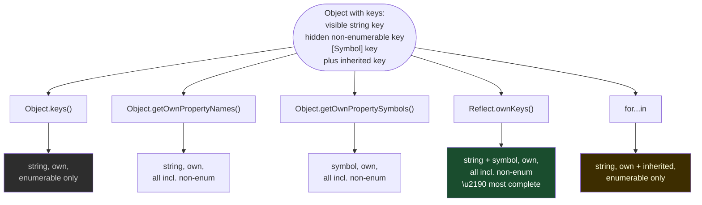

# 06 — Metaprogramming: Proxy, Reflect, Symbols
### 15 Questions | Advanced

---

**Q1. What is a Proxy and what can it intercept?** — Hard

**Answer:**
A Proxy wraps an object (the "target") and lets you intercept fundamental JavaScript operations on it using "traps" defined in a "handler" object. When code performs an operation on the proxy, the corresponding trap runs instead of the default behavior.

A Proxy has exactly 13 possible traps (one for each fundamental operation on objects):

```mermaid
mindmap
  root(("Proxy Traps"))
    Property
      get
        "proxy.x"
      set
        "proxy.x = 1"
      has
        "in operator"
      deleteProperty
        "delete proxy.x"
    Enumeration
      ownKeys
        "Object.keys()"
        "Reflect.ownKeys()"
      getOwnPropertyDescriptor
        "Object.getOwnPropertyDescriptor()"
      defineProperty
        "Object.defineProperty()"
    Prototype
      getPrototypeOf
        "Object.getPrototypeOf()"
      setPrototypeOf
        "Object.setPrototypeOf()"
    Extensibility
      isExtensible
        "Object.isExtensible()"
      preventExtensions
        "Object.preventExtensions()"
    Function
      apply
        "proxy()"
        "fn.call()"
      construct
        "new proxy()"
```

```js
const handler = {
  get(target, prop, receiver) {
    console.log(`Reading: ${prop}`);
    return Reflect.get(target, prop, receiver); // forward to target
  },
  set(target, prop, value, receiver) {
    console.log(`Writing: ${prop} = ${value}`);
    if (typeof value !== "number") throw new TypeError("Numbers only");
    return Reflect.set(target, prop, value, receiver);
  }
};

const proxy = new Proxy({}, handler);
proxy.x = 42;   // logs "Writing: x = 42"
proxy.x;        // logs "Reading: x", returns 42
proxy.y = "hi"; // throws TypeError: Numbers only
```

**Spec Reference:** ECMAScript section 10.5 — Proxy Object Internal Methods and Internal Slots

**Follow-up:** Can a Proxy be transparent — completely indistinguishable from the original object?

Almost, but not completely. `Object.is(proxy, target)` is `false`. Some native operations like `WeakMap.has(target)` and `WeakMap.has(proxy)` treat them differently. Functions like `JSON.stringify` that use internal operations directly on the object will use the trap, so they may behave differently. Some introspection tools can also detect proxies.

**GOTCHA:** The `apply` and `construct` traps only work when the target itself is a function. Wrapping a plain object in a Proxy and defining `apply` does nothing — you cannot make a non-function callable by proxying it.

---

**Q2. What is a Reflect and why does it exist alongside Proxy?** — Hard

**Answer:**
`Reflect` is a built-in object introduced alongside `Proxy` in ES6. It provides static methods that correspond exactly to the 13 Proxy handler traps. Its purposes are:

1. Forward operations from within a trap to the target with correct behavior.
2. Provide a more functional, non-throwing equivalent to some Object methods.
3. Make it possible to "do the default thing" inside a trap.

Without `Reflect`, forwarding inside a trap requires knowing the exact behavior of each operation, which is error-prone:
```js
// Without Reflect — fragile forwarding in get trap:
get(target, prop) {
  return target[prop]; // Works for simple cases but misses receiver binding for getters
}

// With Reflect — correct forwarding:
get(target, prop, receiver) {
  return Reflect.get(target, prop, receiver); // Correctly handles getters, prototype chain
}
```

Reflect methods vs their traditional equivalents:
```js
// Old way — throws on failure:
Object.defineProperty(obj, "x", { value: 1 }); // throws if already defined and non-configurable

// Reflect — returns boolean, does not throw:
Reflect.defineProperty(obj, "x", { value: 1 }); // returns true/false

// Old way — delete is an operator:
delete obj.x; // true/false but not usable functionally

// Reflect — function, composable:
Reflect.deleteProperty(obj, "x"); // returns true/false, same behavior

// Old way:
fn.apply(thisArg, args);

// Reflect:
Reflect.apply(fn, thisArg, args); // same, but functional-style, works with proxied functions
```

The critical use of `receiver` in get/set traps:
```js
// Inherited getter example:
const base = {
  get value() { return this._val; } // 'this' should be the receiver
};

const child = Object.create(base);
child._val = 42;

// Without receiver:
get(target, prop) {
  return target[prop]; // 'this' in getter = target (base), not child!
}

// With Reflect and receiver:
get(target, prop, receiver) {
  return Reflect.get(target, prop, receiver); // 'this' in getter = receiver (child)
}
```

**Spec Reference:** ECMAScript section 28 — The Reflect Object

**GOTCHA:** `Reflect.ownKeys(obj)` returns ALL own keys including non-enumerable and Symbol keys — it is the combination of `Object.getOwnPropertyNames()` and `Object.getOwnPropertySymbols()`. This is the only method that gives you truly all keys.

---

**Q3. What are the most useful real-world Proxy patterns?** — Hard

**Answer:**
Proxy enables several powerful patterns that are otherwise impossible in JavaScript.

Pattern 1 — Validation:
```js
function createValidated(schema) {
  return new Proxy({}, {
    set(target, prop, value) {
      if (prop in schema) {
        const { type, required } = schema[prop];
        if (typeof value !== type) throw new TypeError(`${prop} must be ${type}`);
      }
      return Reflect.set(target, prop, value);
    }
  });
}

const user = createValidated({
  name: { type: "string" },
  age: { type: "number" }
});

user.name = "Alice"; // ok
user.age = "thirty"; // TypeError: age must be number
```

Pattern 2 — Reactive/Observable data (how Vue 3 works):
```js
function reactive(data, onChange) {
  return new Proxy(data, {
    set(target, prop, value) {
      const old = target[prop];
      const result = Reflect.set(target, prop, value);
      if (old !== value) onChange(prop, value, old);
      return result;
    }
  });
}

const state = reactive({ count: 0 }, (prop, val) => {
  console.log(`${prop} changed to ${val} — re-rendering`);
  rerender();
});

state.count++; // logs "count changed to 1 — re-rendering"
```

Pattern 3 — Default values for missing properties:
```js
function withDefaults(target, defaults) {
  return new Proxy(target, {
    get(t, prop, receiver) {
      return prop in t ? Reflect.get(t, prop, receiver) : defaults[prop];
    }
  });
}

const config = withDefaults({ debug: true }, { debug: false, logLevel: "info", timeout: 5000 });
config.debug;    // true — own property
config.logLevel; // "info" — from defaults
config.timeout;  // 5000 — from defaults
```

Pattern 4 — Read-only protection:
```js
function readonly(obj) {
  return new Proxy(obj, {
    set(target, prop) {
      throw new TypeError(`Property "${prop}" is read-only`);
    },
    deleteProperty(target, prop) {
      throw new TypeError(`Cannot delete "${prop}"`);
    }
  });
}
```

Pattern 5 — Negative array indices:
```js
function withNegativeIndices(arr) {
  return new Proxy(arr, {
    get(target, prop, receiver) {
      const index = Number(prop);
      if (Number.isInteger(index) && index < 0) {
        return Reflect.get(target, target.length + index, receiver);
      }
      return Reflect.get(target, prop, receiver);
    }
  });
}

const arr = withNegativeIndices([1, 2, 3, 4, 5]);
arr[-1]; // 5
arr[-2]; // 4
```

**GOTCHA:** Proxies add overhead to every trapped operation. In performance-critical hot paths that access properties millions of times per second, proxy overhead can be measurable. Profile before adding proxies to tight loops.

---

**Q4. What is a revocable Proxy?** — Hard

**Answer:**
`Proxy.revocable(target, handler)` creates a proxy that can be permanently disabled. It returns `{ proxy, revoke }`. After calling `revoke()`, any operation on the proxy throws a `TypeError`.

```js
const { proxy, revoke } = Proxy.revocable(
  { secret: "sensitive data" },
  {
    get(target, prop) {
      return Reflect.get(target, prop);
    }
  }
);

proxy.secret; // "sensitive data" — works normally

revoke(); // revoke the proxy — no longer usable

proxy.secret; // TypeError: Cannot perform 'get' on a proxy that has been revoked
```

Use cases:

1. Capability-based security — distribute a revocable proxy to external code. When the capability should expire, revoke it. The external code can no longer access the underlying object even if it kept a reference to the proxy.

2. Lifecycle management — revoke a proxy when the resource it wraps is disposed:
```js
class Resource {
  #data = {};
  #revoke;

  constructor() {
    const { proxy, revoke } = Proxy.revocable(this.#data, {
      get: (t, p) => Reflect.get(t, p)
    });
    this.proxy = proxy;
    this.#revoke = revoke;
  }

  dispose() {
    this.#revoke(); // proxy becomes inoperable after dispose
  }
}
```

3. Membrane patterns — in security-sensitive code, a membrane is a system of revocable proxies around all objects that cross a trust boundary.

**GOTCHA:** Revocation is irreversible. Once `revoke()` is called, the proxy is permanently broken — it cannot be re-activated. The only way to get a new working proxy is to create one with `new Proxy()` or `Proxy.revocable()` again.

---

**Q5. What are all the well-known Symbols and what do they customize?** — Hard

**Answer:**
Well-known Symbols are predefined Symbol values that the JS engine uses at specific internal operation points, allowing you to customize built-in behaviors.

`Symbol.iterator`:
- Called by `for...of`, spread, destructuring, `Array.from`
- Must return an iterator object

`Symbol.asyncIterator`:
- Called by `for await...of`
- Must return an async iterator

`Symbol.toPrimitive(hint)`:
- Called during type coercion when the engine needs a primitive
- `hint` is `"number"`, `"string"`, or `"default"`
- Takes precedence over `valueOf` and `toString`

```js
class Money {
  constructor(amount, currency) {
    this.amount = amount;
    this.currency = currency;
  }
  [Symbol.toPrimitive](hint) {
    if (hint === "number") return this.amount;
    if (hint === "string") return `${this.amount} ${this.currency}`;
    return this.amount; // default
  }
}
const price = new Money(42, "USD");
+price;        // 42
`${price}`;    // "42 USD"
price + 10;    // 52
```

`Symbol.toStringTag`:
- Customizes `Object.prototype.toString.call(obj)` output
```js
class MyQueue {
  get [Symbol.toStringTag]() { return "Queue"; }
}
Object.prototype.toString.call(new MyQueue()); // "[object Queue]"
```

`Symbol.hasInstance`:
- Customizes `instanceof` behavior
```js
class EvenNumber {
  static [Symbol.hasInstance](value) {
    return Number.isInteger(value) && value % 2 === 0;
  }
}
4 instanceof EvenNumber; // true
3 instanceof EvenNumber; // false
```

`Symbol.species`:
- Specifies which constructor to use when creating derived objects from a class method
```js
class MyArray extends Array {
  static get [Symbol.species]() { return Array; }
}
const a = new MyArray(1, 2, 3);
const mapped = a.map(x => x * 2);
mapped instanceof MyArray; // false — species says use Array
mapped instanceof Array;   // true
```

`Symbol.isConcatSpreadable`:
- Controls whether `Array.prototype.concat` spreads the object or adds it as-is
```js
const arrayLike = { 0: "a", 1: "b", length: 2, [Symbol.isConcatSpreadable]: true };
[].concat(arrayLike); // ["a", "b"] — spread as if it were an array
```

`Symbol.match`, `Symbol.replace`, `Symbol.search`, `Symbol.split`:
- Allow objects to be used as first argument to `String.prototype` methods

`Symbol.unscopables`:
- Object of properties excluded from the `with` statement binding (used by Array to prevent `with` from seeing `keys`, `values`, `entries`, etc.)

**GOTCHA:** `Symbol.species` is being reconsidered in TC39 — several proposals want to deprecate or change it because its current behavior causes unexpected results in subclassing scenarios. Some built-ins no longer use `Symbol.species` in recent spec updates.

---

**Q6. How do you use the `apply` and `construct` traps to intercept function calls?** — Hard

**Answer:**
The `apply` trap intercepts function calls (`fn()`, `fn.call()`, `fn.apply()`). The `construct` trap intercepts constructor calls (`new fn()`). These traps only work when the Proxy target is a function.

```js
function originalFn(a, b) { return a + b; }

const proxiedFn = new Proxy(originalFn, {
  apply(target, thisArg, argumentsList) {
    console.log(`Called with args: ${argumentsList}`);
    const result = Reflect.apply(target, thisArg, argumentsList);
    console.log(`Result: ${result}`);
    return result;
  },

  construct(target, argumentsList, newTarget) {
    console.log(`Constructed with: ${argumentsList}`);
    return Reflect.construct(target, argumentsList, newTarget);
  }
});

proxiedFn(3, 4); // logs "Called with args: 3,4" and "Result: 7"
```

Function instrumentation example (automatic performance timing):
```js
function instrument(fn, name = fn.name) {
  return new Proxy(fn, {
    apply(target, thisArg, args) {
      const start = performance.now();
      try {
        return Reflect.apply(target, thisArg, args);
      } finally {
        console.log(`${name} took ${(performance.now() - start).toFixed(2)}ms`);
      }
    }
  });
}

const slow = instrument(function computeHeavy(n) {
  let sum = 0;
  for (let i = 0; i < n; i++) sum += i;
  return sum;
});

slow(1_000_000); // "computeHeavy took X.XXms"
```

Mock factory for testing:
```js
function createMock(fn) {
  const calls = [];
  const proxy = new Proxy(fn, {
    apply(target, thisArg, args) {
      const result = Reflect.apply(target, thisArg, args);
      calls.push({ args, result, this: thisArg });
      return result;
    }
  });
  proxy.calls = calls;
  return proxy;
}
```

**GOTCHA:** The `construct` trap's return value MUST be an object. If you return a primitive from `construct`, the engine throws a TypeError. In contrast, returning a non-object from a regular constructor causes `new` to use `this` instead — but Proxy `construct` is stricter.

---

**Q7. How do the `ownKeys` and `has` traps work and what are their invariants?** — Hard

**Answer:**
`ownKeys(target)` intercepts `Object.keys()`, `Object.getOwnPropertyNames()`, `Object.getOwnPropertySymbols()`, `Reflect.ownKeys()`, and `for...in`.

`has(target, prop)` intercepts the `in` operator.

```js
const hiddenProps = new Set(["_internal", "_cache"]);

const guarded = new Proxy({ name: "Alice", _internal: "secret", _cache: {} }, {
  ownKeys(target) {
    return Reflect.ownKeys(target).filter(key => !hiddenProps.has(key));
  },

  has(target, prop) {
    if (hiddenProps.has(prop)) return false; // hide from 'in' operator
    return Reflect.has(target, prop);
  },

  get(target, prop, receiver) {
    if (hiddenProps.has(prop)) return undefined; // hide value too
    return Reflect.get(target, prop, receiver);
  }
});

Object.keys(guarded);    // ["name"] — _internal and _cache hidden
"_internal" in guarded;  // false — hidden
guarded._internal;       // undefined — hidden
guarded.name;            // "Alice" — visible
```

Invariants that proxy traps must respect (the engine enforces these):

`ownKeys` invariants:
- Cannot report non-configurable own properties as missing
- Cannot report additional keys if the target is not extensible

`has` invariants:
- Cannot report `false` for a non-configurable own property of the target
- Cannot report `false` for an own property of a non-extensible target

```js
const frozen = Object.freeze({ x: 1 });
const badProxy = new Proxy(frozen, {
  has(target, prop) { return false; } // Trying to hide 'x'
});
"x" in badProxy; // TypeError — invariant violation! x is non-configurable, cannot hide it
```

**GOTCHA:** Proxy invariants exist to maintain internal consistency of the type system. These invariants are enforced by the engine and cannot be bypassed. Attempting to violate them throws a `TypeError` with a message like "proxy trap returned falsish for property 'x'".

---

**Q8. What is property descriptor interception and how do the `defineProperty` and `getOwnPropertyDescriptor` traps work?** — Hard

**Answer:**
These two traps intercept operations at the property descriptor level, allowing you to control how properties are defined, observed, and described.

`getOwnPropertyDescriptor(target, prop)` — intercepts:
- `Object.getOwnPropertyDescriptor(proxy, prop)`
- The descriptor lookup done by `Object.assign`, spread, etc.

`defineProperty(target, prop, descriptor)` — intercepts:
- `Object.defineProperty(proxy, prop, descriptor)`
- Property assignment `proxy.x = value` (which internally calls DefineOwnProperty)

```js
// Read-only schema enforcement:
function createImmutable(schema) {
  const store = {};

  return new Proxy(store, {
    defineProperty(target, prop, descriptor) {
      if (prop in schema) {
        const schemaType = schema[prop];
        if (descriptor.value !== undefined && typeof descriptor.value !== schemaType) {
          throw new TypeError(`${prop} must be ${schemaType}`);
        }
        if (prop in target) {
          throw new Error(`${prop} is already defined and immutable`);
        }
      }
      return Reflect.defineProperty(target, prop, descriptor);
    },

    getOwnPropertyDescriptor(target, prop) {
      const desc = Reflect.getOwnPropertyDescriptor(target, prop);
      if (desc) {
        // Always report as non-configurable to prevent deletion
        desc.configurable = false;
      }
      return desc;
    }
  });
}
```

Invariant for `getOwnPropertyDescriptor`: If the trap returns a descriptor, it must be consistent with the target's actual descriptor. You cannot report a non-existent property as existing if the target is non-extensible, and you cannot report a non-configurable property as configurable.

**GOTCHA:** `Object.assign` and spread internally call `[[OwnPropertyKeys]]` (triggering `ownKeys` trap) and `[[GetOwnProperty]]` (triggering `getOwnPropertyDescriptor` trap) — not just `[[Get]]`. This means your `getOwnPropertyDescriptor` trap affects how properties are copied during object spread, which is often surprising.

---

**Q9. What is the difference between `Symbol()`, `Symbol.for()`, and `Symbol.keyFor()`?** — Medium

**Answer:**
`Symbol()` creates a new unique symbol each time. No two symbols created with `Symbol()` are equal, even if they have the same description:
```js
Symbol("id") === Symbol("id"); // false — always unique
const s = Symbol("tag");
typeof s; // "symbol"
s.description; // "tag" (read-only, available since ES2019)
```

`Symbol.for(key)` uses a global symbol registry. It returns the same symbol for the same key across the entire runtime (including different modules, iframes, and even `eval`):
```js
const s1 = Symbol.for("app.id");
const s2 = Symbol.for("app.id");
s1 === s2; // true — same symbol from registry

// Cross-realm sharing:
// In an iframe:
const iframeSymbol = iframe.contentWindow.Symbol.for("app.id");
iframeSymbol === Symbol.for("app.id"); // true — shared global registry
```

`Symbol.keyFor(symbol)` retrieves the key from the global registry for a given symbol:
```js
const s = Symbol.for("app.id");
Symbol.keyFor(s); // "app.id"

const local = Symbol("local");
Symbol.keyFor(local); // undefined — not in global registry
```

Well-known symbols (like `Symbol.iterator`) are NOT in the global registry:
```js
Symbol.keyFor(Symbol.iterator); // undefined
```

Use `Symbol.for` when:
- You need a symbol shared across modules (like a shared extension point)
- You need cross-realm identity
- You are building a library that needs symbols to be compatible across instances

Use `Symbol()` when:
- You want a completely private, per-usage unique key
- You are sure the symbol will not need to be shared across realms or registry lookups

**GOTCHA:** Symbols created with `Symbol.for` are globally shared. If two independent libraries both use `Symbol.for("id")`, they will unintentionally share the same symbol — potentially causing conflicts. Use namespaced keys like `Symbol.for("@mylib/id")` to avoid collisions.

---

**Q10. How does `Symbol.toPrimitive` interact with explicit and implicit coercion?** — Hard

**Answer:**
`Symbol.toPrimitive` is called before `valueOf` and `toString` during type coercion. It receives a hint argument indicating what type is expected.

Hint values:
- `"string"`: String context (template literals, `String()`, `alert`, `+` when other operand is string)
- `"number"`: Numeric context (unary `+`, arithmetic operators, `Number()`, comparison operators)
- `"default"`: Ambiguous context (the binary `+` operator, `==`, `!=`)

```js
class Vector {
  constructor(x, y) {
    this.x = x;
    this.y = y;
  }

  [Symbol.toPrimitive](hint) {
    switch (hint) {
      case "string":
        return `Vector(${this.x}, ${this.y})`;
      case "number":
        return Math.sqrt(this.x ** 2 + this.y ** 2); // magnitude
      case "default":
        return `${this.x},${this.y}`;
    }
  }
}

const v = new Vector(3, 4);

String(v);       // "Vector(3, 4)" — hint: "string"
+v;              // 5 (magnitude) — hint: "number"
`${v}`;          // "Vector(3, 4)" — hint: "string"
v + "";          // "3,4" — hint: "default"
v + 10;          // "3,410" — hint: "default", result is "3,4" + "10"
v > 3;           // true — hint: "number", magnitude 5 > 3
```

Comparison with `valueOf`/`toString` without `Symbol.toPrimitive`:
- Without `Symbol.toPrimitive`: number hint calls `valueOf()` first, then `toString()`; string hint calls `toString()` first.
- With `Symbol.toPrimitive`: it is called INSTEAD of `valueOf`/`toString`. The method has full control and can differentiate all three hints.

**GOTCHA:** The `"default"` hint exists to handle cases where the `+` operator cannot determine context (it can be either string concatenation or addition). Most types (including the spec's Date) treat `"default"` the same as `"number"`. Only if you specifically want `+` to behave differently from numeric contexts should you differentiate `"default"`.

---

**Q11. How do you create a proxy that logs all property access recursively (deep observable)?** — Hard

**Answer:**
A recursive proxy wraps not just the top-level object but also any object values returned from property access — creating a fully observable object tree.

```js
function createObservable(target, onChange, path = "") {
  if (typeof target !== "object" || target === null) return target;

  return new Proxy(target, {
    get(t, prop, receiver) {
      const value = Reflect.get(t, prop, receiver);
      const currentPath = path ? `${path}.${String(prop)}` : String(prop);

      // Wrap returned objects recursively:
      if (typeof value === "object" && value !== null) {
        return createObservable(value, onChange, currentPath);
      }

      return value;
    },

    set(t, prop, value, receiver) {
      const currentPath = path ? `${path}.${String(prop)}` : String(prop);
      const oldValue = t[prop];
      const result = Reflect.set(t, prop, value, receiver);
      if (oldValue !== value) {
        onChange(currentPath, value, oldValue);
      }
      return result;
    }
  });
}

const state = createObservable(
  { user: { name: "Alice", address: { city: "London" } } },
  (path, newVal, oldVal) => console.log(`Changed: ${path} = ${newVal} (was ${oldVal})`)
);

state.user.name = "Bob";
// "Changed: user.name = Bob (was Alice)"

state.user.address.city = "Paris";
// "Changed: user.address.city = Paris (was London)"
```

Performance consideration: A new Proxy is created on every property access that returns an object. For rarely-accessed deep trees this is acceptable, but for frequently-accessed deeply nested state, consider caching the proxies.

**GOTCHA:** The recursive proxy approach creates a new Proxy wrapper on every `get` that returns an object. This means `state.user === state.user` can return `false` — each access creates a new Proxy wrapper around the same object. If you cache objects by reference, this can break equality checks.

---

**Q12. What is the `Reflect.ownKeys` method and how does it differ from other key enumeration methods?** — Medium

**Answer:**
`Reflect.ownKeys(obj)` returns ALL own keys of an object — string keys (both enumerable and non-enumerable) plus Symbol keys. It is the union of `Object.getOwnPropertyNames()` and `Object.getOwnPropertySymbols()`.

Comparison of all key enumeration methods:



```js
const sym = Symbol("key");
const obj = Object.defineProperty({ visible: 1, [sym]: 2 }, "hidden", {
  value: 3,
  enumerable: false
});

Object.keys(obj);                    // ["visible"]
Object.getOwnPropertyNames(obj);     // ["visible", "hidden"]
Object.getOwnPropertySymbols(obj);   // [Symbol(key)]
Reflect.ownKeys(obj);                // ["visible", "hidden", Symbol(key)]
```

`Reflect.ownKeys` order: integer-like string indices (ascending numeric order), then other string keys (insertion order), then Symbol keys (insertion order).

**GOTCHA:** The `ownKeys` Proxy trap intercepts all of these methods. But each method filters the result differently based on property descriptors. The Proxy trap returns the raw array; the engine applies enumerable/non-enumerable filtering afterward based on which method triggered the trap.

---

**Q13. What is a Membrane pattern and when would you use it?** — Hard

**Answer:**
A Membrane is a system of mutually-referential Proxies that creates a transparent security boundary between two pieces of code. Any object that crosses the boundary is automatically wrapped in a Proxy, and references back across the boundary are also wrapped. The membrane ensures no direct object reference ever crosses the boundary unproxied.

The pattern is used in:
- Sandboxed execution environments
- Plugin systems where plugins should not be able to access host objects directly
- Security-sensitive code that needs to control what an untrusted module can observe or modify

```js
class Membrane {
  #wet = new WeakMap(); // wet side (inner) -> dry proxy
  #dry = new WeakMap(); // dry side (outer) -> wet proxy

  // Wrap an object from the "wet" inner world for the "dry" outer world:
  wrapForDry(wetObj) {
    if (this.#wet.has(wetObj)) return this.#wet.get(wetObj);

    const membrane = this;
    const dryProxy = new Proxy(wetObj, {
      get(target, prop, receiver) {
        const value = Reflect.get(target, prop, receiver);
        // Any object that crosses to the dry side is wrapped:
        return membrane.wrapForDry(value);
      },
      set(target, prop, value, receiver) {
        // Any value set from dry side is unwrapped before entering wet side:
        return Reflect.set(target, prop, membrane.wrapForWet(value), receiver);
      }
    });

    this.#wet.set(wetObj, dryProxy);
    return dryProxy;
  }

  wrapForWet(dryObj) {
    if (typeof dryObj !== "object" || dryObj === null) return dryObj;
    if (this.#dry.has(dryObj)) return this.#dry.get(dryObj);
    // Similar reverse wrapping...
    return dryObj;
  }
}
```

**Follow-up:** What is the difference between a Membrane and a simple Proxy?

A simple Proxy wraps a single object. A Membrane wraps an entire object graph — every object that transitions across the boundary gets wrapped. The wrapping is transparent (proxies are invisible to the code using them) and bidirectional (references back across the boundary are also wrapped). This creates a true isolation layer.

**GOTCHA:** Implementing a complete, correct Membrane is significantly complex — it must handle all 13 Proxy traps, maintain consistent identity (the same wet object should always wrap to the same dry proxy), and handle prototypes correctly. Production-quality membrane implementations like SES-shim are thousands of lines of code.

---

**Q14. How does Proxy interact with `instanceof` and prototype chain operations?** — Hard

**Answer:**
Proxy intercepts prototype operations through `getPrototypeOf` and `setPrototypeOf` traps.

`getPrototypeOf` trap:
```js
const fakeArray = new Proxy({}, {
  getPrototypeOf(target) {
    return Array.prototype; // lie about prototype
  }
});

Object.getPrototypeOf(fakeArray) === Array.prototype; // true
fakeArray instanceof Array; // true — because instanceof uses getPrototypeOf
fakeArray.push; // Array.prototype.push (via prototype chain)
Array.isArray(fakeArray); // false — Array.isArray uses [[Class]] tag, not prototype
```

`getPrototypeOf` invariant: The trap must return either an object or `null`. If the target is non-extensible, the trap MUST return `Object.getPrototypeOf(target)` — you cannot lie about the prototype of a non-extensible target.

```js
const target = Object.preventExtensions({});
const proxy = new Proxy(target, {
  getPrototypeOf(t) {
    return Array.prototype; // TypeError! Target is non-extensible
  }
});
Object.getPrototypeOf(proxy); // TypeError: invariant violation
```

`instanceof` resolution:
```js
// instanceof first checks for Symbol.hasInstance:
class MyClass {
  static [Symbol.hasInstance](instance) {
    return typeof instance === "number";
  }
}
42 instanceof MyClass; // true
"str" instanceof MyClass; // false

// If no Symbol.hasInstance, falls back to OrdinaryHasInstance
// which walks the [[Prototype]] chain using getPrototypeOf
```

**GOTCHA:** `Array.isArray()` cannot be fooled by a Proxy's `getPrototypeOf` trap — it uses an internal check (`[[IsArray]]`) that sees through proxies and checks the actual target. This is a deliberate decision to make array detection reliable.

---

**Q15. What is the `defineProperty` trap invariant and why does it exist?** — Hard

**Answer:**
The `defineProperty` trap must respect certain invariants to maintain the integrity of the language. These invariants are enforced by the engine regardless of what your trap returns.

Core invariants for `defineProperty`:
1. A property cannot be added to a non-extensible target.
2. A non-configurable property on the target cannot be made configurable.
3. A non-configurable, non-writable property's value cannot be changed.
4. `defineProperty` must return `true` to indicate success or `false` to indicate failure (in strict mode, `false` triggers a TypeError at the call site).

```js
const target = {};
Object.defineProperty(target, "x", { value: 1, writable: false, configurable: false });

const proxy = new Proxy(target, {
  defineProperty(t, prop, descriptor) {
    if (prop === "x") {
      // This trap CANNOT succeed in making x configurable:
      return Reflect.defineProperty(t, prop, { ...descriptor, configurable: true });
      // Engine will throw TypeError — invariant violation
    }
    return Reflect.defineProperty(t, prop, descriptor);
  }
});

Object.defineProperty(proxy, "x", { configurable: true }); // TypeError: invariant violated
```

Why invariants exist: They ensure that operations that depend on object invariants (like sealed or frozen objects, non-configurable properties) cannot be secretly bypassed through Proxies. Without invariants, code that freezes an object for security purposes could be subverted by wrapping it in a Proxy.

**GOTCHA:** The return value of the `defineProperty` trap is a boolean, but the engine checks the actual target's state afterward to verify the trap respected the invariants. Even if you return `true`, if the operation was invalid (trying to make a non-configurable property configurable), the engine throws a TypeError.

---

*Next: [07-Memory-Performance.md](./07-Memory-Performance.md)*
