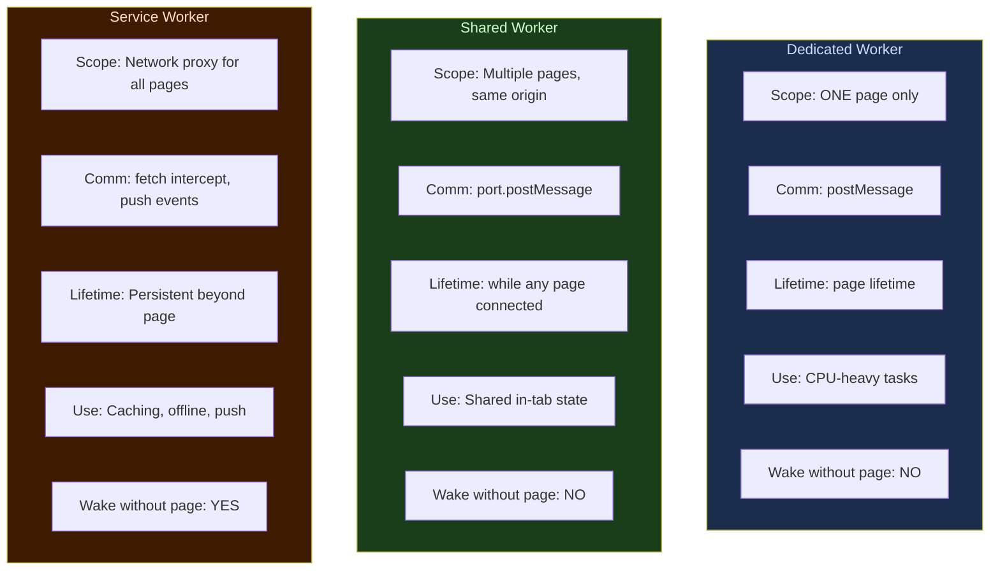

# 08 — Concurrency, Workers & Atomics
### 12 Questions | Advanced

---

**Q1. What is a Web Worker and how does it differ from the main thread?** — Medium

**Answer:**
A Web Worker runs JavaScript in a background thread, completely separate from the main (UI) thread. This allows CPU-intensive work to execute without blocking user interactions or rendering.

Key characteristics:
- Runs in a separate thread with its own event loop and memory space.
- Cannot access the DOM directly — no `document`, `window`, or UI APIs.
- Communicates with the main thread exclusively via `postMessage`/`onmessage` — a message-passing model.
- Has access to: `fetch`, `WebSocket`, `IndexedDB`, `CacheAPI`, `Math`, `JSON`, `crypto`, `setTimeout`/`setInterval`, `performance`, `XMLHttpRequest`.

```js
// main.js — main thread
const worker = new Worker("worker.js");

// Send data to worker:
worker.postMessage({ type: "PROCESS", data: largeArray });

// Receive result from worker:
worker.onmessage = (event) => {
  const { result } = event.data;
  displayResult(result);
};

// Handle errors from worker:
worker.onerror = (error) => {
  console.error("Worker error:", error.message);
};

// Terminate worker when done:
worker.terminate();
```

```js
// worker.js — background thread
self.onmessage = function(event) {
  const { type, data } = event.data;

  if (type === "PROCESS") {
    const result = data.map(item => heavyTransform(item)); // runs in background
    self.postMessage({ result });
  }
};
```

Types of workers:
- Dedicated Worker: Owned by one page. Terminated when page closes.
- Shared Worker: Shared across multiple pages/tabs from the same origin. Has `onconnect` instead of `onmessage`.
- Service Worker: Intercepts network requests. Has its own lifecycle independent of any page.

**Spec Reference:** HTML Living Standard — Workers section

**Follow-up:** What happens to a Dedicated Worker when the page is navigated away?

The worker is terminated. All pending messages are discarded. This is why Shared Workers are needed for state that must survive navigation.

**GOTCHA:** Each call to `new Worker("worker.js")` loads and parses the worker script independently. Spinning up many workers has significant overhead — both memory (each worker has its own V8 isolate and heap) and startup time. Prefer a worker pool pattern for multiple tasks.

---

**Q2. What is the Structured Clone Algorithm and what can and cannot be transferred?** — Hard

**Answer:**
The Structured Clone Algorithm (SCA) defines how data is copied when transferred between the main thread and workers via `postMessage`. It is a deep clone operation that handles more types than `JSON.stringify`.

Types the SCA handles:
- Primitives (number, string, boolean, null, undefined, BigInt)
- `Date`, `RegExp`
- `Map`, `Set`
- `Array`, plain objects
- `ArrayBuffer`, `TypedArray`, `DataView`
- `Blob`, `File`, `FileList`
- `ImageData`, `ImageBitmap`
- `MessagePort` (transferred, not cloned)
- `ReadableStream`, `WritableStream` (some environments)

Types the SCA cannot handle (throws `DataCloneError`):
- Functions
- DOM nodes
- Symbols
- Objects with circular references (wait — actually SCA DOES handle circular refs)
- `WeakMap`, `WeakSet`
- Error objects (partially supported now)
- Class instances (cloned as plain objects, losing prototype)

```js
// Correct — everything here is cloneable:
worker.postMessage({
  numbers: new Float64Array([1.1, 2.2, 3.3]),
  metadata: { created: new Date(), id: 42n },
  lookup: new Map([["a", 1]])
});

// ERROR — function cannot be cloned:
worker.postMessage({ transform: (x) => x * 2 }); // DataCloneError
```

Transferable Objects — move instead of copy:
Transferring moves ownership of the underlying buffer to the worker, making the original variable detached (zero-byte). This avoids copying large buffers entirely.

```js
const bigBuffer = new ArrayBuffer(1024 * 1024 * 100); // 100MB

// COPY — 100MB is duplicated (slow):
worker.postMessage({ buffer: bigBuffer });
bigBuffer.byteLength; // still 100MB — a copy was sent

// TRANSFER — ownership moved instantly (fast):
worker.postMessage({ buffer: bigBuffer }, [bigBuffer]); // second arg: transferables list
bigBuffer.byteLength; // 0 — transferred! Main thread can no longer access it
```

Transferable types:
- `ArrayBuffer`
- `MessagePort`
- `ReadableStream`, `WritableStream`, `TransformStream`
- `ImageBitmap`
- `OffscreenCanvas`

**GOTCHA:** After transferring an `ArrayBuffer`, any TypedArray that was viewing it also becomes detached. `Int32Array(buffer).length === 0` after the buffer is transferred. Always create TypedArray views after receiving the buffer in the worker, not before transferring.

---

**Q3. What is `SharedArrayBuffer` and why does it require special HTTP headers?** — Hard

**Answer:**
`SharedArrayBuffer` is an `ArrayBuffer` that can be shared between the main thread and workers without copying. Both threads access the SAME underlying memory simultaneously — true shared memory between JavaScript contexts.

This enables:
- Zero-copy data sharing (large datasets, image frames, audio buffers)
- Coordination via `Atomics` (locks, semaphores, message queues)

```js
// Main thread:
const sab = new SharedArrayBuffer(1024); // 1024 bytes of shared memory
const view = new Int32Array(sab);
view[0] = 42; // write to shared memory

worker.postMessage({ buffer: sab }); // Not a transfer — shares the SAME memory

// Worker:
self.onmessage = ({ data: { buffer } }) => {
  const view = new Int32Array(buffer);
  console.log(view[0]); // 42 — same physical memory
  view[0] = 100; // write back
};

// Main thread can see view[0] === 100 now
```

Why cross-origin isolation headers are required:
`SharedArrayBuffer` was disabled in all browsers in 2018 following the Spectre vulnerability — a timing side-channel attack that used high-resolution timers (enabled by `SharedArrayBuffer`) to read arbitrary process memory. It was re-enabled in 2021 with two required HTTP headers that ensure cross-origin isolation:

```
Cross-Origin-Opener-Policy: same-origin
Cross-Origin-Embedder-Policy: require-corp
```

These headers prevent the page from being embedded in or embedding cross-origin resources without explicit permission, mitigating the Spectre risk by isolating the process's memory from other origins.

```js
// Check if SharedArrayBuffer is available:
if (typeof SharedArrayBuffer === "undefined") {
  console.log("Cross-origin isolation not active — SharedArrayBuffer unavailable");
}
// Also: self.crossOriginIsolated === true confirms the headers are set correctly
```

**Spec Reference:** ECMAScript section 25.1 — SharedArrayBuffer Objects

**GOTCHA:** Even with the headers set, `SharedArrayBuffer` requires HTTPS (or localhost). Also, tools like Chrome DevTools, some CI environments, and some CDNs can interfere with the COOP/COEP headers. Test the actual deployment environment, not just locally.

---

**Q4. What are `Atomics` and what operations do they provide?** — Hard

**Answer:**
`Atomics` is a built-in object with static methods for performing atomic operations on `SharedArrayBuffer` data. "Atomic" means the operation completes without interruption — no other thread can observe a half-finished state.

Without atomics, concurrent access to shared memory can lead to race conditions:
```js
// Race condition WITHOUT Atomics:
// Thread 1:
view[0] = view[0] + 1; // read, then write — NOT atomic
// Thread 2 may interleave between the read and write
```

Atomics methods:

`Atomics.add(typedArray, index, value)` — Atomically adds `value` to the element and returns the OLD value.
`Atomics.sub()`, `Atomics.and()`, `Atomics.or()`, `Atomics.xor()` — Same pattern for other operations.
`Atomics.load(typedArray, index)` — Atomically reads a value (ensures no reordering by compiler).
`Atomics.store(typedArray, index, value)` — Atomically writes a value.
`Atomics.exchange(typedArray, index, value)` — Atomically sets a value and returns the OLD value.
`Atomics.compareExchange(typedArray, index, expected, replacement)` — If current value equals expected, replaces with replacement. Returns the actual value before (whether replacement happened or not). This is the foundation for lock-free algorithms.

`Atomics.wait(typedArray, index, expectedValue, timeout)` — Blocks the current thread (works in workers, NOT in main thread) until `typedArray[index]` is no longer `expectedValue`. Used for sleeping/waiting.
`Atomics.notify(typedArray, index, count)` — Wakes up threads blocked on `wait` at the given index.

```js
// Implementing an atomic counter across threads:
const sab = new SharedArrayBuffer(4); // 1 Int32 = 4 bytes
const counter = new Int32Array(sab);

// In any thread:
function atomicIncrement() {
  return Atomics.add(counter, 0, 1); // returns old value, increments atomically
}

// Implementing a simple mutex:
const mutex = new Int32Array(new SharedArrayBuffer(4));
// mutex[0] === 0: unlocked, mutex[0] === 1: locked

function lock() {
  while (Atomics.compareExchange(mutex, 0, 0, 1) !== 0) {
    Atomics.wait(mutex, 0, 1); // sleep until mutex[0] changes from 1
  }
}

function unlock() {
  Atomics.store(mutex, 0, 0);
  Atomics.notify(mutex, 0, 1); // wake one waiting thread
}
```

**Spec Reference:** ECMAScript section 25.4 — The Atomics Object

**GOTCHA:** `Atomics.wait()` CANNOT be called on the main thread — it throws a `TypeError`. The main thread must remain non-blocking to handle the event loop. Use `Atomics.waitAsync()` (ES2024) for an async (promise-based) version that works on the main thread.

---

**Q5. What is a worker pool and why do you need one?** — Hard

**Answer:**
A worker pool maintains a fixed set of pre-created workers and distributes tasks among them. This solves two problems: startup overhead (creating workers is expensive) and the risk of spawning too many workers (each consumes memory and OS thread resources).

```js
class WorkerPool {
  #workers = [];
  #available = [];
  #queue = [];
  #taskCallbacks = new WeakMap();

  constructor(size, scriptURL) {
    for (let i = 0; i < size; i++) {
      const worker = new Worker(scriptURL);
      worker.onmessage = (event) => this.#handleResult(worker, event);
      this.#workers.push(worker);
      this.#available.push(worker);
    }
  }

  #handleResult(worker, event) {
    const { resolve, reject } = this.#taskCallbacks.get(worker);
    this.#taskCallbacks.delete(worker);
    this.#available.push(worker); // return to pool

    if (event.data.error) {
      reject(new Error(event.data.error));
    } else {
      resolve(event.data.result);
    }

    this.#processQueue(); // check if tasks are waiting
  }

  #processQueue() {
    if (this.#queue.length === 0 || this.#available.length === 0) return;
    const { task, resolve, reject } = this.#queue.shift();
    const worker = this.#available.pop();
    this.#taskCallbacks.set(worker, { resolve, reject });
    worker.postMessage(task);
  }

  run(task) {
    return new Promise((resolve, reject) => {
      this.#queue.push({ task, resolve, reject });
      this.#processQueue();
    });
  }

  terminate() {
    this.#workers.forEach(w => w.terminate());
    this.#workers = [];
    this.#available = [];
  }
}

// Usage:
const pool = new WorkerPool(4, "processor.js");

// Queue up 100 tasks across 4 workers:
const results = await Promise.all(
  items.map(item => pool.run({ type: "PROCESS", item }))
);

pool.terminate();
```

**Follow-up:** How many workers should a pool have?

`navigator.hardwareConcurrency` returns the number of logical CPU cores. A common rule: `Math.min(navigator.hardwareConcurrency, 4)` — matching CPU count avoids over-subscription (too many workers competing for CPU time), while capping at 4 prevents excessive memory use on high-core-count machines.

**GOTCHA:** Worker pool tasks must be serializable via the Structured Clone Algorithm. If your task includes functions, DOM references, or class instances with methods, you must redesign the task API to pass only plain data.

---

**Q6. What is a Service Worker and how does it enable offline support?** — Hard

**Answer:**
A Service Worker is a script that runs in the background, separate from the web page, and acts as a network proxy. It can intercept fetch requests, serve cached responses, and operate even when the page is closed.

Service Worker lifecycle:
1. Registration: The page registers the service worker.
2. Installation: SW downloads and installs. `install` event fires — use to pre-cache assets.
3. Activation: SW activates and can control pages. `activate` event fires — use to clean old caches.
4. Running: Intercepts fetch events for controlled pages.

```js
// main.js — register the service worker:
if ("serviceWorker" in navigator) {
  navigator.serviceWorker.register("/sw.js")
    .then(reg => console.log("SW registered:", reg.scope))
    .catch(err => console.log("SW failed:", err));
}

// sw.js — the service worker:
const CACHE_NAME = "app-v1";
const PRECACHE_URLS = ["/", "/index.html", "/app.js", "/styles.css"];

// Install — pre-cache critical assets:
self.addEventListener("install", event => {
  event.waitUntil(
    caches.open(CACHE_NAME)
      .then(cache => cache.addAll(PRECACHE_URLS))
      .then(() => self.skipWaiting()) // activate immediately
  );
});

// Activate — remove old caches:
self.addEventListener("activate", event => {
  event.waitUntil(
    caches.keys()
      .then(names => Promise.all(
        names
          .filter(name => name !== CACHE_NAME)
          .map(name => caches.delete(name))
      ))
      .then(() => self.clients.claim()) // control all pages immediately
  );
});

// Fetch — serve from cache with network fallback:
self.addEventListener("fetch", event => {
  event.respondWith(
    caches.match(event.request)
      .then(cached => {
        if (cached) return cached; // Cache hit
        return fetch(event.request) // Network request
          .then(response => {
            const clone = response.clone();
            caches.open(CACHE_NAME).then(cache => cache.put(event.request, clone));
            return response;
          })
          .catch(() => caches.match("/offline.html")); // Offline fallback
      })
  );
});
```

Key differences from Web Workers:
- Service Workers persist beyond any single page — they can wake up for push notifications even with no page open.
- They intercept network requests globally for their scope.
- They have a complex lifecycle (install/activate) for cache versioning.
- They cannot access the DOM and do not receive messages via `postMessage` by default — use `BroadcastChannel` or `clients.matchAll()`.

**GOTCHA:** Service Worker scope is determined by the script's location. A SW at `/app/sw.js` only controls pages under `/app/`. Place the SW at the root (`/sw.js`) to control your entire site.

---

**Q7. What is the difference between Dedicated, Shared, and Service Workers?** — Medium

**Answer:**



Shared Worker example:
```js
// Shared across multiple tabs — maintains shared state:
// shared-worker.js
const connections = new Set();
const sharedState = { count: 0 };

self.onconnect = (event) => {
  const port = event.ports[0];
  connections.add(port);

  port.onmessage = (e) => {
    if (e.data.type === "INCREMENT") {
      sharedState.count++;
      // Broadcast to all connected pages:
      connections.forEach(p => p.postMessage({ count: sharedState.count }));
    }
  };

  port.onmessageerror = () => connections.delete(port);
};

// main.js
const worker = new SharedWorker("shared-worker.js");
worker.port.start();
worker.port.postMessage({ type: "INCREMENT" });
worker.port.onmessage = (e) => updateCounter(e.data.count);
```

**GOTCHA:** Shared Workers are identified by their URL AND name. Two `new SharedWorker("/sw.js")` calls with the same URL share the same worker instance. Adding a name (`new SharedWorker("/sw.js", "my-worker")`) creates a separate instance from unnamed ones.

---

**Q8. What are `postMessage` patterns for performance-critical communication?** — Hard

**Answer:**
For high-throughput worker communication, naive `postMessage` creates overhead due to serialization (Structured Clone) and message delivery latency. Several patterns optimize this.

Pattern 1 — Transferables for large data:
```js
// Instead of copying a large array, transfer the buffer:
const data = new Float32Array(1_000_000);
// ... populate data ...

// SLOW: copies 4MB of data:
worker.postMessage({ data });

// FAST: transfers ownership instantly:
worker.postMessage({ data }, [data.buffer]);
// data.buffer is now detached in the main thread
```

Pattern 2 — SharedArrayBuffer for continuous data streams:
```js
// For ongoing data sharing (audio, video, sensor data):
const sab = new SharedArrayBuffer(4096);
const writeView = new Float32Array(sab);
let writeIndex = 0;

// Main thread continuously writes sensor data:
function onSensorData(value) {
  writeView[writeIndex % writeView.length] = value;
  Atomics.add(new Int32Array(sab), 0, 1); // notify worker
  Atomics.notify(new Int32Array(sab), 0);
  writeIndex++;
}

// Worker reads directly from shared buffer without any copying
```

Pattern 3 — Batching messages to reduce IPC overhead:
```js
// SLOW: 10,000 messages
for (let i = 0; i < 10000; i++) {
  worker.postMessage({ item: items[i] });
}

// FAST: one message with all data
worker.postMessage({ items }); // serialized once
```

Pattern 4 — OffscreenCanvas for rendering in workers:
```js
// Transfer canvas rendering to worker:
const canvas = document.getElementById("canvas");
const offscreen = canvas.transferControlToOffscreen();
worker.postMessage({ canvas: offscreen }, [offscreen]);

// Worker can now render without main thread involvement:
self.onmessage = ({ data: { canvas } }) => {
  const ctx = canvas.getContext("2d");
  // All rendering happens in the worker — zero main thread paint cost
};
```

**GOTCHA:** There is always at minimum one event loop tick of latency in `postMessage` communication — the message is processed in the receiver's next event loop iteration. For true zero-latency data sharing, use `SharedArrayBuffer` with `Atomics` for coordination.

---

**Q9. What is `navigator.locks` (Web Locks API)?** — Hard

**Answer:**
The Web Locks API allows scripts in different tabs, workers, or even service workers (all within the same origin) to coordinate access to shared resources by acquiring and releasing locks.

Unlike `Atomics.wait` (which is thread-level), Web Locks work across different JavaScript contexts (tabs, iframes, workers) at the Web Platform level.

```js
// Tab 1 and Tab 2 both try to update the same IndexedDB record:

// Without locks — race condition between tabs:
async function updateRecord_unsafe(id, value) {
  const record = await db.get(id);
  record.value = value;
  await db.put(record); // Tab 2 may have already changed record since Tab 1 read it
}

// With Web Locks — serialized across tabs:
async function updateRecord_safe(id, value) {
  await navigator.locks.request(`record-${id}`, async () => {
    // Only ONE tab holds this lock at a time
    const record = await db.get(id);
    record.value = value;
    await db.put(record);
    // Lock is released when this async function resolves
  });
}
```

Lock modes:
- `"exclusive"`: Only one holder at a time. Other requests block until released. (Default)
- `"shared"`: Multiple holders allowed simultaneously. Exclusive requests wait for all shared holders to release.
- Shared/exclusive corresponds to read/write lock semantics.

```js
// Multiple readers, single writer:
async function readRecord(id) {
  return navigator.locks.request(`record-${id}`, { mode: "shared" }, async () => {
    return await db.get(id); // Multiple tabs can read simultaneously
  });
}

async function writeRecord(id, value) {
  return navigator.locks.request(`record-${id}`, { mode: "exclusive" }, async () => {
    await db.put({ id, value }); // Waits until all readers and writers release
  });
}
```

Options:
- `{ ifAvailable: true }`: Acquire only if immediately available, otherwise return null to the callback without waiting.
- `{ steal: true }`: Force-acquire the lock, breaking any existing holder (use with extreme care).
- `signal`: `AbortSignal` to cancel waiting.

**GOTCHA:** Web Locks are per-origin and coordinated by the browser across all contexts. The lock name is a string — use descriptive, namespaced names to avoid accidental conflicts between unrelated code using the same lock name.

---

**Q10. What is the difference between `worker.postMessage` and `BroadcastChannel`?** — Medium

**Answer:**
Both are used for inter-context communication, but with different scope and directionality.

`postMessage` (on Worker or MessagePort):
- Point-to-point: You explicitly target a specific worker or port.
- Bidirectional: Worker can reply to main thread, main thread can send to worker.
- Requires a reference to the specific context.

```js
// Direct point-to-point:
const worker = new Worker("worker.js");
worker.postMessage("hello"); // main to specific worker
// In worker:
self.postMessage("reply"); // specific worker to its main thread
```

`BroadcastChannel`:
- One-to-many: Messages broadcast to ALL contexts (tabs, workers, iframes) on the same origin that are listening on the same channel name.
- Unidirectional from sender's perspective — sender does NOT receive its own messages.
- No reference to specific contexts needed.

```js
// In main thread and all workers — shared channel:
const bc = new BroadcastChannel("app-events");

// Send:
bc.postMessage({ type: "USER_LOGOUT", userId: "123" });

// Receive in any other context on the same channel:
bc.onmessage = (event) => {
  if (event.data.type === "USER_LOGOUT") {
    clearUserData();
    redirectToLogin();
  }
};

// Close when done:
bc.close();
```

Use cases for `BroadcastChannel`:
- Synchronizing authentication state across tabs (logout from one tab, all tabs log out)
- Cache invalidation across tabs
- Theme/preference changes propagating to all tabs

**GOTCHA:** `BroadcastChannel` does NOT work across origins or between service workers and pages directly. Service workers must use `clients.matchAll()` and iterate to send to all pages, or pages must open a `BroadcastChannel` that the service worker also uses.

---

**Q11. What is an OffscreenCanvas and when should you use it?** — Hard

**Answer:**
`OffscreenCanvas` is a canvas that can be rendered to off the main thread — inside a Web Worker. This moves all GPU draw calls and compositing work to the worker thread, completely freeing the main thread from rendering overhead.

```js
// main.js — transfer canvas to worker:
const canvas = document.getElementById("gameCanvas");
const offscreen = canvas.transferControlToOffscreen();

const renderWorker = new Worker("renderer.js");
renderWorker.postMessage({ canvas: offscreen }, [offscreen]);

// Send game state updates to the renderer:
gameLoop.onUpdate = (state) => {
  renderWorker.postMessage({ type: "RENDER", state });
};
```

```js
// renderer.js — runs entirely off the main thread:
let ctx;

self.onmessage = ({ data }) => {
  if (data.canvas) {
    ctx = data.canvas.getContext("2d");
    return;
  }

  if (data.type === "RENDER") {
    ctx.clearRect(0, 0, ctx.canvas.width, ctx.canvas.height);
    data.state.entities.forEach(entity => {
      ctx.fillRect(entity.x, entity.y, entity.width, entity.height);
    });
  }
};
```

When to use `OffscreenCanvas`:
- Complex animations or visualizations that take >16ms to render (causing frame drops)
- WebGL rendering that saturates the main thread
- Data visualizations with frequent full redraws
- Games where rendering should not compete with game logic

`OffscreenCanvas` with WebGL:
```js
// Worker:
self.onmessage = ({ data: { canvas } }) => {
  const gl = canvas.getContext("webgl2"); // Full WebGL in a worker!
  // ... all rendering in background ...
};
```

**GOTCHA:** Once you call `canvas.transferControlToOffscreen()`, the original canvas element on the page is no longer writable from the main thread. You cannot get a 2D context from it anymore. The transfer is permanent — you must manage the canvas entirely through the worker after that.

---

**Q12. How does `Atomics.waitAsync()` work and why is it needed?** — Hard

**Answer:**
`Atomics.wait()` blocks the calling thread — it is a synchronous sleep until the shared value changes. This is fine in worker threads, but it cannot be used on the main thread because blocking the main thread freezes the entire page.

`Atomics.waitAsync(typedArray, index, value, timeout)` is the non-blocking version — it returns a promise that resolves when the condition is met. This makes coordination possible from the main thread.

```js
const sab = new SharedArrayBuffer(4);
const shared = new Int32Array(sab);
shared[0] = 0; // Initial state: not ready

// In a WORKER — blocking wait (fine in worker):
Atomics.wait(shared, 0, 0); // blocks until shared[0] is no longer 0
// ... process data after being notified ...

// In the MAIN THREAD — non-blocking wait:
const { value } = Atomics.waitAsync(shared, 0, 0);
const result = await value; // "ok" (notified) or "timed-out"

// In a WORKER that wants to notify the main thread:
shared[0] = 1; // change value
Atomics.notify(shared, 0, 1); // wake one waiter
```

Full coordination example — worker signals main thread when task is done:
```js
// main.js:
const sab = new SharedArrayBuffer(8);
const control = new Int32Array(sab);

const worker = new Worker("compute.js");
worker.postMessage({ buffer: sab, input: bigDataset });

// Non-blocking wait for worker completion:
const { value: waitPromise } = Atomics.waitAsync(control, 0, 0);
const reason = await waitPromise;

if (reason === "ok") {
  const result = new Int32Array(sab)[1]; // read result from shared memory
  displayResult(result);
}

// compute.js:
self.onmessage = ({ data: { buffer, input } }) => {
  const control = new Int32Array(buffer);
  const result = compute(input);
  control[1] = result;          // write result
  Atomics.store(control, 0, 1); // signal: done
  Atomics.notify(control, 0, 1); // wake main thread
};
```

**Spec Reference:** ECMAScript 2024 — Atomics.waitAsync

**GOTCHA:** `Atomics.waitAsync` was not in the initial SharedArrayBuffer spec. It requires Chrome 87+, Firefox 95+, and Safari 16.4+. In environments without it, you must poll using `Atomics.load` in a timeout loop — which wastes CPU. Always check availability and provide a fallback.

---

*Next: [09-Security.md](./09-Security.md)*
