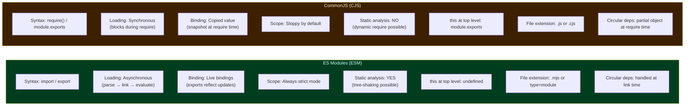
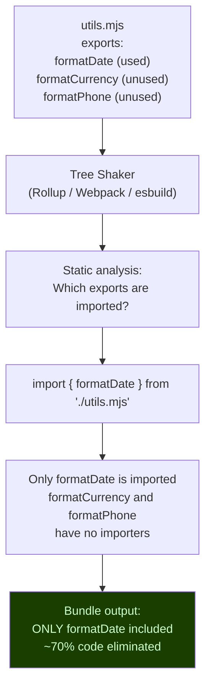
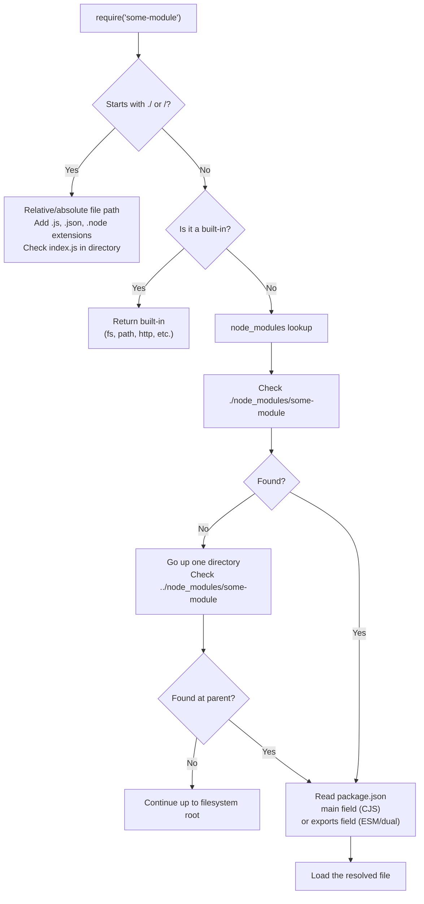
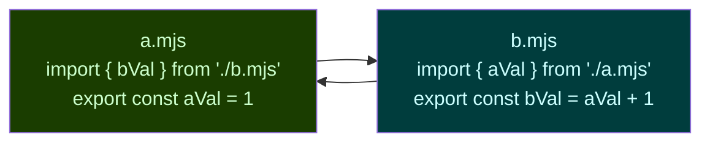
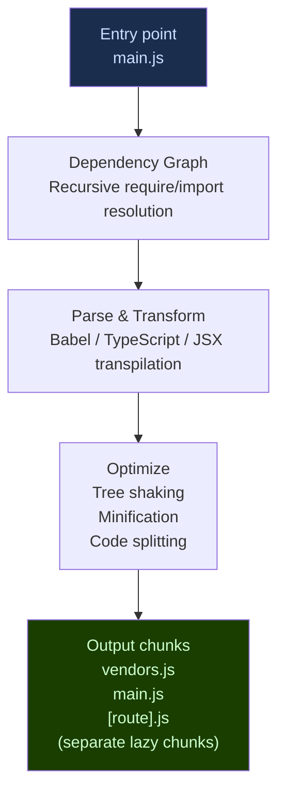
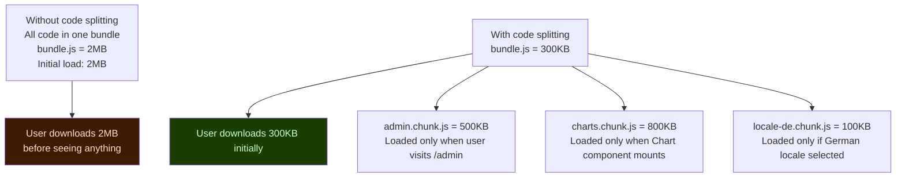
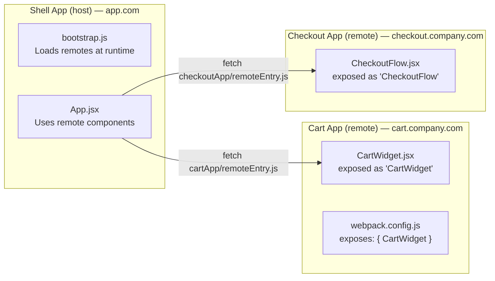
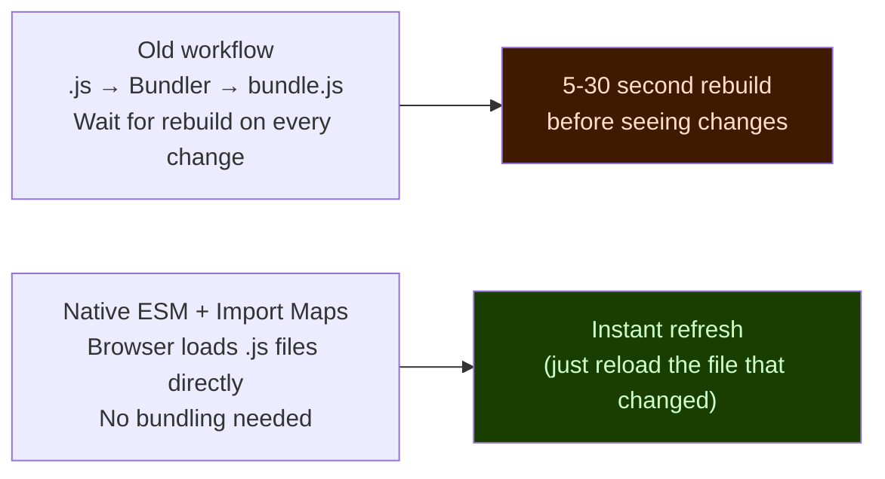

# 10 — Modules & Bundling
### 12 Questions | Intermediate to Advanced

---

**Q1. What are ES Modules (ESM) and how do they differ from CommonJS (CJS)?** — Medium

**Answer:**
ES Modules are the standardized JavaScript module system (ES2015+). CommonJS is the older synchronous module system used by Node.js originally.



Live bindings vs value copies — critical distinction:
```js
// ESM — counter.mjs:
export let count = 0;
export function increment() { count++; }

// main.mjs:
import { count, increment } from "./counter.mjs";
console.log(count); // 0
increment();
console.log(count); // 1 — live binding reflects the update

// CommonJS — counter.js:
let count = 0;
module.exports = { count, increment: () => { count++; } };

// main.js:
const { count, increment } = require("./counter.js");
console.log(count); // 0
increment();
console.log(count); // STILL 0 — count was copied by value at require time
```

**Spec Reference:** ECMAScript section 16 — ECMAScript Language: Scripts and Modules

**Follow-up:** Can you use `require()` in an ES Module?

No — `require` is not defined in ES Modules. You must use `import`. However, you can use `createRequire` from Node's `module` package to get a CJS `require` function for interoperability in edge cases. Going the other direction, `import()` (dynamic import) works in CJS files.

**GOTCHA:** ESM and CJS have different default export semantics. When you `import cjsModule from "./cjs.js"`, the entire `module.exports` object becomes the default import. There is no named import from CJS from ESM without a build tool or `.default` access.

---

**Q2. What is tree shaking and how does it depend on ESM static analysis?** — Medium

**Answer:**
Tree shaking is the process of removing unused code (dead code elimination) from a bundle. It is possible with ESM because `import` and `export` statements are static — they cannot be conditional and their shape is known at parse time before any code runs.



Why CJS cannot be tree-shaken reliably:
```js
// CJS — require is dynamic, cannot be analyzed statically:
const util = require("./utils");
const fn = util[dynamicKey]; // Which export? Unknown at parse time!

// Or conditional requires:
if (process.env.NODE_ENV === "development") {
  const debug = require("./debug-utils"); // Cannot tree-shake
}

// ESM — static, always analyzable:
import { formatDate } from "./utils.mjs"; // Always imported, always analyzable
// You CANNOT write: import { [dynamicKey] } from "./utils.mjs" — SyntaxError
```

Making code tree-shakeable:
```js
// NOT tree-shakeable — exports one big object:
export default {
  formatDate,
  formatCurrency,
  formatPhone
};

// Tree-shakeable — named exports allow selective imports:
export function formatDate() { ... }
export function formatCurrency() { ... }
export function formatPhone() { ... }

// Also mark side-effect-free in package.json:
{
  "sideEffects": false  // tells bundler: no imports have side effects, all safe to remove
}
// Or specify which files DO have side effects:
{
  "sideEffects": ["./src/polyfills.js", "*.css"]
}
```

**GOTCHA:** `import * as utils from "./utils.mjs"` defeats tree shaking — the bundler must include all exports because you might use any of them. Use specific named imports whenever possible.

---

**Q3. What is dynamic import (`import()`) and when would you use it?** — Medium

**Answer:**
`import()` is a function-like expression that loads a module asynchronously at runtime. Unlike static `import`, it can be used conditionally, in functions, and with computed paths. It returns a Promise that resolves to the module's namespace object.

```js
// Static import — must be at top level, always loaded:
import { formatDate } from "./utils.mjs";

// Dynamic import — loaded on demand:
async function loadChart() {
  const { Chart } = await import("./chart-library.mjs");
  return new Chart(canvas);
}
```

Use cases:

Route-based code splitting (React example):
```js
// Load component only when the route is visited:
const UserProfile = React.lazy(() => import("./UserProfile.jsx"));
```

Conditional loading based on features:
```js
async function setupPayments() {
  if (navigator.canMakePayment) {
    const { PaymentHandler } = await import("./payment-handler.mjs");
    return new PaymentHandler();
  }
  // No payment module loaded if not supported
}
```

Language-specific modules:
```js
async function loadLocale(lang) {
  const locale = await import(`./locales/${lang}.mjs`);
  applyLocale(locale.default);
}
```

Accessing a specific export with `import()`:
```js
const { formatDate } = await import("./utils.mjs");
// or:
const utils = await import("./utils.mjs");
utils.formatDate(new Date());
utils.default; // the default export, if any
```

**Follow-up:** What is the difference between `import()` and `require()` for dynamic loading?

`require()` is synchronous — it blocks the entire thread until the module is loaded. `import()` is asynchronous — it returns a Promise and does not block. In browser environments, `require()` cannot load modules from the network without a bundler because there is no blocking I/O for HTTP. `import()` works natively in browsers with `<script type="module">`.

**GOTCHA:** Dynamic `import()` with a template literal path (`import(\`./locales/${lang}.mjs\`)`) prevents bundlers from statically analyzing which files to bundle. Bundlers like webpack handle this by including ALL files matching the pattern — which can increase bundle size significantly. Use a `/* webpackChunkName: "locale-[request]" */` magic comment or equivalent to control this.

---

**Q4. What is module resolution and how does Node.js resolve `require("lodash")`?** — Hard

**Answer:**
Module resolution is the process of turning a module identifier string into an actual file path.



Node.js `package.json` exports field (modern):
```json
{
  "name": "my-lib",
  "exports": {
    ".": {
      "import": "./dist/esm/index.mjs",
      "require": "./dist/cjs/index.cjs",
      "types": "./dist/types/index.d.ts"
    },
    "./utils": {
      "import": "./dist/esm/utils.mjs",
      "require": "./dist/cjs/utils.cjs"
    }
  }
}
```

This allows:
```js
// Automatically gets ESM version in ESM context, CJS in CJS context:
import lib from "my-lib";
const lib = require("my-lib");

// Sub-path export:
import { formatDate } from "my-lib/utils";
```

**Follow-up:** What is the difference between `"main"` and `"exports"` in package.json?

`"main"` is the legacy CJS entry point — a single file path. `"exports"` is the modern way — it supports conditional exports (different files for ESM vs CJS), sub-path exports, and encapsulates the package (files not listed in `"exports"` cannot be imported directly). `"exports"` takes precedence over `"main"` in Node 12+.

**GOTCHA:** The `"exports"` field makes package internals inaccessible. `require("lodash/internal/_something")` worked with the old `"main"` system but throws `ERR_PACKAGE_PATH_NOT_EXPORTED` if lodash uses `"exports"` without mapping that sub-path. Many projects broke when migrating to `"exports"` without mapping their internal paths.

---

**Q5. What is the difference between named exports, default exports, and namespace exports?** — Easy

**Answer:**
```js
// Named exports — explicitly named, multiple allowed:
export const PI = 3.14;
export function add(a, b) { return a + b; }
export class Calculator { ... }

// Import named: must use exact name or alias:
import { PI, add, Calculator } from "./math.mjs";
import { add as sum } from "./math.mjs"; // alias

// Default export — one per module, imported with any name:
export default class App { ... }
// or: export { App as default };

// Import default — any name you choose:
import App from "./app.mjs";
import MyApp from "./app.mjs"; // same thing, different local name

// Namespace export — re-export all named exports from another module:
export * from "./utils.mjs";     // re-export all named (not default)
export * as utils from "./utils.mjs"; // re-export as named namespace

// Import namespace:
import * as math from "./math.mjs";
math.PI;
math.add(1, 2);
```

Re-exporting for barrel files (index.mjs):
```js
// index.mjs — barrel file that collects and re-exports:
export { Button } from "./Button.mjs";
export { Input } from "./Input.mjs";
export { default as Modal } from "./Modal.mjs"; // re-export a default as named

// Consumer:
import { Button, Input, Modal } from "./ui-library";
```

**Follow-up:** Should you prefer named exports or default exports?

Named exports are generally preferred for libraries and shared code:
- They are explicitly named — no confusion about what you are importing
- Tree-shaking works better
- They work better with auto-import in IDEs
- You can import multiple things from one statement

Default exports are fine for application-level components (React components, page components) where there is a clear "primary" thing a file exports.

**GOTCHA:** You cannot have a named export and a default export with the same name in one `import` statement. Named and default are two separate slots. `import x, { y } from "./module.mjs"` — `x` is the default, `y` is a named export.

---

**Q6. What is a circular dependency in modules and how does each module system handle it?** — Hard

**Answer:**
A circular dependency occurs when module A imports module B, and module B also imports module A (directly or indirectly). Both module systems handle this — but differently.



CommonJS behavior (synchronous, copies values):
```js
// a.js:
const b = require("./b.js");
console.log("a loaded, b.value =", b.value);
exports.value = 1;

// b.js:
const a = require("./a.js");
// At this point, a is partially initialized — only what ran BEFORE require("./b.js")
console.log("b loaded, a.value =", a.value); // undefined! a.value not set yet
exports.value = a.value + 1; // NaN — a.value is undefined

// Main:
require("./a.js");
// CJS returns a PARTIAL export object for the in-progress module
```

ESM behavior (live bindings, handled at link phase):
```js
// a.mjs:
import { bVal } from "./b.mjs";
export const aVal = 1;
console.log(bVal); // May be undefined at first — but LIVE binding updates when b finishes

// b.mjs:
import { aVal } from "./a.mjs";
export const bVal = aVal + 1;
```

ESM handles circular imports at link time — all bindings are established before any module body runs. Modules with circular dependencies work if the referenced values are used after initialization (in functions called later), not at module evaluation time.

**Best practice:** Refactor circular dependencies by extracting shared code into a third module that both depend on.

**GOTCHA:** With ESM, reading a circularly-imported binding DURING module initialization (at the top level, not in a function) can give `undefined` even though the binding will eventually have a value. Wrap reads in functions that run after initialization completes.

---

**Q7. What is the difference between `import.meta`, `__dirname`, and `__filename`?** — Medium

**Answer:**
These provide module-specific metadata, but they are available in different module systems.

`__dirname` and `__filename` — CommonJS only:
```js
// Available automatically in every CJS module:
console.log(__dirname);  // "/home/user/project/src" — absolute directory of current file
console.log(__filename); // "/home/user/project/src/app.js" — absolute path of current file

// Common use: resolve relative paths robustly:
const configPath = path.join(__dirname, "config.json");
```

`import.meta` — ES Modules only:
```js
// import.meta.url — URL of the current module file:
console.log(import.meta.url); // "file:///home/user/project/src/app.mjs"

// Emulate __dirname and __filename in ESM:
import { fileURLToPath } from "url";
import { dirname } from "path";

const __filename = fileURLToPath(import.meta.url);
const __dirname = dirname(__filename);

// Or use import.meta.dirname (Node.js 21.2+, Bun 1.0+):
import.meta.dirname; // direct equivalent of __dirname
import.meta.filename; // direct equivalent of __filename
```

`import.meta.resolve()` — resolve a module path relative to current module:
```js
const resolvedPath = import.meta.resolve("./utils.mjs");
// "file:///home/user/project/src/utils.mjs"
```

`import.meta.env` — build tool specific (Vite, bundlers inject at build time):
```js
if (import.meta.env.DEV) {
  // Development-only code — stripped in production bundle
}
```

**GOTCHA:** `__dirname` and `__filename` are NOT defined in ES Modules — they throw `ReferenceError`. Using a file with `import`/`export` (or `.mjs` extension) means you must use `import.meta.url` and convert. This is a very common migration pain point when converting CJS to ESM.

---

**Q8. How does bundling work? What do Webpack, Rollup, and esbuild do differently?** — Hard

**Answer:**
A bundler combines multiple JavaScript module files into one (or a few) output files for deployment, handles dependency resolution, and applies optimizations.



Webpack:
- Works with both ESM and CJS
- Highly configurable via plugins and loaders
- Code splitting: automatic + manual `import()` splitting
- Module Federation: share modules between separately deployed applications at runtime
- Slower than esbuild but most mature ecosystem

Rollup:
- ESM-first — best tree shaking
- Designed for library bundling (outputs clean ESM, CJS, IIFE)
- Does NOT handle CJS without plugins
- Superior to webpack for library output quality

esbuild:
- Written in Go — 10-100x faster than webpack/rollup
- Handles ESM, CJS, TypeScript, JSX natively
- Less configurable — fewer plugins
- No type checking (transpiles TypeScript without checking types)
- Ideal for: dev servers, CI builds where speed matters

Vite (development server):
- Uses native browser ESM in development — no bundling at all
- esbuild for dependency pre-bundling (converts CJS deps to ESM)
- Rollup for production builds (full tree shaking and optimization)

**GOTCHA:** Different bundlers handle circular dependencies, CJS interop, and top-level `await` differently. Always test your library bundle with your target bundler before publishing. What works with Rollup may break with Webpack and vice versa.

---

**Q9. What is code splitting and what are the strategies for it?** — Hard

**Answer:**
Code splitting divides your bundle into smaller chunks that can be loaded on demand. This improves initial load time by deferring non-critical code.



Strategies:

1. Route-based splitting (most common):
```js
// React Router with React.lazy:
const Home = React.lazy(() => import("./pages/Home"));
const Admin = React.lazy(() => import("./pages/Admin"));
const Dashboard = React.lazy(() => import("./pages/Dashboard"));

// Each route loads only when navigated to
```

2. Component-level splitting (for heavy UI components):
```js
const HeavyChart = React.lazy(() => import("./HeavyChart"));

function App() {
  return (
    <Suspense fallback={<Spinner />}>
      <HeavyChart data={data} />
    </Suspense>
  );
}
```

3. Vendor splitting (separate library code from app code):
```js
// webpack.config.js:
optimization: {
  splitChunks: {
    cacheGroups: {
      vendors: {
        test: /[\\/]node_modules[\\/]/,
        name: "vendors",
        chunks: "all"
      }
    }
  }
}
// Vendors chunk changes rarely — cached by browser across deploys
// App chunk changes frequently — gets new hash
```

4. Preloading critical chunks:
```html
<!-- Hint browser to load high-priority future chunk early: -->
<link rel="modulepreload" href="/admin.chunk.js">

<!-- Or programmatically: -->
<!-- const link = document.createElement("link");
link.rel = "modulepreload";
link.href = adminChunkUrl;
document.head.appendChild(link); -->
```

**GOTCHA:** Too many tiny chunks (micro-chunking) actually hurts performance — HTTP/1.1 has a maximum of 6 parallel connections per host. Even with HTTP/2 multiplexing, the TLS overhead and header compression cost for many tiny requests can exceed the savings. Aim for chunks of 50KB–200KB compressed.

---

**Q10. What is the `package.json` `"type"` field and how does it affect module interpretation?** — Medium

**Answer:**
The `"type"` field in `package.json` tells Node.js how to interpret `.js` files in that package — as CommonJS or ES Modules.

```json
// CommonJS package (default if "type" is absent):
{
  "type": "commonjs"
}
// .js files → interpreted as CJS (require/module.exports)
// .mjs files → always ESM regardless
// .cjs files → always CJS regardless

// ES Module package:
{
  "type": "module"
}
// .js files → interpreted as ESM (import/export)
// .cjs files → always CJS regardless
// .mjs files → always ESM regardless
```

File extension overrides always win:
- `.mjs` → always ESM
- `.cjs` → always CJS
- `.js` → determined by nearest `package.json` `"type"` field

Directory-level scope:
```
project/
  package.json  ← "type": "module"  — .js in project = ESM
  src/
    app.js       ← ESM (inherits from project)
    legacy/
      package.json  ← "type": "commonjs"  — overrides for this subdirectory
      old.js         ← CJS (inherits from legacy/package.json)
```

**Follow-up:** Can you mix ESM and CJS in the same project?

Yes, but with friction:
- ESM can `import` CJS files — Node.js wraps them automatically.
- CJS cannot statically `require()` ESM files — must use dynamic `import()`.
- Build tools usually handle this in development but produce a specific format for output.

**GOTCHA:** Many npm packages (especially older ones) have `"type": "module"` added in a major version bump — causing breaking changes for CJS consumers who used to `require()` the package. Always check the changelog before updating packages that changed their module type.

---

**Q11. What is module federation and how does it enable micro-frontends?** — Hard

**Answer:**
Module Federation (webpack 5+) allows a JavaScript application to dynamically load code from another independently deployed application at runtime — sharing modules across build boundaries without pre-bundling them together.



Configuration example:
```js
// Cart app webpack.config.js (remote):
new ModuleFederationPlugin({
  name: "cartApp",
  filename: "remoteEntry.js",       // expose this as the manifest
  exposes: {
    "./CartWidget": "./src/CartWidget", // what this app shares
  },
  shared: { react: { singleton: true }, "react-dom": { singleton: true } }
});

// Shell app webpack.config.js (host):
new ModuleFederationPlugin({
  name: "shell",
  remotes: {
    cartApp: "cartApp@https://cart.company.com/remoteEntry.js"
  },
  shared: { react: { singleton: true }, "react-dom": { singleton: true } }
});

// Shell app code — loads Cart's component at runtime:
const CartWidget = React.lazy(() => import("cartApp/CartWidget"));
```

`shared` configuration ensures React is loaded only once — both the shell and cart use the same React instance, preventing "multiple React instances" bugs.

**GOTCHA:** Module Federation requires webpack 5. There is no standard equivalent for Vite/Rollup yet (vite-plugin-federation exists but is less mature). Shared dependencies must have compatible version ranges — mismatched semver can cause both versions to load.

---

**Q12. What are import maps and how do they replace bundlers for development?** — Hard

**Answer:**
Import maps are a browser feature that lets you control how bare module specifiers (like `"lodash"`) resolve to actual URLs — without a bundler. They are defined in a `<script type="importmap">` element.

```html
<script type="importmap">
{
  "imports": {
    "lodash": "https://cdn.skypack.dev/lodash",
    "lodash/": "https://cdn.skypack.dev/lodash/",
    "react": "https://esm.sh/react@18",
    "react-dom": "https://esm.sh/react-dom@18",
    "./utils": "/src/utils.mjs"
  },
  "scopes": {
    "/lib/": {
      "lodash": "https://cdn.skypack.dev/lodash@3"
    }
  }
}
</script>

<script type="module">
  import _ from "lodash";       // resolves to skypack CDN
  import React from "react";    // resolves to esm.sh
  import { formatDate } from "./utils"; // resolves to /src/utils.mjs

  // Works without ANY build step!
</script>
```

`"scopes"` — provide different mappings for different directory contexts. In the example, files in `/lib/` get lodash v3 while the rest of the app gets the default version.

Development workflow without a bundler:


**Follow-up:** Does this replace production bundlers?

For development, yes — native ESM with import maps is the foundation of Vite's development server. For production, bundling still wins because:
- Many small HTTP requests (one per module) have latency overhead
- Tree shaking requires static analysis by a bundler
- Minification, compression, and cache optimization still require a build step

**GOTCHA:** Import maps must appear before any `<script type="module">` that uses the mapped specifiers. The browser processes them sequentially — an import map defined after a module script that needs it will not apply. Also, only one import map per document is allowed.

---

*Next: [11-Regex.md](./11-Regex.md)*
